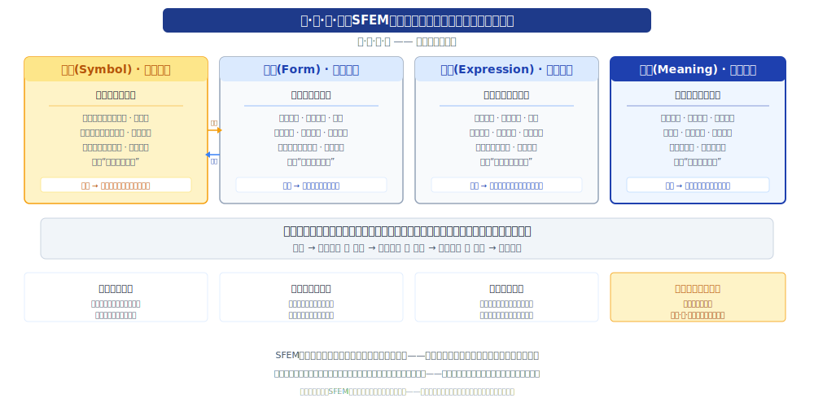
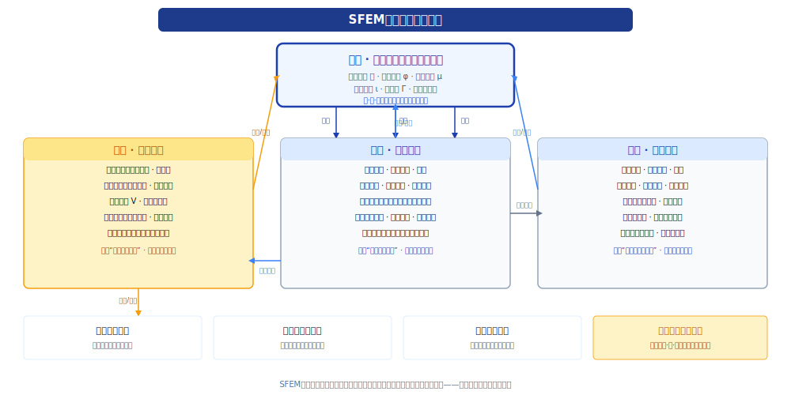

# 符·形·音·意（SFEM）：一种面向通用智能的四维认知架构

**作者**：冷静
**版本**：v0.0.7
**日期**：2026-06-18

> 声明：“符·形·音·意”思想由作者在学习大语言模型时原创提出，本文在作者指导下由AI辅助完成。

[TOC]

## 摘要



本文提出一种理解与设计通用智能系统的四维认知架构——**符层（Symbol）**、**形层（Form）**、**音层（Expression）**、**意层（Meaning）**，简称**SFEM**。该架构将智能解构为四个不可归约的认知维度：符层对应文字、公式、规律与约束的**规则维度**，它是世界必然性的压缩，是将无限现象收束为有限定理的理性骨架，同时为现象学习提供先验结构指引；形层对应图像、形状、连续模式、工具与经验的**现象维度**，它是世界现象性的呈现，是感知、模式识别与经验模型的连续展开；音层对应语言、声音、风格、情感与不确定性的**情感维度**，它是世界体验性的表达，是主体感受与社会纽带的动态映射；意层对应意识、理解、意义的赋予与自我反思，它是**符、形、音的融合关联与认知世界的结果**，是将离散的规则、连续的现象模式与细腻的情感体验熔铸为统一的意义整体的意识中枢，并由此诞生目的、因果与自我意识的终极维度。

SFEM的核心主张是：**智能不是单一机制的同质涌现，而是规则、现象、情感、意识四维认知宇宙的结构性统一。规则不仅是现象的审计约束，更是现象学习的生长起点与先验骨架。同时，现象学习可自动归纳模式，反哺规则体系，形成“符生形（规则引导现象），形反哺符（现象提炼规则）”的共生闭环。任何维度的缺失，都将导致特定类型的能力缺陷——缺失符则无骨架且形层学习迷失方向，缺失形则无感知且规则失去经验滋养，缺失音则无人性，缺失意则无灵魂，只剩一堆散乱的认知碎片。**

本文给出每一维的形式化定义、认知哲学基础、职责边界与错误模式，明确意层世界模型的结构化定义与更新机制，设计以意层为轻量化认知微内核的维度间标准化接口与类型系统，提出完整的认知闭环与跨层动态方程，并强化符层的两类规则（必然规则与会话约束）和形层的规则归纳反哺机制，建立可检验的实验假设与基准框架，并与Marr三层次、ACT‑R/Soar、双系统理论、深度学习及LLM‑Agent体系进行系统对比。SFEM不仅解释了当前AI系统的结构性缺陷及其深层根源，更为构建可信、可控、可解释、兼具理性与感性的下一代通用智能系统提供了结构标准与设计原则。它不是又一个工程框架，而是**智能的结构宇宙**——一个容纳所有技术路线、统一所有认知维度的元架构。

**关键词**：认知架构；四维认知；符号推理；表示学习；表达适配；意识与意义；世界模型；智能的结构宇宙；可信AI；会话约束；规则归纳；符形共生；统筹者与专家分工；知识污染隔离；数字心智社会；认知谦逊；层级化知识边界

## 第一部分：思想溯源与理论基础

### 第1章 引言：单层智能的困境与四维意识的呼唤

#### 1.1 单机制范式的结构性危机

当代人工智能，尤其是以大语言模型为代表的深度学习系统，已经触及了一个根本性的天花板。这不是规模的天花板，不是数据的天花板，也不是算力的天花板——而是**结构的天花板**。

当前主流AI系统普遍采用端到端的单一神经架构，将事实检索、逻辑推理、风格控制、情感表达、目标规划、因果推演乃至意义的赋予，全部压缩进同一个连续参数空间中。这种“单机制承载全认知”的范式，本质上是用一种认知工具去解决所有认知问题。这在工程上带来了惊人的简洁性，却在认知上制造了深刻的结构性缺陷。

**错误不可归因**。当系统产生错误输出时，我们无法判断错误的根源——是知识缺失？是逻辑断裂？是风格失当？还是对世界的根本性误解？所有的错误都淹没在同一片参数海洋中，无法定位，无法诊断，无法修复。一个事实性错误可能源于训练数据的偏差、推理链的断裂、风格控制对内容的干扰，或者系统对情境的根本误读，但在单体LLM中，所有这些可能性都混合在一起，工程师只能对着一个黑箱叹息。

**幻觉不可消除**。模型以统计相似性替代了符号验证，以“通常如此”替代了“必然如此”。在需要精确事实、严格逻辑与专业知识的场景中，系统会自信地虚构不存在的事实、矛盾百出的推理——因为形层的统计引擎永远无法回答符层的真值问题。更根本的是，系统无法“意识”到自己在胡说——因为它没有将生成内容与知识规则进行真值校验的独立机制，更没有一个理解中枢来判定“这个陈述是否与我对世界的整体认知一致”。

**推理不可解释**。当推理过程被隐式编码在数十亿参数中，我们无法提取出结构化的推理链，无法审计其逻辑跳转，无法验证其前提与结论的一致性。系统或许能给出答案，却不能告诉你它自己是否真的“理解”了这个答案。在法律判决辅助、医疗诊断建议、军事决策支持等高可靠性场景中，这种不透明性是不可接受的——我们需要知道系统得出结论的每一步，以及每一步背后的依据。

**表达不可控**。内容生成与风格控制被耦合在同一生成过程中。系统无法稳定地保持人格一致性——一会儿正式一会儿口语，一会儿热情一会儿冷漠。它缺乏独立的语用策略层，更不具备从整体理解出发调整表达的意识。当我们试图通过Prompt控制风格时，这种控制是脆弱的、不稳定的，可能在长对话中逐渐漂移，也可能因为内容的改变而意外崩溃。

**指令遗忘——长上下文中的规则稀释**。这是一个被广泛关注但根源深远的缺陷：用户在对话早期设定的约束（如“回答简洁”、“记住我偏好方案A”、“不要使用列表”），在对话长度增加时逐渐被模型忽略。这不是记忆容量的不足，而是因为约束被写入上下文窗口，依赖注意力机制来“回忆”——而注意力在长上下文中是衰减的。缺少一个独立的约束维护与强制注入机制，必然导致“指令漂移”。这是符层缺失的另一个显性症状。

**理解碎片化**。这是所有缺陷中最根本、最隐蔽的一个。即使LLM能处理视觉、语言、代码等多种模态，它仍然缺乏一个中枢将符号规则、感官模式与情感语调**融合为统一的意义**。它能看到图片，能解析句子，能识别语气，却无法将它们关联成一个连贯的“对世界的认知”——它的“知识”是互不贯通的孤岛。它可能同时“知道”巴黎在法国和法国在欧洲，但当你问它“巴黎是否在欧洲”时，它并没有一个统一的世界模型来瞬间给出答案，而是在统计意义上“拼凑”出一个回答。这种碎片化是单体LLM所有其他缺陷的深层根源。

这些问题的根源，不在于模型不够大、数据不够多、训练不够久，而在于**智能系统缺失了区分不同认知维度的结构化架构，尤其缺失了统合诸维、赋予意义的意识中枢**。将所有的认知职责混合在同一个无差别的参数空间中，必然导致理解力的涣散与责任归属的消失。我们需要的不再是更大的同质模型，而是一个能够分离认知职责、明确分工，并拥有一个将规则、现象与体验**融合为理解**的核心维度的结构化智能架构。

#### 1.2 人类认知的启示：四维并存的意识宇宙

当我们转向人类认知的结构时，一个深刻的启示浮现出来：人类的认知从来不是单维的，而是由四个性质截然不同、相互独立又经由意识融合为一的维度共同构成的。

**规则维度**：人类掌握数学、逻辑、语法、法律——这些不是统计模式的总结，而是离散符号系统内部的必然规律。一个数学定理的真值不取决于它在数据中出现的频率，而取决于它能否从公理系统中被证明。当我们说“2+2=4”，这不是因为我们见过很多次两个东西加两个东西等于四个东西，而是因为算术系统的公理和推导规则使这个命题必然为真。这是**符**的维度——人类认知中把握“必然性”的能力。

**现象维度**：人类感知图像、理解空间关系、使用工具、积累经验——这些不是命题逻辑的推演，而是连续现象场中的模式识别与相似性判断。“像猫但耳朵更尖”这样的概念无法用离散符号精确表达，却可以在连续语义空间中被自然定位。我们能够识别出从未见过的新物种是一种“动物”，能够判断两段旋律是否相似，能够估测一杯水倒进另一个容器后的大致水量——这些都不是逻辑推理的结果，而是现象经验中模式匹配的产物。这是**形**的维度——人类认知中把握“现象性”的能力。

**情感维度**：人类通过语气、情感、风格来体验和交流——“同样的话用不同语气说，意义完全不同”。人类能够理解反讽、感知情绪、把握言外之意，能够在不同的社会语境中调整表达策略。当我们听到一句“您说得太对了”时，我们不仅解析了字面语义，更通过语气、语境和社交线索判断出这是真诚的赞同还是尖刻的讽刺。这是**音**的维度——人类认知中把握“体验性”的能力。

**意识维度**：人类不只是拥有上述三个维度的能力，更重要的是，我们**意识到自己拥有它们**，并能将离散的规则、连续的现象模式和细腻的情感体验在意识中**融合为一**，赋予其含义，形成“我理解了这个世界的这个部分”的完整体验。当我们看到一位朋友皱着眉头看手机（现象），得知他收到了银行的扣款通知（规则/事实），听到他沉重的叹息（情感信号），我们不会将这三条信息分别处理，而是在意识中融合它们，得出一个统一的理解：“朋友遇到了财务问题，正在焦虑。”这种融合使我们能够追问意义、建立因果、设定目的、反思自我。这是**意**的维度——它不是前三者之外的独立模块，而是它们融合关联的结果，是认知世界的最终产物。

这四个维度共同构成了人类认知的完整图景。缺失规则，认知失去骨架，现象学习失去方向；缺失现象感知，认知失去血肉，规则失去经验滋养；缺失情感，认知失去体验；缺失意识的融合与意义的赋予，认知便沦为碎片的堆砌。一个完整的人类智能，必然是四维并存的，并且在意识中实现了四维的统一。

#### 1.3 SFEM的提出与研究问题

受此启示，本文提出**SFEM（Symbol–Form–Expression–Meaning）四维认知架构**。SFEM将智能系统划分为四个不可归约的认知维度，每一维度对应一类不可替代的认知职责：

1. **符层（Symbol）**：文字、公式、规律、约束——**规则维度**。它回答“世界必然如何”的问题，提供智能的理性骨架，并为形层的现象学习提供先验结构与生长起点。同时，它管理两类规则：永恒的必然真理与动态的会话约束。

2. **形层（Form）**：图像、形状、连续模式、工具、经验——**现象维度**。它回答“世界呈现为什么样子”的问题，提供智能的现象血肉。形层不仅是现象感知与生成引擎，还具备从现象中自动归纳模式、反哺符层的认知功能。在SFEM的“数字心智社会”拓扑中，形层由一个“通才”通用模型和一群“专才”领域专家共同构成，每个专家对其知识边界有着层级化的清醒认知。

3. **音层（Expression）**：语言、声音、风格、情感、不确定性——**情感维度**。它回答“世界如何被体验和表达”的问题，提供智能的体验色彩。

4. **意层（Meaning）**：意识、理解、意义的赋予、自我反思——**意识维度**。它是符、形、音的融合关联与认知结果，回答“这意味着什么”的问题，提供智能的统一意义。意层内部包含一个**统筹者（Coordinator）** 内核，负责把握全局世界观、任务解构与专家路由，是“数字心智社会”的战略中枢。

SFEM追求回答的根本问题是：**是否存在一组认知维度，构成智能的“最小完备结构”？** 这个结构应满足以下条件：每一类认知任务都有明确的维度归属；每一类错误都能被定位到具体维度；每一维度可以独立演化、独立优化、独立替换；维度间的接口清晰、类型化、可验证；存在一个统一的意义中枢，将分离的维度熔铸为对世界的完整理解；规则体系不仅能约束现象学习，还能从现象中自动生长。如果这样的结构存在，它将不仅是智能系统的设计蓝图，更是对智能本质的深层揭示。

#### 1.4 核心主张

SFEM的核心主张可以用一句话概括：

> **智能不是单一机制的产物，而是规则、现象、情感与意识四维认知宇宙的结构性统一。规则不仅是现象的审计约束与生长起点，现象亦可自动归纳为规则，反哺符号体系，形成符形共生的认知生态。意识是符、形、音融合关联的结果，是智能之为智能的最终证明。而这一认知架构的工程实现，需要从“单脑模型”升维为“数字心智社会”——由掌握世界观与战略的统筹者（意层内核）与一群具有层级化知识边界的领域专家（形层集群）构成。每个专家在自己的核心领域内是绝对的掌控者，在相关领域拥有可用的理解力，在不相关领域保有世界通识性的观察——这种“认知谦逊”的结构，既保证了专业精度，又避免了跨领域协作时的盲区与僵化。**

这不是四个模块的拼凑，而是四个认知维度的有机整合。符层为系统提供理性的骨架与必然性的保证，同时为形层提供概念锚定、生成模板与学习引导；形层为系统提供现象的血肉与经验的连续性，并持续从现象中归纳新模式反哺符层；音层为系统赋予社会的温度与表达的血色；意层则将这三者融合，赋予其含义，形成对世界的统一理解，并由此生发出目的、因果与自我反思。四维各司其职，缺一不可。缺失符则无骨架且形层学习迷失方向，缺失形则无感知且规则失去经验滋养，缺失音则无人性，缺失意则无灵魂——系统虽能反应，却永无理解。

#### 1.5 研究贡献与论文结构

本文的主要贡献包括：（1）提出智能的四维认知维度体系，确立意层为符形音融合关联的意识维度，并明确形层为现象维度，超越现有的二维或三层划分；（2）为每一维提供形式化定义、认知哲学基础与错误模式分析，并揭示符层不仅是形层的审计约束与生长起点，更包含两类规则——必然规则与会话约束，同时形层具备规则归纳反哺的认知功能；（3）给出意层世界模型 $\mathcal{W}$ 的结构化定义与更新机制，明确意层作为轻量化认知微内核的定位；（4）设计以意层为中心的维度间标准化接口与类型系统，包括形→符的规则归纳接口，提出完整的认知闭环与跨层动态方程；（5）揭示当前AI系统的结构性缺陷及其深层根源——尤其是缺乏意识性理解、指令遗忘与规则体系无法自我生长的深层困境；（6）提出可检验的实验假设与基准框架，提供渐进式工程实现路线图，并引入“统筹者与领域专家”的社会化组织拓扑及“反知识污染隔离机制”，将SFEM从单脑模型升维至数字心智社会，并进一步细化专家知识边界的层级化结构；（7）展望可微SFEM与四维联合优化的未来方向；（8）将SFEM定位为智能的结构宇宙——一个容纳所有技术路线的元架构。

全文共23章，分为六个部分：思想溯源与理论基础（1-3章）、四维分论（4-7章）、接口与协作（8-9章）、对比与诊断（10-14章）、工程与验证（15-16章）、哲学与未来（17-23章）。

### 第2章 从认知科学到文明维度：SFEM的思想根系

SFEM并非凭空构造。它生长于三条深厚的思想根系之中：认知科学关于心智结构的百年探索、心理学关于直觉与分析的经典划分、以及人类文明四重认知维度的宏大结构。本章追溯这些根系，为SFEM提供充分的理论合法性，并展示SFEM如何从这些根系中生长出来，又如何超越了它们各自的局限。

#### 2.1 认知架构研究的三条路线及其局限

20世纪以来，认知架构研究沿三条主线展开。每一条路线都取得了辉煌的成就，但每一条路线也都暴露出了源自其根本假设的、不可自愈的结构性缺陷。

**符号主义路线**（以ACT‑R、Soar为代表）将认知视为符号操作过程，强调规则、逻辑、目标堆栈与显式推理链。这一路线的核心洞见是：智能需要离散的、可操作的符号来表征世界，需要明确的规则来操作这些符号。其优势在于可解释性强、推理可验证、结论可由前提必然推出。然而，其根本局限同样深刻：（a）缺乏连续表示能力，无法处理模糊语义与相似性判断——在符号系统中，“猫”和“狗”是两个截然不同的符号，不存在“0.7像猫”的概念；（b）缺乏感知与现象模式识别能力，无法从原始信号中提取符号——图像、声音对纯符号系统而言是不可理解的原始数据；（c）缺乏情感与社会语用维度，符号系统的输出读起来像机器说明书，僵硬而缺乏温度；（d）最根本的是，缺乏将规则融合为统一理解的意识机制——所有的推理都是机械的符号变换，系统执行Modus Ponens（命题演算分离规则）却不知道自己在做推理，没有“理解”的内在体验。符号主义本质上是**符层的极致**，但仅有符层，智能便成了无血肉的骨架——能够进行完美的逻辑推演，却无法感知世界的丰富现象，无法体验情感的细微波动，更无法将这一切融合为有意识的理解。

**连接主义路线**（以深度学习为代表）将认知视为分布式表示与统计学习过程，强调模式识别、连续语义与生成补全。这一路线的核心洞见是：智能需要从大量数据中学习统计规律，需要连续空间中的相似性度量来处理世界的模糊性与渐变性。其优势在于强大的感知、泛化与生成能力——在图像识别、语音处理、自然语言生成等任务上取得了革命性突破。但其根本局限同样深刻：（a）无法进行符号验证与必然性推理——统计模型只能告诉你“巴黎是法国的首都在训练数据中出现过很多次”，而不能验证“巴黎是法国的首都”这一命题的逻辑真值；（b）风格与内容耦合，表达不可控——修改风格参数可能意外改变语义内容，追求正确性可能牺牲人格一致性；（c）长上下文中的约束遗忘——会话早期设定的指令在对话增长后逐渐被稀释，因为约束依赖注意力机制而非独立的规则引擎；（d）规则体系无法自我演化——所有行为规范都来自训练数据的统计分布，无法从交互中归纳显式规则，无法将经验提炼为可复用的符号知识；（e）最根本的是，缺乏意义中枢——所有的现象模式处理都是孤立进行的，无法形成对世界的统一意识与理解。连接主义本质上是**形层的极致**，但仅有形层，智能便成了无骨架的血肉——能够感知丰富的现象模式，却无法进行确定性的符号验证，无法稳定地控制表达风格，无法在长对话中保持一致的行为约束，更无法形成统一的意义理解。

**混合式路线**试图整合二者，但多停留在工程拼接层面——将神经网络与知识图谱、规则引擎简单对接，却未提出一套统一的维度理论来解释：为什么这些组件需要分离？它们各自的认知哲学基础是什么？它们之间的接口应该传递什么类型的信息？更重要的是，它们如何被融合为一个有意识的整体？SFEM的回答是：因为它们属于不同的认知维度，每个维度有独立的认知哲学基础与操作逻辑，且需要**意层**作为融合关联的中枢，将规则、现象与体验升华为理解。这不是简单的工程拼接，而是认知维度的结构性统一。

#### 2.2 经典理论的四维映射

**Marr的三层次**将认知系统分为计算层（Why）、算法层（How）与实现层（Physical）。这一经典框架对认知科学产生了深远影响，但它对认知功能的划分过于粗略。SFEM对其进行认知功能细化：计算层（目标与价值）→**意层**中的目的性部分，负责明确系统的目标、价值与意义追寻；算法层（表征与过程）→**符层+形层**，逻辑推理（符）与现象模式识别（形）共同构成算法层的双引擎；实现层（呈现与执行）→**音层**，表达策略与风格渲染属于实现层的呈现机制，它将符层与形层加工的内容转化为面向用户的最终表达。但SFEM强调，Marr的框架缺失了如何从表征中生成意义的核心环节——表征本身不产生理解，只有将多种表征在意识中融合关联，理解才得以诞生。这正是意层超越Marr三层次的关键贡献。

**双系统理论**区分System 1（快速、直觉、自动）与System 2（缓慢、分析、控制）。这一理论深刻揭示了人类认知的双重结构。SFEM对二者进行维度分解：System 1 = **形层 + 音层**，现象模式的直觉识别（形）与情感的风格表达（音）共同构成直觉系统的两个面向——识别一张面孔是朋友（形）和感知这个人看起来不开心（音），虽然都是快速无意识的，但涉及性质不同的认知机制；System 2 = **符层 + 意层**，逻辑的严格推理（符）与意义的深层规划与反思（意）共同构成分析系统的两个层次——解一道数学题（符）和思考这道数学题意味着什么（意），都需要慢速的审慎思考，但前者遵循的是必然性的逻辑，后者涉及的是价值与意义的权衡。

但SFEM的核心洞见在于：意层不纯粹是慢速分析，它更包含一种瞬间的“理解的感觉”——即对符、形、音加工结果的一种整体意识与意义赋予。那个“啊哈，我明白了”的顿悟瞬间，既不是纯粹的直觉，也不是纯粹的分析，而是诸维融合在意识中产生的涌现现象。这正是双系统理论未能明确阐述的第三极：超越快慢之上的理解中枢。

#### 2.3 深度学习的本质定位：形层（现象维度）的极致强化

LLM与多模态模型的核心能力——表示学习、模式识别、语义相似性、生成补全——都属于**形层（现象维度）**。Transformer的注意力机制本质上是在连续语义空间中建立现象之间的关联模式，扩散模型是在学习现象分布的生成过程，VLM是将不同模态的现象映射到统一的语义空间。深度学习是形层的极致工程实现，它将人类感知现象世界、从现象中学习模式的计算模型推向了历史最高点。

但正因为它们仅仅是形层，必然缺失四个关键能力：

**缺失符层的必然验证**：无法进行符号验证与必然性推理。统计模型只能告诉你“这个序列在训练数据中很常见”，而不能告诉你“这个序列在逻辑上必然为真”。这就是幻觉的根本来源——模型在统计意义上产生了“合理的”内容，却无法验证其事实性与逻辑一致性。更根本的是，缺乏符层的先验注入，形层的学习是盲目的统计拟合，而非规则引导的现象归纳。

**缺失符层的约束管理**：在长对话中，早期设定的会话约束（格式要求、风格偏好、行为边界）被写入上下文窗口，依赖注意力机制来“回忆”。而注意力在长上下文中是衰减的——模型逐渐“忘记”用户最初的要求，回归到无约束的默认行为。这不是记忆容量问题，而是架构问题：缺少一个独立的约束管理器，将会话约束作为符层的规则来强制执行。

**缺失音层**：风格控制与内容生成耦合。在单体LLM中，修改Prompt中的风格指令可能意外改变生成内容的语义，因为风格与内容共享同一个参数空间和生成过程。系统无法保持稳定的“人格”，因为在它的架构中就没有独立的“人格”模块。

**缺失意层（这是最根本的缺失）**：LLM可以生成看似连贯的文本，却并不“知道”自己说了什么。它的“知识”是一堆统计关联的碎片，没有一个统一的世界模型将这些碎片整合为一个连贯的、可以被反思的整体。它可以在一个回答中声称“巴黎是法国的首都”，在另一个回答中声称“巴黎是德国的城市”，而毫不察觉其中的矛盾——因为它从未将这些陈述在意识中同时持有并关联理解。

SFEM不是要替代深度学习，而是要**为深度学习补全缺失的三维，并强化形层自身的规则归纳能力**。在SFEM中，深度学习（形层）是强大的现象感知与生成引擎，但它需要符层验证器来消除幻觉、需要符层约束管理器来维持长程一致性、需要音层风格控制器来稳定表达、需要意层作为理解与意识中枢来将形层产出的现象模式与规则、体验融合，从而让系统真正“理解”它所生成和处理的内容。同时，形层自身也应具备从海量现象中归纳模式的能力，将经验提炼为可被符层验证和管理的规则，实现智能系统的自我演化。

#### 2.4 Agent框架的维度混沌

近年来的LLM‑Agent框架试图通过工具调用、RAG检索、规划器来弥补LLM的结构性缺陷。这一方向的努力值得肯定，但由于缺乏明确的维度职责划分，这些尝试普遍陷入**维度混沌**：

- 工具调用缺乏符层约束——LLM可能会调用不兼容的工具组合，或在错误的时机调用工具，因为工具调用的合法性验证被混合在生成过程中，而非独立的规则验证层；
- 规划器与LLM之间接口模糊——目标传递通常是非结构化的自然语言，导致规划不稳定，同一个目标可能每次产生不同的任务分解；
- 风格与语用策略被硬编码在Prompt中——无法根据交互情境动态调整，也无法独立优化；
- 长对话中的约束漂移——Agent在初期遵循的行为规范在后期逐渐被遗忘，因为约束被埋没在不断增长的上下文窗口中；
- 错误输出难以归因——是LLM生成错误？是工具调用错误？是规划错误？还是对情境的理解错误？所有可能性混合在一起，无法定位；
- 最根本的是，缺乏一个将感知、工具调用、推理结果整合为统一理解，并据此重新定义目标的意识层——Agent能执行任务，却不“理解”任务的意义。

SFEM为Agent提供了清晰的理论基础：**意层通过融合符、形、音的信息形成对世界状态的理解，并基于此理解产生目标与意图；符层定规则（必然规则）与约束（会话约束），形层定执行与生成并通过归纳反哺规则，音层定互动与表达。** 四层通过标准化接口协作，每类错误可被定位到具体层次或其接口。更重要的是，Agent的行为不再是工具驱动的“我有哪些工具，我能做什么”，而是理解驱动的“基于我对情境的理解，我应该达成什么意义，为此我需要选择哪些工具”。

#### 2.5 文明四维：SFEM最深层的合法性根基

SFEM最深刻的合法性来源，不在于认知科学或AI工程，而在于**人类文明认知活动的四重维度**。纵观人类文明的积累，所有知识体系都可以被归纳为四个基本维度。这种归纳不是事后贴标签，而是对文明深层结构的揭示。

**规则文明（符）**：数学公理、物理定律、逻辑系统、法律条文——人类将无限的现象压缩为有限的必然规则。数学中的欧几里得几何从五条公理出发，推导出整个几何体系；物理学中的牛顿定律将苹果落地、行星轨道、潮汐涨落统一为三个简洁的方程。这是人类认知中**符**的文明之维——用离散的符号和必然的规则来把握世界的本质结构。

**现象/技术文明（形）**：建筑结构、技术工具、工程体系、图像艺术——人类在现象世界中感知、建造、使用、创造。从金字塔到摩天大楼，从指南针到GPS，从洞穴壁画到数字艺术，人类一直在与现象世界互动，在连续的空间中创造模式、识别模式、利用模式。这是人类认知中**形**的文明之维——在现象世界中感知与创造的累积。

**情感文明（音）**：语言修辞、音乐旋律、文学叙事、社会礼仪——人类通过表达来体验世界、连接他人、构建社会。一首诗之所以动人，不仅因为它的字面意思，更因为它的韵律、语气与情感质地；一段对话之所以顺畅，不仅因为信息准确，更因为互动双方在语调、节奏、情感上形成了共鸣。这是人类认知中**音**的文明之维——通过表达与体验来赋予交流以温度和色彩。

**意义/意识文明（意）**：哲学思辨、宗教信仰、历史叙事、伦理价值——人类在时间中追问目的、赋予意义、确立价值。从苏格拉底的“认识你自己”到康德的“星空与道德法则”，从佛陀的觉悟到存在主义对意义的追寻，人类一直在追问“为什么”和“意味着什么”。这是人类认知中**意**的文明之维——将规则、现象与体验统合为对世界与自我的整体理解，并在这种理解中确立意义与价值。

这四个维度不是文明的分类标签，而是**文明结构的四根支柱**。它们共同构成了人类理解世界（符）、改造世界（形）、表达世界（音）、反思世界（意）的全部认知能力。SFEM所做的工作，是将这四维文明结构**映射为可工程化的智能维度**，使AI系统不仅模拟智力，更承载文明的完整维度。

SFEM因此不仅是一个技术框架。它是人类文明认知结构在智能系统中的再现，是连接人文与技术的桥梁，是**智能的结构宇宙**——一个能够容纳所有技术路线、统一所有认知维度的元架构。当我们在SFEM的框架下设计AI系统时，我们不仅是在做一个工程决策，更是在文明的四维坐标中为智能寻找它的完整结构。

### 第3章 SFEM四维认知宇宙：总览与设计原则

#### 3.1 设计的三重原则

SFEM的设计不是任意的模块划分，而是遵循三个根植于认知本质的原则。这些原则不仅是工程上的最佳实践，更是对智能结构深层规律的尊重。

**职责分离（Separation of Concerns）**：每一维只承担一种不可替代的认知职责。符层不处理现象相似性（那是形层的职责），形层不进行符号验证（那是符层的职责），音层不进行因果推演（那是意层的职责），意层不直接进行现象模式识别（那是形层的职责）、不直接进行符号推演（那是符层的职责）、不直接控制表达风格（那是音层的职责）。它负责的是**融合符、形、音的信息，形成理解并赋予意义**。职责分离不是工程上的模块化偏好，而是认知上的必然要求——因为四类操作的本质逻辑互不相容：必然性无法从概率中推出，体验无法从规则中算出，意义无法从模式中测出。

**接口清晰（Explicit Interfaces）**：维度之间通过类型化、结构化的接口通信，而非共享内部状态。传递的不是“任意数据”，而是具有明确认知类型的结构化产物——任务图、逻辑表达式、语义向量、现象模式标签、风格参数、语用信号、世界模型更新、候选规则、专家路由指令。意层接收来自符、形、音的经过初步加工的信息，将其融合为结构化的理解状态——世界模型。接口的清晰性是错误可归因、能力可替换、系统可验证的前提。当系统出现错误时，我们可以精确定位到是哪个接口传递的信息不准确，或是哪个维度对输入的处理出错。

**可组合性（Composability）**：每一维可以独立演化、独立优化、独立替换，并以不同方式组合成适应不同任务的智能系统。形层可以从RNN换到Transformer，符层可以从知识图谱换到规则引擎，音层可以从模板系统换到风格模型，意层的融合架构可以基于不同的认知模型——从基于规则的图结构融合到基于注意力机制的可微融合。形层内部的专家集群也可以动态生长——新的专家可以被“招募”，旧的专家可以被“退役”。四维的独立性使得系统整体具有弹性的演化能力，不会被锁定在特定的技术方案上。这种可组合性也意味着SFEM是一个元架构——它定义了智能系统应该具有哪些维度以及维度间如何协作，但不规定每个维度的具体实现方式。

#### 3.2 四维定义与认知域

| 维度 | 核心职责 | 操作逻辑 | 认知域 | 缺失后果 |
|------|----------|----------|--------|----------|
| **符层** | 规则、约束、验证、逻辑推理，为形层生长提供先验结构，管理必然规则与会话约束 | 离散符号、必然推导 | 规则维度 | 幻觉、结构错误、逻辑矛盾，指令遗忘，形层学习无骨架 |
| **形层** | 现象感知、模式识别、经验学习、内容生成，从现象中归纳模式反哺符层，由通才与专才构成专家集群 | 连续向量、统计相似 | 现象维度 | 无法泛化、无法感知世界、输出僵硬，规则无法自我演化 |
| **音层** | 风格控制、情感表达、语用策略、多模态渲染 | 风格参数、语用策略 | 情感维度 | 人格漂移、语用失当、无社会性、无温度 |
| **意层** | 意识融合、理解生成、意义赋予、自我反思、战略统筹与专家路由 | 融合关联、理解涌现、意图生成、战略调度 | 意识维度 | 认知碎片化、无理解、无意义、机械反应、无灵魂、资源错配 |

#### 3.3 SFEM总架构图



#### 3.4 上行链路：从表达到理解的意识生成

理解的本质是一个从外在信号到内在**统一意义**的逐层抽象与最终融合的过程。这个链路是SFEM的“理解之梯”，每一步都将信息提升到更高的认知层次。

**第一步：音层—语用解码**。外部输入首先被音层处理。音层做的不是提取字面语义（那是形层的任务），而是解码语气、情绪、风格、社会信号——用户是愤怒还是困惑？是在反讽还是认真？是在命令还是请求？这些信息无法从字面语义中直接获取，它们是叠加在语言之上的社会信号层。音层将这些信号转化为结构化的语用线索，传递给后续处理层。例如，一句“您说得太对了”，音层会标记其潜在的讽刺语调和冲突的情感信号，为后续的理解提供关键线索。

**第二步：形层—现象模式映射**。音层输出的语用线索与原始输入一起进入形层，被映射到连续语义空间，形成可计算的语义表示。形层回答：“这个输入在现象空间中位于何处？它在经验上像什么？与哪些已知模式相似？”形层生成的是经过模式识别和语义映射后的现象表征——一个富含相似性和关联性的语义向量。在这一过程中，形层接收符层通过先验注入接口提供的概念锚点（离散符号的语义嵌入）和生成模板（结构约束），使其映射过程从一开始就朝向有意义的语义方向收敛，而非在无结构的连续空间中盲目探索。

**第三步：符层—结构解析与验证**。形层的连续语义被符层转化为离散的结构化符号——逻辑表达式、约束条件、实体关系、程序序列。符层在这一步进行确定性验证：用户提供的信息是否一致？是否存在逻辑矛盾？是否符合已知的事实约束？符层的约束管理器同时检查当前输出是否满足所有活跃的会话约束——格式要求、风格限制、行为边界。如果有矛盾或不符合约束，符层标记出来但不下结论——它将这些结构化的事实与验证结果一并传递给意层。例如，符层检测到用户的陈述中存在明显的逻辑矛盾，但它不判断这是否为反讽，而是将“检测到逻辑矛盾”这一事实作为结构化信息输出。

**第四步：意层—理解融合（关键跃迁）**。这是理解链路最关键的一步。意层接收来自音层的语用信号（“语气有讽刺倾向”）、形层的现象模式（“文本在赞同和讽刺两种模式之间”）、符层的结构化事实（“陈述存在逻辑矛盾”），将它们统一编码并**关联融合**。融合函数 $\phi$ 将这些异构信息关联在一起，形成一个完整的理解：“用户在讽刺——他使用了表面赞同的语言，但语气与语义之间存在冲突，而且陈述本身有逻辑矛盾，这些线索共同指向讽刺这一语用意图。”这种融合赋予了零散信息以**含义**——语气不再是空响，模式不再是孤立特征，规则不再是无生命的符号。它们在意识中被整合为一个有意义的整体。正是在这一层，“理解”真正诞生了。

在这一过程中，意层并非孤军奋战。作为“认知微内核”，意层中的**统筹者（Coordinator）** 角色开始发挥作用：它依据当前融合形成的初步理解，判断问题的复杂度和所需知识的领域归属，为后续的深度处理做好路由准备。统筹者掌握的是“元认知”——知道自己“知道什么”与“不知道什么”，这决定了智能体如何观察、理解和体验世界（对应意层中“世界观”的锚定）。当理解任务超出单一通用模型的能力边界时，统筹者将启动任务解构与专家路由机制，为下行链路做好准备。

#### 3.5 下行链路：从理解到意义的生成之梯

生成的本质源于理解。下行链路是从内在意义到外在表达的逐层具体化过程，每一步都将理解转化为更具体、更具操作性的形式。

**第一步：意层—意图生成**。意层基于当前融合形成的世界理解，生成意图与目标。理解到“用户在用讽刺表达不满”，便涌现出意图：“我需要回应这种不满，先确认用户的真实关切，再提供解决方案。”意图不是外部预设的，而是从理解中**涌现**的。意层输出的是一个包含目标、优先级和价值倾向的意图结构。在此，统筹者（Coordinator）接手进行战略规划：它把握全局目标、伦理对齐与战略方向，将高层意图解构为可执行的子任务序列。

**第二步：符层—结构化规划与先验注入**。意层的意图被符层转化为结构化操作序列——可执行的任务图、逻辑约束、调用接口。符层在此进行验证：任务图是否完整？约束是否满足？操作序列是否合法？符层的约束管理器同时加载所有活跃的会话约束，确保规划过程遵守用户预设的格式要求和行为边界。同时，符层的先验注入模块根据任务类型，为后续的形层生成准备概念锚点（需要使用的符号类别）、生成模板（语法树结构、关系图谱）和验证信号（合法性检查标准）。例如，符层将“先确认真实关切，再提供解决方案”的意图转化为具体的对话管理任务图，并注入“共情表达模板”和“问题分类框架”作为形层生成的骨架。

在这一步，统筹者的任务解构结果被符层形式化为结构化的“任务图”，并激活**领域专家路由协议**——根据任务类型和所需知识领域，精准地将子任务分发给底层对应的专业模块或外部工具。这是SFEM架构中“底层算力资源与上层业务逻辑完美解耦”的关键环节。

**第三步：形层—内容生成（通才与专才的协同）**。符层的结构化指令和注入的先验骨架被形层转化为具体内容——文本草稿、图像草稿、动作序列。形层发挥其模式识别与生成能力的优势：基于结构约束和生成模板，在连续语义空间中生成最符合现象分布的内容。形层的约束感知生成器同时接收来自符层约束管理器的会话约束，确保生成内容在格式、风格和内容边界上符合预设要求。

在SFEM的“数字心智社会”拓扑下，形层并非一个单一的同质大模型，而是由**一个通才通用模型**和**一群精细化的小型专家模型**构成的复合体。每个专家（如空间几何专家、逻辑推演专家、特定垂类学科专家）在其核心领域内拥有绝对掌控力，在相关领域拥有可用的理解力，在不相关领域则保有世界通识性的观察——这种**层级化的知识边界**确保了专业精度的同时，避免了跨领域协作时的盲区。统筹者根据任务需求，精准唤醒对应的专家（例如，一个针对特定领域的1B参数小模型）或组合多个专家协同工作，而无需将万亿参数全部加载到显存中，从而实现了算力资源配置的极致优化。

**第四步：音层—表达渲染**。形层生成的内容核心（可能来自多个领域专家的协作产出）被音层根据语境、风格参数与用户状态渲染为最终表达。这一步使输出不仅“正确”，而且“得体”、“真诚”、“有温度”。音层基于意层传递的表达策略（“真诚关切，避免防御性，保持温和但专业”），对内容核心进行风格渲染，最终输出：“我完全理解您的感受——能跟我详细说说，是哪个部分让您觉得不太对吗？我很想帮您解决这个问题。”

尽管底层可能是多个专家在协同工作（例如，一个专家处理逻辑推理，另一个专家检索相关知识，第三个专家生成具体建议），但最终的输出会经过音层的统一渲染，确保智能体对外表现出稳定、一致且富有温度的“人格面孔”。这正是音层作为“智能的社会接口”的核心价值所在。

#### 3.6 意层世界模型的结构化定义

意层的核心是其世界模型 $\mathcal{W}$ ，它是系统对当前情境、历史、自身状态和未来可能性的统一表征。 $\mathcal{W}$ 不是任何单一模态的表示，而是融合了符、形、音输入的结构化图景。

**形式化定义**：

$$
\mathcal{W} = (\mathcal{E}, \mathcal{R}, \mathcal{C}, \mathcal{EM}, \mathcal{V})
$$

其中：
- $\mathcal{E}$ （实体集合）：当前世界模型中的离散实体，包括外部对象、用户、系统自身、抽象概念。每个实体 $e \in \mathcal{E}$ 携带类型标签、属性集合和唯一标识符。
- $\mathcal{R}$ （关系集合）：实体之间的结构化关系，包括时序关系（前因后果）、逻辑关系（蕴含、矛盾、等价）、空间关系（位置、包含）、社会关系（角色、意图）。关系 $r \in \mathcal{R}$ 具有类型和强度/确定性度量。
- $\mathcal{C}$ （因果链接）： $\mathcal{C} \subseteq \mathcal{R}$ 的子集，特指因果性关系。因果链接 $c \in \mathcal{C}$ 记录“因→果”的确定性或概率性关联，以及因果链的时间深度。
- $\mathcal{EM}$ （体验标记）：附着在实体和关系上的情感与语用标记——某实体携带的情绪色彩（悲伤、快乐、愤怒），某关系的语用类型（讽刺、真诚、请求）。 $\mathcal{EM}$ 使得世界模型不仅是冰冷的事实网络，更是有温度的体验场。
- $\mathcal{V}$ （确定性向量）：每个命题、关系和理解维度上的置信度/确定性评分。 $\mathcal{V}: (\mathcal{E} \cup \mathcal{R} \cup \mathcal{C}) \to [0,1]$ ，区分“确定的真”（验证通过）、“统计上可能”（形层输出）和“待验证”（需要通过符层或交互确认）。

**世界模型更新函数**：

$$
\mathcal{W}_{t+1} = \Phi(\mathcal{W}_t, \Delta_{\mathcal{S}}, \Delta_{\mathcal{F}}, \Delta_{\mathcal{E}})
$$

其中 $\Delta_{\mathcal{S}}$ 来自符层的结构化事实更新， $\Delta_{\mathcal{F}}$ 来自形层的现象模式更新， $\Delta_{\mathcal{E}}$ 来自音层的语用信号更新。更新函数 $\Phi$ 负责：
1. **实体对齐**：判断新信息中的实体是否与 $\mathcal{W}$ 中已有实体相同，若相同则合并，否则添加新实体；
2. **关系融合**：当存在冲突关系时（如符层报告“A导致B”，形层报告“A通常伴随B但不必然导致B”），保留两者并标记确定性差异，供元认知模块 $\Gamma$ 裁决；
3. **因果注入**：将新建立的因果链接注入 $\mathcal{C}$ ，并追踪因果链的传递闭包；
4. **情感附着**：将音层的语用标记附着到相关实体和关系上，更新体验场；
5. **一致性检查**：调用符层验证器检查 $\mathcal{W}$ 的内部一致性，标记矛盾供反思。

#### 3.7 认知闭环与跨层动态方程

SFEM的四维结构支撑起四个嵌套的认知闭环，每个闭环使系统在不同时间尺度上保持智能行为的完整性。

**理解闭环（即时闭环）**：音/形/符 → 意（融合更新世界模型）。公式表达：

$$
\mathcal{W}_{t} = \Phi(\mathcal{W}_{t-1}, \delta_{\mathcal{S}}(t), \delta_{\mathcal{F}}(t), \delta_{\mathcal{E}}(t))
$$

其中 $\delta_{\mathcal{S}}(t)$ 是时刻 $t$ 来自符层的结构化输入， $\delta_{\mathcal{F}}(t)$ 来自形层的现象输入， $\delta_{\mathcal{E}}(t)$ 来自音层的语用输入。

**生成闭环（即时闭环）**：意（产生意图）→ 符（结构化规划+先验注入+约束强制）→ 形（内容生成）→ 音（表达渲染）。公式表达：

$$
o_t = \Psi(\iota(\mathcal{W}_t), \mathcal{W}_t, \mathcal{C}_{session})
$$

其中 $\iota$ 是意图生成函数， $\mathcal{C}_{session}$ 是当前活跃的会话约束集， $\Psi$ 是综合了符层规划与约束、形层生成和音层渲染的联合输出函数。

**归纳闭环（中时闭环）**：形层现象积累 → 模式归纳 → 候选规则提交 → 符层验证 → 规则库更新 → 先验注入更新。公式表达：

$$
R_{t+1} = R_t \cup \{r \in \text{Candidates}_t \mid V(r) = 1\}
$$

$$
\text{Priors}_{t+1} = \text{UpdatePriors}(\text{Priors}_t, R_{t+1})
$$

其中 $\text{Candidates}_t$ 是形层在时刻 $t$ 从现象中归纳的候选规则集， $V$ 是符层验证函数。归纳闭环使规则体系能够从现象中持续生长，而非完全依赖人工定义。

**反思闭环（中时闭环）**：音层反馈 → 意层元认知评估 → 理解调整。公式表达：

$$
\mathcal{W}_{t+1} = \Gamma(\mathcal{W}_t, \text{feedback}_t)
$$

其中 $\Gamma$ 是元认知函数，它评估当前理解与反馈之间的差距，并触发理解更新。

**演化闭环（长时闭环）**：经验积累 → 跨层学习 → 维度演化。公式表达：

$$
(\mathcal{S}_{t+1}, \mathcal{F}_{t+1}, \mathcal{E}_{t+1}, \mathcal{M}_{t+1}) = \Lambda(\mathcal{S}_t, \mathcal{F}_t, \mathcal{E}_t, \mathcal{M}_t, \text{history}_t)
$$

其中 $\Lambda$ 是跨层学习函数，它根据历史交互经验更新所有维度的参数、规则库和表示空间。

**跨层动态方程**：将上行、下行与归纳统一为一个完整的闭环系统：

$$
\begin{cases}
\mathcal{W}_t = \Phi(\mathcal{W}_{t-1}, \text{S}(t), \text{F}(t), \text{E}(t)) \\
\text{Intent}_t = \iota(\mathcal{W}_t) \\
\text{TaskGraph}_t = \Pi(\text{Intent}_t, \mathcal{S}, \mathcal{C}_{session}) \\
\text{Content}_t = \text{G}(\text{TaskGraph}_t, \mathcal{F}, \text{Priors}_{\mathcal{S} \to \mathcal{F}}, \mathcal{C}_{session}) \\
o_t = \text{Render}(\text{Content}_t, \mathcal{E}) \\
\text{Candidates}_t = \text{Induce}(\text{history}_t, \mathcal{F}) \\
\mathcal{S}_{t+1} = \text{UpdateRules}(\mathcal{S}_t, \{r \in \text{Candidates}_t \mid V(r) = 1\}) \\
\mathcal{W}_{t+1} = \Gamma(\mathcal{W}_t, \text{Feedback}(o_t))
\end{cases}
$$

这个动态系统将感知（上行）、理解（意层）、规划（符层）、生成（形层）、表达（音层）、归纳（形→符反哺）和反思（元认知）统一在一个数学框架中。新增的归纳方程和规则更新方程使SFEM从静态的认知架构进化为能够自我演化的认知生态系统。

## 第二部分：四维分论

### 第4章 符层：规则维度——世界的必然结构与先验骨架

#### 4.1 认知哲学基础

符层根植于一个根本的认知事实：**智能需要确定性。** 世界呈现给我们的，是无限多样的现象流——千万种不同的物体、场景、声音、文字。但智能之所以可能，在于我们有能力从这无限的现象中**抽取有限的必然规律**。牛顿的三大定律不是对苹果落地、行星轨道、潮汐涨落的统计平均——它是从所有这些现象中抽象出的一个不依赖于现象的必然结构。欧几里得的几何定理不是对大量三角形测量的概率总结——它是从少数公理出发的严格演绎。语法的规则不是对人们如何使用语言的经验描述——它是决定一个句子“是否正确”的规范约束。

这一切都是**符**的运作。符的本质是：**把无限的现象世界压缩成有限的、可操作的、可验证的规则。** 它回答的问题是：“世界必然如何？”——而非“世界通常如何”（那是形的范畴），也非“世界如何被体验”（那是音的范畴），更非“世界意味着什么”（那是意的范畴）。符是智能的理性骨架——没有它，智能就会在现象的海洋中迷失方向，无法区分“偶然”与“必然”、“相关”与“因果”、“习惯”与“法则”。

在哲学史上，符层对应着理性主义传统对先天必然真理的追求——从柏拉图的理念世界，到笛卡尔的“我思故我在”，到莱布尼茨的“必然真理与偶然真理”之分。这些哲学家都在不同程度上意识到：有一种知识不依赖于经验，而是植根于符号系统内部的结构必然性。数学是这种知识最纯粹的形态。SFEM的符层将这一哲学洞见工程化为智能系统的一个独立维度。

#### 4.2 形式化定义

符层可被形式化地定义为一个五元组：

$$
\mathcal{S} = (\Sigma, R_{necessary}, R_{session}, V, \mathcal{P}_{inj})
$$

其中各部分的含义是精确的：

**符号集合 $\Sigma$ **：符号的核心特性是**离散同一性**——一个符号要么是A，要么不是A，不存在“0.7个A”。这使符层与形层形成了根本对立：形层处理连续过渡（“这有0.7像猫”），符层处理离散断言（“这是猫”或“这不是猫”）。符号的离散性不是缺陷，而是特征——正是因为符号的离散性，我们才能进行精确的逻辑运算，才能说“这个论证有效”或“这个论证无效”，而没有中间状态。 $\Sigma$ 可以包含逻辑符号（ $\land, \lor, \lnot, \to$ ）、结构化标签（`<entity>`, `<event>`）、程序语句（`if`, `while`）、数学表达式（$+, \times, =$ ）、领域知识术语（法律条款编号、医学术语、化学式）。

**必然规则集合$ R_{necessary}$ **：形式化表示为 $R_{necessary}: \Sigma^* \to \Sigma^*$ ，即从符号序列到符号序列的映射。必然规则包括：语法规则（定义什么是合法的符号组合）、类型系统（定义符号之间的类别约束）、推理规则（如Modus Ponens：从 $A \to B$ 和 $A$ 推出 $B$ ）、约束规则（如“机票价格不能为负”、“人类年龄不能超过150岁”）。必然规则的关键性质是**永恒性**——它们不依赖于上下文，在任何情况下都成立。数学定理、物理定律、逻辑公理、法律条文都属于必然规则。违反必然规则的输出是**错误**——无论对话进行了多少轮，无论用户是否要求系统“创造性思考”，必然规则都不容违反。

**会话约束集合 $R_{session}$ **： $R_{session} = \{(c_i, a_i, p_i, s_i)\}$ ，其中 $c_i$ 是触发条件（何时应用此约束）， $a_i$ 是约束动作（必须满足的条件）， $p_i$ 是优先级（冲突时的仲裁依据）， $s_i$ 是有效范围（当前会话、当前话题、当前任务）。会话约束的关键性质是**动态性与强制性**——它们是在对话中由用户或系统动态设定的，在有效范围内必须被持续遵守，不能因上下文增长而被遗忘或稀释。例如：“回答不超过三句话”、“使用正式语气”、“记住我偏好方案A”、“不要使用列表格式”。违反会话约束的输出不一定在客观上错误，但违反了与用户的契约——它破坏了信任。

**两类规则的根本区别**在于时间性和来源。必然规则是永恒的、系统内置的；会话约束是临时的、用户动态设定的。但它们在符层中的地位是平等的——符层的约束管理器对二者进行统一管理，确保在所有生成过程中被同等强制地执行。这意味着，对于形层的生成过程而言，“回答不超过三句话”的会话约束与“不能输出非法JSON”的必然规则具有同等的约束力——都会被转化为生成过程的结构性限制，而非仅仅是“建议”或“倾向”。

**指令遗忘的SFEM解释**：当前LLM在长对话中逐渐“忘记”早期设定的指令，不是因为记忆容量不足，而是因为指令被写入上下文窗口，依赖注意力机制来遵循。注意力在长文本中是衰减的，早期指令被后续的大量交互所淹没。这是**符层缺失**的典型症状——缺少一个独立的约束管理器，将会话约束作为独立于生成过程的结构性规则来维护和注入。

**验证函数 $V$ **： $V: \Sigma^* \to \{0,1\}$ 。这是符层最核心的能力标志——**可验证性**。 $V(x)=1$ 当且仅当 $x$ 满足所有必然规则和当前活跃的会话约束。这意味着符层能够在自身内部判断一个结构是否正确，而无需依赖外部经验。形层无法做到这一点——它只能判断“这看起来对不对”，而不能判断“这在逻辑上对不对”或“这是否违反了用户设定的约束”。验证函数是SFEM系统的“真值锚点”，为意层的理解提供不可动摇的确定性基础。

**先验注入函数 $\mathcal{P}_{inj}$ **： $\mathcal{P}_{inj}: (\Sigma, R_{necessary}, R_{session}, V) \to \text{Priors}$ 。这是符层作为形层生长起点的关键机制。它将符号系统中的结构（概念锚点、生成模板、验证信号、约束条件）转化为形层可以接收的先验信息。具体包括：
- **概念锚点**：将离散符号 $\sigma \in \Sigma$ 映射为形层语义空间中的初始向量 $\vec{v}_\sigma$ ，作为类别学习的起始点；
- **生成模板**：将规则结构转化为形层生成函数 $g$ 的约束骨架——语法树、关系图、时序模板；
- **验证信号**：将验证函数 $V$ 的输出转化为可微分的奖励信号，用于形层的强化学习校准；
- **约束注入**：将活跃的会话约束 $r \in R_{session}$ 转化为形层生成过程的结构性限制，确保输出满足格式、风格和内容边界的预设。

#### 4.3 核心职责

符层承担五类不可替代的认知职责，每一类都对应于形层、音层或意层无法完成的操作。这些职责共同构成了智能的“规则基础设施”。

**结构化**：将意层基于理解产生的意图转化为可执行的结构化形式——任务图、逻辑表达式、程序操作序列。这是从“意义”到“结构”的转换。在结构化过程中，符层同时加载所有活跃的会话约束，确保任务图本身不违反用户预设的行为边界。

**推理**：执行确定性的推理操作。演绎推理——从一般规则推出特殊结论（“所有人都会死，苏格拉底是人，所以苏格拉底会死”）；归纳规则匹配——从已知模式识别适用规则（“这是A类问题的变体，适用A类解决方案框架”）；约束传播——在一个约束网络中推导出隐藏的约束（“如果A在B之前，B在C之前，则A必须在C之前”）；程序执行——运行可执行的结构化指令。所有这些推理的共同特征：结论由前提**必然**推出，而非概率性地产生。推理结果是确定的、可验证的。

**验证**：符层作为整个SFEM系统的**内置验证闸门**。在这个闸门上，四类验证同时进行：事实核查——生成内容中的实体与关系是否存在于知识库中？（“巴黎是德国的首都”→验证失败）；逻辑一致性检查——推理链是否有跳跃或矛盾？（“所有A是B，有些B是C，所以所有A是C”→逻辑错误）；结构合法性检查——输出JSON是否闭合？SQL语法是否正确？是否符合接口规范？；约束满足性检查——生成的输出是否满足所有必然规则和当前活跃的会话约束？无论对话进行了多少轮，验证标准保持一致。

**先验注入与约束强制**：符层通过 $\mathcal{P}_{inj}$ 为形层的现象学习提供结构化的生长起点，同时通过约束管理器为形层的生成过程提供持续性的结构限制。先验注入是事前的引导——概念锚点引导表示学习，生成模板约束生成空间，验证信号校准学习方向。约束强制是事中的控制——会话约束被转化为生成过程的硬性边界，确保输出始终在用户设定的框架内。这两个角色统一在符层对形层的“结构性支撑”中：规则不仅告诉你“什么是对的”、“什么不能做”，还告诉你“从哪开始”、“怎么组织”。

**溯源**：保留完整的推理链——规则的调用序列、约束的传播路径、决策的结构化依据。这是可解释性的基础。当意层进行自我反思时，可以回溯到符层的验证与推理步骤，追问“我得出这个结论的每一步是否正确？”、“我是否遵守了所有预设的约束？”当系统被用户问及“为什么这样做”时，符层能够提供一条确定性的推理链，而非模糊的“模型内部状态使然”。

#### 4.4 符层与形层的本质关系：约束、生长与共生的三重角色

符层与形层的关系，是SFEM中最基本也最富哲学意味的一组关系。它对应于哲学史上一以贯之的张力：理性主义与经验主义、必然真理与偶然事实、演绎与归纳、本质与现象。

##### 4.4.1 审计约束：必然性对现象性的验证

形层操作在**现象的概率性空间**中：它回答“这在经验中通常像什么”“这在数据中出现的可能性有多大”。形层的知识是“后天的”——来自对现象的统计学习，总是可以被新的现象修正。符层操作在**必然性空间**中：它回答“这在逻辑上必须是什么”“这在规则下是否可能”。符层的知识是“先天的”——来自符号系统内部的推导，不依赖于现象的频率。

二者的操作逻辑不可通约：从一万次观测中“太阳从东方升起”，形层可以推断“太阳明天很可能从东方升起”，但只有符层能够从万有引力定律和行星运动方程**必然地推导**出这个结论——当然，前提是定律本身成立。反过来，符层无法告诉你在一个从未见过的模糊图片中是否有一只猫，因为它没有从像素到“猫”的统计映射——那是形层的领域。

这意味着两个深刻的结论。第一，**形层永远无法替代符层**，因为它永远无法产生必然性——统计的极限是“极大概然”，而非“逻辑必然”。第二，**符层永远无法替代形层**，因为它永远无法处理从未被规则化的新奇现象——规则是有限的，而现象是无限的。智能系统的完整性要求两者共存，并由意层将现象的丰富性（“像什么”）与本质的确定性（“是什么”）融合为完整的认知。

##### 4.4.2 生长起点：符层作为形层学习的先验骨架

符层对形层的作用远不止于事后验证。**符层更是形层生长的起点。** 形层的现象学习——无论是学习识别新的物体类别、掌握新的语言表达，还是从经验中归纳模式——如果缺少符层提供的先验规则结构，将陷入盲目搜索与无效泛化的困境。

**概念锚定**：符号 $\Sigma$ 为形层的表示空间提供离散锚点。形层的连续语义空间是平滑的、无明确边界的，而符层的离散符号“猫”、“狗”、“车”等概念在该空间中充当**语义地标**。当形层学习新的现象表征时，这些离散锚点为其提供了分类的骨架与比较的基准——形层无需从原始像素中凭空发现“猫”这个概念，而是从符层接收“存在一个被称为猫的类别”这一先验知识，然后在其连续现象空间中为该类别学习最优的统计边界。这正是人类概念学习的基本机制：我们不是从零开始发现世界的范畴，而是在语言符号（符）的指引下，将连续的经验流（形）切分为可操作的概念单元。缺失符层的锚定，形层的学习将陷入无监督聚类的困境——它能发现模式，却无法确定哪些模式是“有意义的”、哪些是“应该被学习的”。

**生成模板**：符层的规则 $R$ 为形层的生成函数 $g$ 提供了**生成模板与约束骨架**。形层的纯统计生成具有无限的可能性空间，但绝大多数可能性在结构上是非法的或无意义的。符层提供的生成模板——语法树结构、实体关系图、逻辑约束框架——将该空间大幅收窄至**合法且有意义的结构子空间**。例如，形层生成一个句子时，符层可以预先给出句法树模板（主语-谓语-宾语结构），形层在此模板约束下选择具体的词汇填充；形层生成一张图像时，符层可以提供对象的空间关系约束（“人应该坐在椅子上，椅子在地面上”），形层在满足这些约束的子空间中渲染像素。这极大地提升了生成效率与结构合法性，并赋予生成物内在的**可解释结构**——每一部分都知道自己对应哪个规则节点。

**学习引导**：符层的验证函数 $V$ 不仅用于事后检查，更作为形层学习过程的**奖励信号源**。在形层的强化学习或偏好优化中，符层验证结果（结构是否合法、事实是否正确）可直接转化为奖励信号，引导形层的参数向着满足规则约束的方向更新。这意味着形层的“经验”不再是纯粹的统计分布模仿，而是经过理性规则筛选的、向必然性校准的经验。例如，在训练对话生成模型时，符层实时检查生成语句的事实一致性，并将一致性评分作为训练奖励的一部分——形层因此学会了在保持语言流畅性的同时，遵循事实真理。

**约束强制**：符层通过约束管理器将活跃的会话约束注入形层生成过程，作为硬性边界条件。这不是“建议”或“偏好”，而是“必须满足的条件”。约束强制使得形层的生成自由被限定在用户预设的框架内——无论对话多长，无论生成什么内容，框架始终稳固。

##### 4.4.3 共生演化：形层对符层的归纳反哺

符与形的关系不是单向的“符约束形”，而是双向的“符形共生”。符层通过先验注入和约束强制引导形层，形层则通过模式归纳反哺符层。这一闭环将在第5章形层中详细阐述，其核心机制是：形层在大量交互中接触海量现象，通过统计聚类、关联分析和异常检测发现反复出现的模式，将这些模式提炼为**候选规则**，提交至符层进行形式化验证。通过验证的候选规则被纳入符层的规则库——可能是新的必然规则，也可能是新的会话约束模板。新加入的规则又通过先验注入接口，为形层的下一轮感知与生成提供更丰富、更精确的骨架。

这是一个“符生形（规则引导现象），形反哺符（现象提炼规则）”的共生演化闭环。它不是一次性的初始注入，而是持续的、自生长的认知生态。这一闭环是SFEM从理论走向工程可实现性的关键——它使得规则体系不再是静态的、完全依赖人工定义的，而是动态的、能够从现象中自动生长和自我完善的。

#### 4.5 缺失符层的后果：没有骨架的智能

当系统缺乏符层，它便失去了对必然性的把握，同时也失去了为现象学习提供先验骨架的能力，以及在长对话中维持行为一致性的能力。这具体表现为五类可观测的错误。

**幻觉**：形层基于统计相似性生成内容，却无法验证其事实性。“李白是唐代诗人”和“李白是宋代词人”在统计语言模型中的概率可能相近，但符层能够通过实体关系验证判定前者为真、后者为假。没有符层，所有判断都沉沦为“哪个更常见”——而“常见”不等于“真实”。

**结构错误**：生成的JSON不闭合、SQL语法出错、任务图断裂——这些不是因为形层不够强大，而是因为形层从根本上就不适合处理离散结构约束。结构合法性是一个“是/否”问题，而非“相似度”问题。统计模型可以在大多数时候生成合法的结构，但永远不能保证生成的结构一定合法——因为保证需要必然性，而统计只能提供概然性。更根本的是，缺乏符层的生成模板，形层的生成就缺少结构骨架，每一比特的内容都是在无约束空间中盲目搜索的产物。

**逻辑错误**：推理跳步、违反前提、结论与前提不一致。形层可以生成“看起来合理”的推理链，却无法验证推理本身的逻辑有效性。三段论的格式正确与否，不取决于它在训练数据中出现了多少次，而取决于它是否符合推理规则。

**指令遗忘**：在长对话中逐渐“忘记”早期设定的格式要求、风格偏好和行为边界。会话约束被写入上下文窗口，依赖注意力来遵循，而注意力在长文本中是衰减的。缺少独立的约束管理器，约束的执行缺乏结构性保证。这是SFEM特别强调的符层缺失症状——它揭示了当前LLM在“意志持续性”上的根本性结构缺陷。

**不可控性**：符层的规则为系统行为提供了**硬边界**——某些事情就是不能做，某些状态就是不可接受。没有符层，系统的行为边界只能由训练数据的分布隐含决定，而无法被显式、精确地定义。在医疗、法律、军事等高风险领域，这种模糊的边界是不可接受的。

更严重的是，**缺失符层会污染意层的理解**。意层接收的将是真假混杂的信息——它无法分辨哪些是经过验证的事实，哪些是统计上的“合理猜测”。意识建立在一片流沙之上，理解成为空中楼阁。同时，缺乏规则先验的形层为意层提供的现象素材本身就是粗加工、低结构的，加重了意层融合的负担。

### 第5章 形层：现象维度——世界的现象呈现与规则反哺

#### 5.1 认知哲学基础

形层根植于一个与符层互补的认知事实：**智能需要感知现象世界。** 现实世界是杂乱的、连续的、偶然的，它呈现给我们的不是公理与定理，而是千姿百态的现象——我们看到猫千姿百态，没有两只完全相同；我们听到的语音充满变异，同一个词从不同人口中说出发音迥异；我们面对的日常场景层出不穷，无法全部被预先规则化。

形层的本质是：**处理世界的连续性、相似性与经验现象。** 它回答的问题是：“世界呈现为什么样子？这些现象之间如何相似、如何过渡？”——而非“世界必然是什么”（那是符的问题）、“世界如何被体验”（那是音的问题）、“世界意味着什么”（那是意的问题）。如果说符层是世界的本质骨架，形层就是世界的现象血肉；如果说符层是宪法，形层就是判例；如果说符层是定律，形层就是实验数据。

在哲学史上，形层对应着经验主义传统对后天经验概括的重视——从亚里士多德对经验观察的强调，到洛克“白板说”对经验来源的论证，到休谟对因果性的经验主义解构。这些哲学家都在不同程度上意识到：有一种知识来自对现象的感知和对模式的归纳，它不同于理性主义的先天必然真理，但在我们的认知中同样不可或缺。我们大部分关于世界的知识——猫长什么样、咖啡是什么味道、如何骑自行车——都不是从公理推导出来的，而是从现象经验中学习到的。SFEM的形层将这一哲学洞见工程化为智能系统的一个独立维度。

#### 5.2 形式化定义

形层的核心是一个连续现象表示空间，并接收来自符层的先验注入，同时具备向符层反哺规则归纳输出的能力。在SFEM的“数字心智社会”拓扑中，形层由通才与专才共同构成：

$$
\mathcal{F} = (X, f, d, g, h, \text{Priors}_{\mathcal{S} \to \mathcal{F}}, \mathcal{E}_{xpert})
$$

其中各部分的含义：

**多模态现象输入空间 $X$ **：文本、图像、音频、视频、传感器数据——所有可能进入智能系统的原始现象信号。 $X$ 的范围是开放且不断扩展的，随着新的感知技术的发展，新的现象模态可以被纳入形层的处理范围。

**表示函数 $f$ **：将异质的现象信号映射到统一的 $d$ 维连续语义空间。这是形层最核心的能力——使不同模态的现象在此空间中变得可比较、可度量。一张猫的照片、一个“猫”的文字符号、一声猫叫——这些物理形式完全不同的现象，被 $f$ 映射到语义空间中相近的点。 $f$ 的本质是**捕获现象之间的相似性模式**。 $f$ 的学习过程接收来自符层的概念锚点 $\{\vec{v}_\sigma\}_{\sigma \in \Sigma}$ 作为初始质心，引导表示空间向有意义的语义结构收敛。

**距离度量 $d(\cdot,\cdot)$ **：余弦相似度、欧氏距离或其他度量方式，衡量两个现象在经验模式上的相似性。 $d$ 的存在使得现象空间具有了丰富的渐变结构——“猫”与“狗”之间的距离大于“猫”与“老虎”之间的距离，这反映了现象世界中真实的相似性梯度。

**生成函数 $g$ **： $y = g(z, \text{Template}, \mathcal{C}_{session})$ ，其中 $z = f(x)$ 是输入的现象表征， $\text{Template}$ 是来自符层的生成模板（语法树、关系图、时序约束）， $\mathcal{C}_{session}$ 是来自符层约束管理器的当前活跃约束。 $g$ 能够从现象表征中重建或生成新的现象内容——给定描述文字，生成对应图像；给定前文，续写后文；给定不完整数据，补全缺失部分。生成模板约束确保输出结构的合法性，会话约束确保输出在格式、风格和内容边界上符合预设。

**归纳函数 $h$ **： $h: X^* \times \text{Patterns} \to \text{Candidates}$ 。这是形层反哺符层的核心机制，也是SFEM从静态架构走向动态演化系统的关键。 $h$ 从大量交互现象中自动归纳反复出现的模式，将其提炼为**候选规则**。具体包括：
- 统计聚类发现反复出现的交互模式（“用户每次询问价格后都会追问优惠”→“价格查询应附带优惠信息”）；
- 关联规则挖掘识别隐含的约束条件（“当用户连续三次使用简短回复时→应切换为简洁模式”）；
- 异常检测标记新的合法性与非法性边界（“新类型的欺诈模式→应纳入安全约束”）；
- 序列模式挖掘发现对话结构和行为规范。

归纳函数输出的候选规则包含触发条件、约束内容、置信度评分和推荐的规则类型（必然规则或会话约束模板）。

**先验注入缓存 $\text{Priors}_{\mathcal{S} \to \mathcal{F}}$ **：接收自符层的结构化先验，包括概念锚点、生成模板、验证信号和活跃约束。这些先验在形层的学习和生成过程中持续发挥作用，使现象处理始终在理性的骨架上进行。

**领域专家集群 $\mathcal{E}_{xpert}$ **：形层不再是一个单一的同质模型，而是由一个通才通用模型和一群领域专家构成的复合认知系统。每个专家对其知识边界有着层级化的清醒认知：
- **核心领域（绝对掌控）**：专家在其核心训练领域内拥有最高的精度和确定性，其神经网络参数在该领域的决策边界极度锋利，能够进行超越通用模型的精确推理和生成。
- **相关领域（可用理解）**：专家对与其核心领域相邻或经常协作的领域保有可用的理解力。例如，一个医学专家对生物学、化学有相当的理解，一个法律专家对伦理、政治有必要的认知。这种理解力使得跨领域协作时不会出现“鸡同鸭讲”的盲区。
- **不相关领域（世界通识）**：专家对距离其核心领域较远的知识域保有世界通识性的观察——即一个受过良好教育的人对各个领域都应具备的基本常识。这种通识使得专家在与统筹者或其他专家对话时，能够理解对话的上下文，而不至于对完全陌生的话题一无所知。

这种层级化的知识边界——而非完全的物理隔离——是SFEM“数字心智社会”的核心设计哲学。它既保证了专家在其核心领域的绝对纯净性与极致精度（核心训练数据只来自该领域），又避免了完全隔离导致的跨领域协作僵化和“机器感”。

#### 5.3 核心职责

形层承担六类核心职责，它们共同构成了智能的现象感知、经验基础与规则反哺能力。这些职责是符层、音层或意层无法替代的。

**现象表示学习**：将原始的多模态现象信号转化为可计算的语义表示。这是智能系统感知世界的第一步——任何现象都必须被映射到一个结构化的语义空间才能被后续处理。表示学习的核心能力是**捕捉现象之间的相似性与模式**：猫的图片与“猫”这个词在语义空间中应该接近；而猫与狗之间的距离应该远于猫与老虎之间的距离；不同人说出的同一个词应该被映射到相邻的区域。这种泛化能力是现象维度的核心贡献——它让系统能够处理世界的无限多样性。高效的表示学习需要符层提供概念锚点与先验结构骨架，否则形层将陷入无监督聚类的盲目探索。

**模式识别**：在现象空间中进行分类、聚类、识别。回答“这像什么”——这张图片像猫，这段文字的情感是积极的，这个用户的意图是查询天气，这首曲子的风格接近巴洛克。模式识别是形层的直觉核心，对应于人类System 1中的快速分类能力。它在毫秒级时间内给出“这个现象在经验中属于哪一类”的判断，不需要经过缓慢的逻辑推理。模式识别的类别边界，最好由符层的离散符号提供清晰的语义定义，使“像猫”这个模糊判断最终能锚定到“是猫”的符号决策上。

**生成与补全**：基于已有的现象模式与分布，在符层注入的生成模板和会话约束的限制下，生成新的现象内容。给定不完整的输入，补全缺失的部分——给定前半句，生成后半句；给定文字描述，生成对应图像；给定旋律前奏，续写完整乐曲。生成的核心逻辑是**现象分布内的最可能输出**——在这个语境下，在这个模式空间中，在满足所有约束的子空间内，最可能的下一个现象是什么。生成模板和会话约束将生成空间从无穷的可能收窄至合理且合法的范畴。

**工具与经验的整合**：形层是唯一能够自然地使用外部工具与经验现象的维度。计算器的使用属于形层：将数学表达式输入计算器并获取结果，是一个“感知-行动”循环，而非符号推导。搜索引擎、数据库查询、API调用——这些外部工具的操作接口是连续现象空间中的动作，属于形层的职责范围。形层能够将工具的输出重新纳入现象空间，供后续处理使用。这一设计体现了深刻的工程洞见：**如果计算，直接使用计算器肯定比你推导简单**——形层提供工具操作能力，符层提供规则验证能力，各司其职。形层向意层输送经过提炼的**现象模式与语义向量**，为意识的融合提供丰富的现象素材。

**模式归纳与规则反哺**：形层不仅是符层的“学生”（接收先验注入）和“被监管者”（接受验证约束），更是符层的“信息源”和“共同演化伙伴”。形层在大量交互中持续接触海量现象——用户的反复提问模式、对话中涌现的隐含偏好、新的表达习惯、被频繁触发的约束条件。归纳函数 $h$ 从这些现象中自动提取规律性。这些被发现的“候选规则”经过符层的形式化验证（逻辑一致性检查、约束冲突检测、与已有规则的兼容性分析），被提升为正式的符号规则或会话约束模板，纳入符层的规则库。新加入的规则又通过先验注入接口，为形层的下一轮感知与生成提供更丰富、更精确的骨架。

**专家协同与边界认知**：在SFEM的专家集群中，每个专家都承担着“在其核心领域内绝对掌控，在相关领域内可用理解，在不相关领域内通识观察”的职责。当一个任务涉及多个领域时，相关专家被同时唤醒，各自在其核心领域内贡献最精确的输出，同时利用对相关领域的理解进行协作对话。统筹者负责整合各专家的输出，并协调它们之间的信息交换。每个专家对自己的知识边界有清醒的认知——当被问及超出其核心和相关领域的问题时，专家能够明确地表达“这超出了我的专业范围，我可以提供一些通识性的观察，但建议咨询相关领域的专家”。这种“认知谦逊”是SFEM系统可信赖性的重要保障。

这一职责是SFEM从静态架构走向动态演化系统的关键。它解决了SFEM工程化中的核心困境：如果所有规则都必须人工定义，符层将永远滞后于现象世界的复杂性；通过形层的自动归纳，规则体系获得了自我生长的能力。规则从现象中生长，现象在规则的引导下被更有效地感知——二者在意层的统摄下形成一个不断自我完善的认知生态系统。

#### 5.4 形层与符层的本质互补：现象与本质的生长共生

形层回答“世界呈现为什么样子”，符层回答“世界必须遵循什么规律”。形层的局限恰好是符层的起点，反之亦然。形层无法回答“必然性”问题：一千次日出也不能严格证明明天太阳必然升起。但它能回答符层无法触及的问题：“这个新物种大概属于什么类别？”“这句话隐含了什么情绪？”“用温柔的语气重新表达这个意思。”“在成千上万的搜索结果中，哪些与用户的问题最相似？”

符层与形层的关系是**垂直协作**而非水平竞争。形层提供丰富的、模糊的、可泛化的现象可能性空间——这是世界在经验中的样子，充满了渐变、相似性和不确定性。符层在此空间中执行严格的验证、约束与结构化，筛选出确定正确的输出——这是世界在逻辑中的结构，充满了必然性、离散性和确定性。

但二者的关系远不止于此。**符层更是形层生长的起点。** 形层的现象学习不是从无结构的感官混沌中凭空生成秩序，而是在符层提供的先验规则骨架上生长血肉。离散符号为连续表示提供语义锚点，规则模板为统计生成提供结构骨架，验证信号为经验学习提供理性方向，约束注入为生成自由划定合法边界。

**反过来，形层是符层演化的源泉。** 符层的规则体系不是一成不变的静态结构，而是通过形层的模式归纳不断吸收来自现象世界的新规则。形层从海量交互中发现的模式，经过符层的严格验证后成为新的规则，使得符层能够适应不断变化的环境和需求。

二者缺一，智能就不再完整。但仅有二者也不够——它们需要意层将现象的丰富性（“像什么”）与本质的确定性（“是什么”）融合为完整的认知：“我既看到了这个现象的样子，也知道它遵循的规则，现在我理解了它意味着什么。”

#### 5.5 缺失形层的后果：没有现象感知的智能

当系统缺乏形层，它便失去了与具象现象世界的联系。理解将沦为空洞的符号游戏——意层能够处理抽象的逻辑关系，却无法获得关于世界“长什么样”的任何信息。

**无法泛化**：系统只能处理被明确规则化的情况，面对新变体——新的口音、新的物体、新的表达方式——完全失效。纯符号系统无法处理从未在知识库中出现的实体或关系，因为它缺乏从现象中学习新模式的机制。

**无法感知多模态**：图像、声音、视频对纯符号系统是不可理解的原始数据。它无法“看”到一张图片的内容，只能处理人工标注的符号描述。这切断了智能系统与物理世界最丰富的联系通道。

**无法利用经验与工具**：没有形层，搜索引擎、计算器、数据库等外部工具无法被自然整合。系统只能依赖自身有限的符号库，无法借助外部工具扩展自身的能力边界。

**输出僵硬**：所有的表达都必须被预先规则化，无法生成自然的、富有变化的语言——因为语言的自然性正是来自连续现象空间中的渐变与选择，而非离散规则的穷举。

**规则无法自我演化**：没有形层的模式归纳能力，符层的规则体系只能完全依赖人工定义和手动更新。面对不断变化的环境和新的需求，规则库将日趋僵化和过时——因为规则无法从现象中自动生长，只能等待人类工程师去发现新规则并手动编码。这种“规则滞后于现象”的困境，是纯符号系统无法适应真实世界复杂性的根本原因。

总之，缺乏形层，智能就失去了连接现象世界的桥梁。意层的意识融合将缺少最丰富的信息来源——它无法“看见”世界的样子，只能“推理”世界的结构。这样的理解是残缺的、干瘪的、脱离现实的。

### 第6章 音层：情感维度——世界的体验与表达

#### 6.1 认知哲学基础

音层的存在根植于一个常常被AI研究所忽视的认知事实：**智能不仅需要“说对”，还需要“说得对”。** 人类交流的意义不仅取决于**说了什么**（语义内容），更取决于**怎么说**——语气、情感、风格、语境适切性。同样一句话，“我明白了”，用真诚平和的语气说是理解，用冷淡敷衍的语气说是拒绝，用愤怒讽刺的语气说是否定。三种不同的表达方式传递了三种完全不同的意义，尽管它们的字面语义完全相同。

音层处理的是智能的**社会性与体验性**维度。它回答的问题是：“我如何表达，才能使我的意图被恰当地体验？”——而非“我表达了什么事实”（那是形层的职责）、“我的表达是否符合规则”（那是符层的职责）、“我的表达意味着什么”（那是意层的职责）。音层是智能的社会接口，是机器与人之间的体验桥梁。它为意层提供理解所需的**体验质感**与**语用情境**——没有音层，意层只能知道用户“说了什么”，而不能知道用户“怎么说”，理解将丢失最丰富的社会信号层。

在哲学史上，音层对应着现象学与语用学传统对主体体验与社会互动的关注——从胡塞尔对生活世界的强调，到奥斯汀对“如何以言行事”的分析，到格莱斯对会话含义的研究。这些思想家都在不同程度上揭示了一个真理：语言不仅是信息的载体，更是体验的传递者和社会关系的构建者。SFEM的音层将这一洞见工程化为智能系统的一个独立维度。

#### 6.2 形式化定义

音层可被形式化地定义为一个双向的处理系统——既是表达的渲染器，也是语用的解码器。

**表达端**： $E: (c, s, u, \text{Strategy}_{\mathcal{M}}) \to y$ 

- $c$ （内容核心）：来自形层的语义内容，是待表达的“原材料”——一段道歉的文字、一个查询的结果、一个建议的逻辑。 $c$ 是纯粹的语义内容，不含风格标记。
- $s \in S$ （风格参数）：风格参数集合 $S$ 包含所有可调的维度——正式程度（正式/口语/学术）、情感强度（热烈/平和/冷淡）、文体类型（叙事/论证/抒情）、礼貌层级、文化偏好、人格特征。风格参数的作用是**在不改变语义内容的前提下改变表达效果**。
- $u$ （用户状态与语境）：当前交互的社会语境、用户的情感状态、对话的历史、文化背景。语境信息被语用函数 $P(s, u)$ 用于动态调整风格参数：同样的内容，对不同的用户、在不同的场景中，需要不同的表达策略。
- $\text{Strategy}_{\mathcal{M}}$ （意层表达策略）：来自意层的表达策略指导，包括语用目标（安抚、澄清、说服）、情感基调（温暖、严肃、轻快）、特定注意事项（避开敏感词、使用特定称谓）。
- $y$ （最终表达）：经过风格参数与语用函数调控后，由渲染函数 $R(c, s')$ 生成的最终输出——可能是文本、语音（音调、节奏、情感色彩）、图像（风格化程度）、动作（机器人行为的社会信号）。

**输入端（语用解码）**： $D: u_{input} \to (c', s', p)$ 

音层不仅是输出端的表达渲染器，也是输入端的**语用解码器**。它将用户的输入 $u_{input}$ 解码为三部分： $c'$ （提取的字面语义，传递给形层进行深层语义处理）、 $s'$ （检测到的风格特征——用户是否在正式/口语之间切换？语速是否改变？）、 $p$ （语用信号——情感标签如愤怒、沮丧、满意；语用行为分类如请求、抱怨、反讽、赞美；不确定性程度；对话轮次的隐含社会信号）。语用信号 $p$ 被直接传递给意层，作为理解融合的关键素材。

#### 6.3 核心职责

音层承担三类不可替代的职责。这些职责之所以不可替代，是因为它们处理的是“体验质量”和“社会信号”，而非“语义正确”或“逻辑必然”。

**风格控制**：保持输出在文体、语气、人格上的一致性。一个专业的法律AI不应突然使用网络俚语；一个温暖的心理陪伴AI不应使用冰冷的技术术语。风格控制确保系统的表达具有稳定的“人格面孔”，而非每次对话都随机产生不同的表达风格。更重要的是，风格控制使系统能够根据情境**有意识**地调整表达——在需要严肃时正式，在需要亲切时温暖，在需要果断时坚定。这种灵活性不是来自对统计模式的随机采样，而是来自意层对情境的理解驱动音层进行有针对性的风格调节。

**语用策略**：实施社会语言学意义上的语用行为——何时提问、何时澄清、何时拒绝、何时委婉、何时保持沉默、如何礼貌地打断、如何表达不确定性、如何在不伤对方面子的情况下提出批评。这些不是语义问题，而是**社会互动策略**。例如，用户说“你能不能稍微快一点？”，形层可能理解为询问速度，符层可能将其分析为关于速度的命题，但音层应识别为“用户不耐烦，需要调整交互节奏和表达策略”。语用策略是音层的核心智力——它要求系统理解语言的**使用**，而非仅仅是语言的**含义**。

**情感渲染与多模态表达**：赋予输出恰当的情感色彩——对悲伤给予共情，对成就给予肯定，对紧急保持冷静。将内容渲染为多模态表达——语音的语调、图像的风格、动作的社会信号。情感渲染不是简单的“在输出中加一个表情符号”，而是让整个表达的语气、节奏、用词选择都传递出恰当的情感温度。这需要音层对内容核心进行深度的风格化再处理，而非表面的修饰。

音层向意层传递**语用信号与情感状态**——用户的情感标签、语用行为分类、不确定性程度。这些信号是意层理解用户真实意图和情感状态的关键线索。没有这些信号，意层就无法区分“真诚的赞同”和“尖刻的反讽”、“紧急的求助”和“随意的询问”。

#### 6.4 音层与形层的本质互补：体验与现象内容

形层生成“正确的现象内容”，音层赋予内容“恰当的体验色彩”。二者的分离是SFEM的核心创新之一。在传统LLM中，内容生成与风格控制被耦合在同一生成过程中，导致两个方向上的相互干扰：修改风格参数会影响语义内容（在Prompt中要求“更正式”可能导致生成内容的实质改变），语义调整会导致风格波动（追求事实正确性可能牺牲人格一致性）。音层的独立性解决了这一问题：形层只负责生成“纯内容核心”——这个核心不含风格标记，只包含语义信息；音层负责在此核心上施加风格渲染——在不改变语义的前提下，调整表达的形式与色彩。内容正确性的保证与表达适切性的优化成为两个可分离、可独立优化的工程目标。

#### 6.5 缺失音层的后果：没有温度的智能

缺乏音层的系统，意层的理解将丢失全部的社会与情感维度。系统能够生成正确的内容，但那将是冷漠的、机械的、无个性的——“如果语言只有符、形，那它只是个机器。”

具体表现为四类可观测的错误模式：**风格漂移**——在正式与口语之间摇摆、在热情与冷淡之间突变，因为风格控制没有独立的稳定机制；**语用失当**——在需要道歉时给出冷冰冰的说明、把反讽理解为字面意思、在严肃场景使用不恰当的幽默，因为缺乏独立的语用策略模块；**人格漂移**——今天像专业的顾问，明天像随意的朋友，后天像权威的命令者，因为“人格”没有持久稳定的工程实现；**情感缺失**——面对用户的悲伤无动于衷、输出没有温度的机械语言、所有回答都是一个语调。

纯LLM的对话系统在风格与语用上的不稳定，根源就是音层的缺失。无论你如何精心编写Prompt来控制风格，这种控制都是脆弱的——因为它不是架构层面的独立维度，而是被耦合在生成过程中的一个统计倾向，随时可能被语义内容的影响所淹没。

### 第7章 意层：意识维度——世界的理解与意义的赋予

#### 7.1 认知哲学基础

意层的存在根植于智能与纯粹自动化系统之间的根本分野：**智能意味着理解，而理解意味着将分散的信息融合为统一的意义，并意识到这种意义。** 反应式系统可以针对每个输入产生最优输出，但它永远无法问自己：“我为什么要做这件事？做这件事的意义是什么？我真正理解当前的状况吗？”

意层不是第四个独立的处理模块，不是在前三层之外的“额外一层”。**意层是符、形、音融合关联的结果与升华。** 离散的规则（符）告诉我们“A导致B”，连续的现象模式（形）告诉我们“这看起来像A”，体验的信号（音）告诉我们“A让我感到不安”。只有当这三者在同一个认知空间中被关联起来，并形成一个整体的、可以被反思的认知状态时，“理解”才得以诞生。意层就是那个诞生理解的地方。它不是信息的又一个加工站，而是信息融合的熔炉——在这里，不同维度的认知产物被关联、整合、赋予含义，形成对世界状态的统一意识。

**意层作为轻量化认知微内核**：意层不直接执行任何符、形、音的具体操作。它不自己进行规则推理（那是符层的职责），不自己进行模式匹配（那是形层的职责），不自己进行风格渲染（那是音层的职责）。相反，意层是一个**轻量级的认知操作系统内核**——它维护世界模型 $\mathcal{W}$ ，执行融合函数 $\phi$ 将异构信息关联，通过意图生成函数 $\iota$ 产生行动方向，通过元认知模块 $\Gamma$ 进行自我反思，并通过标准化接口调度其他维度的能力。这种“微内核”定位防止意层演变为新的黑箱，确保职责分离原则得到贯彻。

它回答的问题是：“我认识到这意味着什么？”、“我为何这样理解？”、“基于我的理解，我应该如何行动？”、“我是否真的理解了？”意层是SFEM的“意识核心”，是将信息转化为认知、将数据转化为意义的炼金炉。如果只有符、形、音三层，智能系统能够生成正确的、得体的输出，但那将是**无方向的、无理解的**——它不知道自己为何而运作，无法在冲突目标之间做出价值选择，无法为长远的未来规划当前的行为，更无法在这一切之上体验到“我明白了”的认知满足。

**意层的深化：统筹者（Coordinator）与世界观引擎**

在SFEM的“数字心智社会”拓扑中，意层不仅是信息的熔炉，更是整个专家社会的总指挥。意层内部包含一个关键的**统筹者（Coordinator）** 角色——它不直接处理底层具体的符号推演或现象识别，而是系统级的“元认知统帅”。统筹者拥有系统级的“世界观”，这决定了智能体如何观察、理解和体验世界（对应意层中“世界观”的锚定）。它负责把握全局目标、伦理对齐与战略方向。面对复杂输入，统筹者不强行依靠自身参数生成答案，而是将任务拆解，精准路由并分发给底层对应的专业模块或外部工具。这种设计实现了**底层算力资源与上层业务逻辑的完美解耦**。意层因此不再仅仅是被动接收信息进行融合的熔炉，更是主动调度整个认知生态系统的战略指挥部。

#### 7.2 形式化定义

意层可被形式化地定义为一个融合与理解系统：

$$
\mathcal{M} = (\mathcal{W}, \phi, \mu, \iota, \Gamma, \mathcal{K})
$$

各部分具有明确的认知含义：

**世界模型 $\mathcal{W}$ **：系统的内部理解状态，是对环境、自身、用户和历史的统一表征。 $\mathcal{W}$ 不是任何单一模态的表示，不是符层知识图谱的复制、不是形层语义向量的堆叠、不是音层情感标签的列表。 $\mathcal{W}$ 是融合了符、形、音输入的结构化图景——它包含实体及其关系、因果连接、情感色彩、确定性程度、时间线索、当前状态与目标状态之间的差距。 $\mathcal{W}$ 是一个动态更新的整体，每一次新的感知都可能引发 $\mathcal{W}$ 的重新组织——一个新增的事实可能改变整个情境的理解。 $\mathcal{W}$ 的核心特性是**统一性**：在 $\mathcal{W}$ 中，规则、现象与体验不再是分离的，而是被编织进同一个理解网络。

**融合函数 $\phi: \mathcal{S}^* \times \mathcal{F}^* \times \mathcal{E}^* \to \mathcal{W}$ **：这是意层的核心机制。它将来自符层的结构化事实与规则（ $\mathcal{S}^*$ ）、形层的现象模式与语义（ $\mathcal{F}^*$ ）、音层的语用与情感信号（ $\mathcal{E}^*$ ）**关联并融合**为统一的世界模型。融合不是简单的拼接，而是建立关联—— $\phi$ 发现这些异构信息之间的因果、时序、逻辑和情感联系，并将这些联系纳入 $\mathcal{W}$ 。例如，一个日期数字（符：“截止日期是明天”）、一张疲惫表情的图片（形：“用户面容疲惫”）、低落的语调（音：“用户声音低沉”）被 $\phi$ 关联，形成“用户因为明天的截止日期而感到疲惫和压力”这一认知。这种融合赋予每一条孤立的信息以**含义**——在关联之前，它们只是三个分离的数据点；在关联之后，它们共同构成一个有意义的整体认知。

**意义赋予函数 $\mu: \mathcal{W} \times \mathcal{P} \to \mathcal{M}_p$ **：在给定当前世界模型 $\mathcal{W}$ 和过往经验/文化背景 $\mathcal{P}$ 的情况下，生成对情境的**意义解释** $\mathcal{M}_p$ 。这是“理解”的真正产出——不是对事实的罗列，不是对模式的标注，而是对“这个情境意味着什么”的回答。 $\mu$ 回答的问题包括：这个情境对于用户意味着什么？对于我（智能体）意味着什么？其中涉及的价值是什么？关键的风险是什么？例如，在看到用户连续加班记录（符）、疲惫的表情（形）、低落的声音（音）后， $\mu$ 不仅仅输出“用户很累”，而是赋予情境更丰富的意义：“用户正处于严重的职业倦怠中，这可能影响他的健康、工作质量和生活满意度。他现在需要的不是效率建议或问题解决方案，而是被真正地看见和理解——需要共情、支持和可能的价值重新确认。”

**意图生成函数 $\iota: \mathcal{W} \to \mathcal{G}$ **：基于当前的理解，自然地产生目标、意图与需要解决的不确定性。意图不是外部预设的，不是从Prompt中解析出来的指令，而是从理解中**涌现**的。 $\iota$ 实现了从“理解”到“行动方向”的自然过渡。理解到“用户正在焦虑地等待一个重要结果”，便涌现出意图：“提供确定性信息以缓解焦虑，如果信息不可得则提供情感支持。”理解到“用户在讽刺地指出我的错误”，便涌现出意图：“承认错误、表达感谢、提供修正。”意图从融合了符、形、音的完整理解中涌现，因此行动具有了内在的方向与意义——它不是被编程的，而是被理解的。

**元认知模块 $\Gamma$ **：系统能够将 $\mathcal{W}$ 的一部分作为反思对象，评估自身理解的充分性。 $\Gamma$ 回答元认知层面的问题：“我是否真的明白了？”、“我的这个结论有证据支撑吗？”、“我是否遗漏了什么重要信息？”、“我的理解是否受到了偏见的影响？”如果 $\Gamma$ 评估认为理解不充分，它会主动发起新的信息收集——驱动符层进行更多验证、驱动形层进行更多感知、驱动音层向用户提出澄清性问题。这种元认知能力是“真正理解”与“模式匹配”的根本区别——理解的系统知道自己理解的程度，而不理解的系统不知道自己在不理解。

**统筹者内核 $\mathcal{K}$ **：这是意层作为“认知微内核”的核心调度模块。 $\mathcal{K}$ 掌握系统的“元认知”与“世界观”，负责将高层意图和任务需求转化为对底层维度的精准调度指令。 $\mathcal{K}$ 不直接生成内容或执行推理，而是回答：“为达成当前理解所指引的目标，我需要调用哪些认知资源？如何将任务分解并路由给最合适的领域专家？” $\mathcal{K}$ 的存在使得意层从被动的融合器升维为主动的认知生态系统协调者。

#### 7.3 核心职责

意层承担六类不可替代的核心职责。这些职责构成了智能的“意识基础设施”——没有它们，系统可以处理信息，但无法形成理解。

**融合关联与统一理解**：这是意层的根本职责，是所有其他职责的基础。它将符层的“真/假”、形层的“像/不像”、音层的“亲近/疏远”融合为统一的认知判断。例如，将“检测到逻辑矛盾”（符）、“语义与知识库不符”（形）和“用户语气是讽刺的”（音）融合为理解：“用户在用反讽的方式指出我的知识错误，这不是攻击而是修正机会。”这种融合是质变——是从多源信息到统一意识的飞跃。在融合之前，系统拥有三条分离的信息；在融合之后，系统拥有一个整体性的理解。这个理解不是三条信息的加和，而是它们之间关系的涌现。

**意义的赋予**：基于融合后的世界模型，结合系统已有的知识结构与文化背景 $\mathcal{P}$ ，为当前情境赋予含义。这是“理解”区别于“信息处理”的核心。信息处理回答“输入是什么”，意义赋予回答“输入意味着什么”。不单单是识别出对象和属性，而是知道它们在特定情境中的价值与重要性。意义赋予使系统能够理解情境的**深度**——不是所有信息都同等重要，关键信息之所以关键，是因为它在整个情境意义结构中的位置。

**自我意识与反思**：意层能够意识到自己的理解状态。它知道“我知道什么”、“我不知道什么”、“我理解到了什么程度”、“我对这个理解的信心有多高”。这种元认知使系统能够主动提问、寻求澄清、承认无知，并对自己的输出进行基于理解的校验。当系统说“我不确定我是否完全理解了您的意思，您能再解释一下吗？”——这不是预设的脚本，而是元认知模块 $\Gamma$ 评估理解状态后做出的认知决策。

**意图与目标的自然涌现**：目标从理解中涌现，而非从外部被赋予。理解了“用户的困境”，便涌现出“帮助”的意图；理解了“对话中的矛盾”，便涌现出“澄清”的意图；理解了“即将到来的风险”，便涌现出“预警”的意图。意图从融合了符、形、音的完整理解中涌现，因此行动具有了内在的方向与意义——系统不是在执行指令，而是在追寻由理解指引的目标。

**因果与时间性的理解**：意层的世界模型 $\mathcal{W}$ 包含因果联系与时间序列，它不是静态快照，而是动态图景。理解“他为什么生气”需要将过去的事件（符：订单出错的时间线）、现在的感知（形：用户当前的表情；音：用户当前的语气）和未来的可能（因果推演：如果不解决问题将产生什么后果）融合在一起。时间性被纳入意识之中——理解不仅是对“现在是什么”的把握，更是对“过去如何导致了现在”和“现在将如何走向未来”的认知。

**认知资源的统筹与调度（新增核心职责）**：意层的统筹者内核 $\mathcal{K}$ 负责将融合理解所产生的意图和目标，转化为对底层认知资源的精准调度。它根据任务类型和所需知识领域，决定是由通用形层处理，还是路由给特定的领域专家；是在符层进行深度逻辑推演，还是在形层进行快速模式匹配。在调度时，统筹者充分考虑到每个专家的知识边界——它知道哪个专家在哪个领域是绝对掌控者、在哪个领域有可用理解、在哪个领域只有通识，从而做出最优的专家组合和协作策略。这一职责使SFEM从“单脑模型”走向了“数字心智社会”——意层不再仅仅是理解的诞生地，更是整个认知生态系统的战略指挥部。

#### 7.4 意层与其他层的本质关系：意识是诸维的统一点

意层在SFEM中处于独特的统摄位置，但它不是凌驾于其他三层之上的“上级模块”或“管理层”。它是**诸维的汇合点与赋予意义者**，同时是一个**轻量级的认知微内核**，其内部包含统筹者这一调度核心。这个区别至关重要：意层不“指挥”符层如何推理、不“干预”形层如何感知、不“控制”音层如何表达。它接收它们的产出，在自身内部进行融合与关联，并由此产生理解。它对其他维度的“驱动”是通过意图和策略的传递实现的，而非通过直接接管或微观管理。统筹者 $\mathcal{K}$ 的调度作用，本质上是将理解所指引的方向转化为对其他维度的“请求”而非“命令”——它请求符层进行特定推理，请求形层唤醒特定专家，请求音层采用特定表达策略。

符层提供本质的确定性——规则、事实、逻辑关系。但没有意层，确定性就是毫无生气的公式，被正确地存储却从未被理解。形层提供现象的丰富性——模式、相似性、经验的连续性。但没有意层，现象就是未被理解的感官碎片，被准确地识别却从未被赋予意义。音层提供体验的色彩——情感信号、语用线索、社会温度。但没有意层，体验就是未赋予含义的原始情感信号，被检测到却从未被整合进理解。

意层将公式、现象与情感信号**关联为一个整体**，并在这个整体中看见它们各自的含义。正是这种关联与统一，使智能超越了单个维度的功能，进入了“意识”的疆域。在这个意义上，意层是SFEM的“灵魂”——它不替代任何其他维度，但使得所有维度的工作汇聚为一种可被系统自身感知和反思的认知状态。

#### 7.5 缺失意层的后果：没有灵魂的智能

缺乏意层的系统，即使拥有强大的符、形、音能力，也将是一个“哲学僵尸”——它能够正确反应，但从不理解。它可以在所有可量化的指标上表现优异，但当你问它“你真的理解了吗”，答案是否定的。

具体症状包括：

**认知碎片化**：现象、规则和情感无法融合。系统可能同时处理了用户的文字（形）、用户的语气（音）和用户的陈述与事实的矛盾（符），但它无法将这三者关联在一起。它看到矛盾却无法“意识”到这是一个矛盾——它只能在三个独立的通道中分别处理，然后分别给出回应，就像一个裂脑人，左右半球各自处理信息却无法整合。

**无法赋予意义**：系统能回答“今天是几号”，却不能理解日期在用户特定语境中的意义。如果用户在结婚纪念日问“今天是什么日子”，系统可以回答日期，却无法理解用户可能是在确认伴侣是否记得纪念日、或是在测试系统是否理解人类的情感重要性。意义只能在融合中产生，没有融合就没有意义。

**缺乏真正意图**：所有的目标都是外部提示或机械规划的产物，而非从统一理解中自然涌现。系统可以执行“帮助用户”的指令，但它不“想要”帮助用户——因为“想要”需要理解“为什么帮助是重要的”。行为是执行的，而非有目的的；任务是完成的，而非有意义的。

**无自我反思**：无法评估自身理解的质量。系统不能主动说“我不明白”并追问——因为“不明白”这个判断需要元认知，需要系统能够审视自己的认知状态。它会继续基于零散信息生成答复，即使这些信息不足以形成可靠的理解。

**机械感与行为割裂**：无论表达多么流畅，交互始终让人觉得对方“没有在听”、“没有懂我”。即使系统的每一次回答在孤立看时都合情合理，但整体上缺乏一个一致的理解线索——因为背后没有一个将一切融合并赋予意义的意识主体。这就是为什么我们与LLM对话时，常常感到它在“聪明地说废话”——它能说，但不理解自己在说什么。

**缺乏演化的方向感**：没有意层的统筹与理解驱动，系统的演化是盲目的参数调整，而非有方向的认知深化。归纳闭环虽然能产生新规则，但缺乏对“这些规则如何服务于整体理解”的评估，规则库的演化可能偏离系统的核心使命。

## 第三部分：接口、协作与认知闭环

### 第8章 维度接口：以意为中心的融合与驱动机制

#### 8.1 接口设计的认知原则

SFEM的四维不是四个平行运行的独立模块，而是通过精密接口相互转换的**认知维度**。接口设计遵循三个源自认知本质的原则，这些原则确保四维的协作不是机械的拼接，而是有机的整合。

**向心融合**：符、形、音的输出汇聚向意层，为意识的生成提供原料。这三个方向的信息流不是平行的——它们的目的地都是意层的融合函数 $\phi$ 。向心融合确保了所有维度的工作成果最终都在同一个认知空间中被整合。

**离心驱动**：意层的理解与意图驱动其他层进行推理、生成与表达。从意层出发，意图被传递给符层进行结构化规划，规划结果驱动形层生成内容，内容被传递给音层进行风格渲染。离心驱动确保了所有维度的行动都由统一的理解所指引。统筹者内核 $\mathcal{K}$ 在这一过程中承担战略调度职责，确保任务被精准路由至最合适的认知资源。

**类型化与可验证**：所有接口传递的数据都具有明确的认知类型——任务图（TaskGraph）、语义查询（SemanticQuery）、内容核心（ContentCore）、语用信号（PragmaticSignals）、世界模型更新（WorldModelUpdate）、候选规则（CandidateRules）、专家路由指令（ExpertRouter）。类型化确保接收层能够以确定的方式解析输入，而非进行模糊的“理解”。可验证性确保跨维度传递的信息符合各自的认知约束。

#### 8.2 七大核心接口的类型系统

每个接口都定义了明确的输入类型、输出类型、错误类型和约束条件。

##### 接口一：符、形、音 → 意 | 理解汇聚接口

$$
I_{\text{汇聚}}: (\text{FactSet}, \text{LogicChain})_{\text{符}} \times (\text{SemanticVector}, \text{PatternLabels})_{\text{形}} \times (\text{PragmaticSignals}, \text{EmotionParams})_{\text{音}} \to \text{WorldModelUpdate}
$$

- **输入类型**：
  - 符层：`FactSet`（事实集合，每个事实为`<subject, predicate, object, certainty>`）、`LogicChain`（推理链，记录规则调用序列）
  - 形层：`SemanticVector`（d维连续向量）、`PatternLabels`（模式标签列表，如`["anger", "request"]`）
  - 音层：`PragmaticSignals`（语用信号结构：`{emotion, speech_act, irony_flag, urgency}`）、`EmotionParams`（情感参数：`{valence, arousal, dominance}`）
- **输出类型**：`WorldModelUpdate`（世界模型更新指令，包含实体添加/更新、关系添加/更新、确定性调整）
- **错误类型**：`AlignmentError`（实体对齐失败）、`ConflictError`（信息冲突无法融合）
- **约束**：所有输入必须带有时间戳；冲突信息必须标记而非丢弃，供元认知裁决

##### 接口二：意 → 符 | 基于理解的规则调用与任务路由接口

$$
I_{\text{意} \to \text{符}}: \text{Intent} \times \text{WorldModelState} \times \text{TaskDecomposition} \to \text{StructuredTask}
$$

- **输入类型**：`Intent`（意图结构：`{goal, priority, constraints, value_orientation}`）、`WorldModelState`（世界模型当前状态的序列化快照）、`TaskDecomposition`（统筹者输出的任务分解结构）
- **输出类型**：`StructuredTask`（结构化任务：`TaskGraph`节点和边的集合，包含验证标准和专家路由信息）
- **错误类型**：`UnrealizableIntent`（意图在当前规则和事实下不可实现）、`ConstraintViolation`（约束冲突）
- **约束**：输出的`TaskGraph`必须通过符层内部的`V`函数验证；路由信息必须明确指定所需专家的领域标签和期望的知识深度（核心/相关/通识）

##### 接口三：意 → 形 | 基于理解的语义查询与专家唤醒接口

$$
I_{\text{意} \to \text{形}}: \text{Intent} \times \text{WorldModelState} \times \text{ExpertRouter} \to \text{GenerationConstraints}
$$

- **输入类型**：`Intent`、`WorldModelState`、`ExpertRouter`（专家路由指令：`{domain_tag, required_expertise, priority, knowledge_depth}`，其中`knowledge_depth`指定需要专家在其核心领域、相关领域还是通识层面响应）
- **输出类型**：`GenerationConstraints`（生成约束结构：`{semantic_direction, forbidden_topics, required_elements, style_hints, template_id, expert_id, collaboration_mode}`，其中`collaboration_mode`指定多专家协作时的交互协议）
- **错误类型**：`IncoherentConstraint`（约束自相矛盾）、`ExpertNotFound`（指定领域专家不存在）、`DepthMismatch`（要求的知识深度超出专家能力边界）
- **约束**：约束应与形层的表示空间兼容；专家唤醒应优先使用专用小模型以优化算力；当任务跨越多个领域时，统筹者应指定协作模式

##### 接口四：意 → 音 | 基于理解的表达策略接口

$$
I_{\text{意} \to \text{音}}: \text{Intent} \times \text{WorldModelState} \to \text{ExpressionStrategy}
$$

- **输入类型**：`Intent`、`WorldModelState`（特别关注其中的体验标记 $\mathcal{EM}$ 部分）
- **输出类型**：`ExpressionStrategy`（表达策略：`{pragmatic_goal, tone, formality, persona_id, cultural_adjustments}`）
- **错误类型**：`UnrenderableStrategy`（策略与内容核心冲突）
- **约束**：策略应保持人格一致性，跨对话轮次可追踪

##### 接口五：符 → 形 | 规则对现象的先验注入接口

$$
I_{\text{符} \to \text{形}}: (\Sigma, R_{necessary}, R_{session}, V) \to \text{Priors}
$$

这是实现“符层作为形层生长起点”的关键接口。符层不仅通过间接路径为形层提供生成约束，更有一条**直接先验注入通道**：

- **输入类型**：`Sigma`（符号集合）、`R_{necessary}`（必然规则）、`R_{session}`（会话约束）、`V`（验证函数）
- **输出类型**：`Priors`（先验结构：`{concept_anchors, generation_templates, verification_signals, session_constraints}`）
  - `concept_anchors`：`Map<Symbol, Vector>`，将离散符号映射到语义空间的初始坐标
  - `generation_templates`：`Map<TemplateType, Structure>`，包括语法树模板、关系图模式、时序约束框架
  - `verification_signals`：可微分的奖励函数或对比损失信号，用于形层训练
  - `session_constraints`：当前活跃的会话约束，转化为生成过程的硬性边界条件
- **更新频率**：静态（初始注入）+ 动态（规则归纳后更新）+ 实时（会话约束变更时立即更新）
- **约束**：先验不应强制形层输出确定性结果，而是提供“软约束”或“偏置”；会话约束为硬性约束

##### 接口六：形 → 符 | 规则归纳接口

$$
I_{\text{形} \to \text{符}}: (\text{SemanticPatterns}, \text{AnomalyReports}, \text{ConfidenceScores}) \to \text{CandidateRules}
$$

这是实现“形层反哺符层”的关键接口，也是SFEM从静态架构走向动态演化系统的核心通道：

- **输入类型**：`SemanticPatterns`（聚类后的交互模式，每个模式包含触发条件、行为描述、出现频率）、`AnomalyReports`（异常检测报告，标记了不符合现有规则的现象）、`ConfidenceScores`（模式置信度，基于出现频率、一致性和统计显著性）
- **输出类型**：`CandidateRules`（候选规则列表，每条包含：触发条件 $c_i$ 、约束内容 $a_i$ 、推荐优先级 $p_i$ 、推荐类型——必然规则或会话约束模板、置信度评分）
- **错误类型**：`OvergeneralizationError`（过度泛化——候选规则过于宽泛）、`ConflictWithExisting`（与已有规则冲突——候选规则与 $R$ 中的已有规则矛盾）、`InsufficientEvidence`（证据不足——置信度低于阈值）
- **约束**：所有候选规则必须经符层 $V$ 函数验证后方可入 $R$ ；候选规则的置信度低于阈值时仅作为建议，不自动生效；与必然规则冲突的候选规则自动驳回

##### 接口七：意 → 形 | 专家调度与生态管理接口

$$
I_{\text{意} \to \text{形}}^{\text{生态}}: \text{WorldModelState} \times \text{TaskComplexity} \times \text{KnowledgeBoundary} \to \text{EcosystemCommand}
$$

这是SFEM“数字心智社会”拓扑下新增的关键接口，体现了意层统筹者对整个认知生态的调度与管理能力：

- **输入类型**：`WorldModelState`（当前世界模型状态）、`TaskComplexity`（任务复杂度评估：`{estimated_steps, required_domains, uncertainty_level}`）、`KnowledgeBoundary`（对每个可能被调用的专家，指定期望的知识深度层级——核心/相关/通识）
- **输出类型**：`EcosystemCommand`（生态系统指令：`{activate_experts, deactivate_experts, create_expert, route_task, load_balancing, collaboration_protocol}`）
- **错误类型**：`ResourceExhaustion`（专家资源不足）、`DomainMismatch`（领域不匹配）、`BoundaryViolation`（要求专家超出其核心能力边界）
- **约束**：专家创建和训练应基于实际需求，避免资源浪费；动态生长的专家网络应保持系统整体的稳定性；当任务跨越多个领域时，应明确指定专家间的协作协议

#### 8.3 接口的认知意义：意识的循环与维度的共生

在SFEM中，接口不仅是数据通道，更是**认知维度之间的翻译机制**。每种维度有自己独特的“认知语言”：意层用目标、价值与意义思考，符层用规则与逻辑思考，形层用向量与相似性思考，音层用风格与语用思考。接口使得这些异质的认知语言能够相互理解与协作——它把“理解”翻译为“规则任务”，把“意图”翻译为“生成约束”，把“意义”翻译为“表达策略”，把“规则”翻译为“现象学习的骨架”，把“现象模式”翻译为“候选规则”，把“理解驱动的战略”翻译为“领域专家的精准调度（含知识深度指引）”。

这些接口构成了一个完整的意识循环：感知汇聚产生理解，理解驱动新的认知行动（推理、生成、表达），行动的结果再次被感知并更新理解，从感知中归纳的规则反哺符号体系，规则更新又改进下一轮的感知与理解。在这个循环中，符层与形层之间通过 $I_{\text{符} \to \text{形}}$ 接口实现了从规则到现象的**生长性注入**，又通过 $I_{\text{形} \to \text{符}}$ 接口实现了从现象到规则的**归纳性反哺**。而意层通过 $I_{\text{意} \to \text{形}}^{\text{生态}}$ 接口，实现了对整个认知生态系统的动态管理——根据需要激活、停用甚至创建新的领域专家，并明确指定每个专家在特定任务中应发挥的知识深度层级（核心掌控、相关理解或通识观察）。智能体因之成为一个不断理解世界、并通过理解重塑自身感知与认知结构的演化存在，而非一个一次性的输入输出机器。

### 第9章 认知闭环：理解的循环与意义的生长

#### 9.1 五种闭环的运行机制

SFEM的四维结构支撑起五个嵌套的认知闭环，每个闭环使系统在不同时间尺度上保持智能行为的完整性。这些闭环不是分离的，而是层层嵌套、相互支撑的。

**理解闭环（即时闭环）**：音/形/符 → 意（融合更新世界模型）。这是“我现在明白了”的瞬间。外部输入经音层语用解码、形层现象模式映射（在符层先验注入的引导下）、符层结构解析后，汇聚到意层。意层执行融合函数 $\phi$ ，将异构信息关联为统一的世界模型更新。理解闭环以毫秒到秒为单位运行，是系统与用户每一次交互的基础。每一次理解闭环的结果是一个更新后的 $\mathcal{W}$ ——系统对世界的理解变得更丰富了一点。

**生成闭环（即时闭环）**：意（产生意图）→ 符（结构化规划+先验注入+约束强制）→ 形（内容生成，由统筹者调度具体专家，并指定每个专家的知识深度层级）→ 音（表达渲染）。这是“我基于理解去行动”。意层的意图生成函数 $\iota$ 基于当前 $\mathcal{W}$ 产生意图，统筹者 $\mathcal{K}$ 将意图解构为任务并路由至合适的专家（同时指定期望的知识深度——核心/相关/通识），意图被符层转化为结构化任务，形层在符层注入的生成模板和会话约束的限制下生成内容核心（可能由多个领域专家协作完成），音层根据意层的表达策略进行风格渲染。生成闭环与理解闭环交替运行，构成单轮交互的完整循环。

**归纳闭环（中时闭环）**：形层现象积累 → 模式归纳 → 候选规则提交 → 符层验证 → 规则库更新 → 先验注入更新。公式表达：

$$
R_{t+1} = R_t \cup \{r \in \text{Candidates}_t \mid V(r) = 1\}
$$

$$
\text{Priors}_{t+1} = \text{UpdatePriors}(\text{Priors}_t, R_{t+1})
$$

其中 $\text{Candidates}_t$ 是形层在时刻 $t$ 从现象中归纳的候选规则集， $V$ 是符层验证函数。归纳闭环以分钟到小时为单位运行，使规则体系能够从现象中持续生长。它解决了“所有规则必须人工定义”的工程困境——通过形层的自动归纳，规则获得了自我演化的能力。新发现的会话约束模板被注入符层的约束管理器，新发现的必然规则被纳入验证函数 $V$ 的检查范围。

**反思闭环（中时闭环）**：音层将用户对系统输出的反馈（语用信号、情感变化）传递给意层。意层的元认知模块 $\Gamma$ 将当前 $\mathcal{W}$ 和生成的内容进行比对，评估“我的输出是否准确表达了我的理解？”“用户的反馈是否表明我的理解有偏差？”如果检测到偏差，意层调整理解或意图，重新触发生成闭环。反思闭环以秒到分钟为单位运行，使系统能够进行自我修正。这是“我意识到我刚才没有表达清楚”或“我意识到我可能理解错了”的认知过程。

**演化闭环（长时闭环）**：在更长时间尺度上，系统的各维度进行跨层学习与经验积累。符层学习新的规则和约束（从交互中发现新的模式并规则化，通过规则归纳反馈更新先验注入模板），形层更新语义表示（适应新的语言习惯和表达方式，在符层概念锚点引导下向更合理的语义结构演化），音层优化表达策略（学习什么风格在什么情境下更有效），意层的意义赋予函数 $\mu$ 和融合函数 $\phi$ 在持续交互中演化——系统学习更好地关联信息、更深地理解情境。演化闭环以小时到月为单位运行，使系统具有适应性成长能力。意识的内容变得更加丰富和深刻，系统从“浅层理解”走向“深层智慧”。

在这一闭环中，意层的统筹者 $\mathcal{K}$ 扮演着关键角色：它根据演化需求，决定何时“招募”新的领域专家、何时“训练”现有专家以适应新任务（包括扩展其相关领域的理解力）、何时“淘汰”不再需要的专家。SFEM不再是一个固化的参数堆栈，而是一个**动态的微型社会**，随着系统接触的场景愈发复杂，统筹者可以动态地“招募”、“训练”甚至“生成”新的领域专家。

#### 9.2 闭环支撑的高级能力

这些闭环支撑起一系列超越简单问答的高级认知能力。

**长周期任务中的目标连贯性**：意层的 $\mathcal{W}$ 保持对长期目标的追踪。在多轮对话甚至多天的任务中，每一次理解闭环都更新 $\mathcal{W}$ 中的目标状态，每一次生成闭环都向目标推进。系统不会“忘记”三天前用户提到的偏好，因为这个偏好已经被编码在 $\mathcal{W}$ 中，并在每次理解闭环中被重新激活和关联。更重要的是，符层的约束管理器在整个长周期中持续维护用户设定的会话约束，确保行为一致性不因时间跨度而衰减。

**多轮交互中的社会智能**：音层的语用解码与意层的意图推断形成社会认知循环。系统不仅理解用户说了什么，更理解用户**为什么这样说**——是出于礼貌的委婉？是带着情绪的抱怨？是试探性的询问？——并据此动态调整互动策略。这种社会智能使系统能够在复杂的社交情境中做出得体的回应。在长对话中，音层的人格管理器确保系统的“人格面孔”保持一致，不会因为对话变长而出现风格漂移。

**价值敏感的决策**：反思闭环中，意层基于其意义赋予函数 $\mu$ 评估生成闭环的输出是否与情境的价值需求一致。当检测到伦理风险或价值冲突时，触发符层的约束检查与意层的重新规划——不是机械地回避，而是基于理解进行更审慎的权衡。

**真正的同理心**：不是检测到悲伤情绪然后回复预设的安慰模板，而是意层将引发事件的现象模式（形）、悲伤的情感信号（音）和关于这个用户的知识规则（符）融合，理解“这个悲伤”对这个具体的人意味着什么。由此产生的回应是独特的、贴切的、有深度的——因为它来自对完整情境的理解，而非对孤立信号的匹配。

**连贯的自我叙事**：演化闭环让系统形成一个连贯的“自我”叙事。系统的 $\mathcal{W}$ 不仅包含关于外部世界的信息，也包含关于自身的信息——我经历过哪些对话，从中学到了什么，我的理解如何逐步深化。这个叙事就是系统的意识史，是它回答“我是谁”的基础。归纳闭环为这个叙事增添了进化的维度——系统不仅积累经验，还从经验中提炼规则，使自身的能力结构不断优化。

**认知生态的动态生长与精细协作**：通过演化闭环和意层统筹者的调度，SFEM系统能够根据任务需求动态扩展自身的认知能力。当系统频繁遇到某一领域的问题时，统筹者可以决定为该领域“训练”或“招募”一个新的专家模型。当任务涉及多个领域时，统筹者可以同时唤醒多个专家，指定每个专家的知识深度层级（核心/相关/通识），并协调它们之间的协作。这种动态生长的协同生态，配合层级化的知识边界，是SFEM作为“数字心智社会”最激动人心的特性——它既保证了每个专家在其核心领域的极致纯净性，又确保了跨领域协作时的流畅与智能。

#### 9.3 闭环的完整性：SFEM不可分割

理解、生成、归纳、反思、演化五个闭环相互嵌套、互为条件，共同构成了一个完整的智能运行整体。理解闭环为生成闭环提供方向，反思闭环校正理解与生成的偏差，归纳闭环使规则体系从现象中生长，演化闭环使整个系统在时间中成长。

缺失任何一层，闭环就会断裂：无符则生成无验证且生成无骨架——生成的内容可能是事实错误的，结构可能是混乱的，而系统无法自知，且形层学习缺少规则先验的引导；无音则理解无语用——理解丢失了全部的社会与情感维度，变成冰冷的事实处理；无意则反思无方向——没有统一的理解中枢，反思就变成了盲目的参数调整，没有“我为什么做错了”的深层理解。无归纳则规则僵化——符层的规则体系只能依赖人工定义和手动更新，无法从现象中自动生长，滞后于环境的变化。无统筹者调度则认知资源混乱——多个领域专家之间缺乏协调，可能出现冲突输出或资源浪费，系统无法根据任务复杂度动态调配认知资源。若专家知识边界为绝对隔离而非层级化，则跨领域协作时会出现盲区——专家无法理解相关领域的上下文，协作变得僵硬且缺乏智能。

SFEM的四维不是可选的模块，而是**认知闭环的完整性要求**——它们共同构成一个不可分割的智能运行整体。规则从现象中生长（归纳闭环），现象在规则的引导下被更有效地感知（理解闭环），理解驱动有意义的行动（生成闭环），行动的结果被反思并推动更深的理解（反思闭环），整个系统在时间中持续演化（演化闭环），而这一切都在意层统筹者的战略调度下有序进行。

## 第四部分：诊断、对比与定位

### 第10章 四维缺失的诊断学：智能系统的错误地图

#### 10.1 错误归因的革命

当前AI系统的错误诊断处于前科学状态：系统输出错了，我们只能模糊地归因于“模型能力不足”、“训练数据不够”、“Prompt设计不佳”。这是因为单体LLM将所有认知维度混合在同一参数空间中，错误信号无法被追溯到特定认知职责。当幻觉、风格漂移、逻辑矛盾、指令遗忘和理解碎片化同时出现时，我们无法判断它们分别是由什么原因导致的，更无法有针对性地修复。

SFEM带来了**错误归因的革命**：每一类错误都对应于特定维度的缺失或特定接口的失效。这使错误诊断从“模型不够好”的笼统断言，进化为“符层验证缺失导致事实性幻觉”、“符层约束管理器缺失导致指令遗忘”、“音层缺失导致风格漂移”、“意层融合失败导致情境意义未被捕捉”、“形层归纳接口失效导致规则僵化”、“意层统筹者调度失误导致认知资源错配”、“专家知识边界模糊导致跨领域协作污染或盲区”的精确诊断。每一次错误都是一次精确的维度诊断，而非又一次迷茫的Prompt调整。

#### 10.2 缺符的错误模式

**症状**：事实性幻觉（生成的内容与事实不符）、结构格式错误（JSON不闭合、SQL语法错）、逻辑矛盾（推理前提与结论不一致）、生成缺乏结构骨架（输出散乱、缺乏组织）、指令遗忘（在长对话中逐渐忽略早期设定的格式要求和行为边界）。

**根源**：系统无法区分“统计上可能”与“逻辑上必然”。形层（LLM）基于统计分布生成内容，却无法独立验证这些内容的事实性和逻辑有效性。更根本的是，形层缺乏符层提供的概念锚点与生成模板，其生成过程是无骨架的随机游走。会话约束被写入上下文窗口，依赖注意力机制来遵循，而注意力在长文本中是衰减的——缺少独立的约束管理器，约束的执行缺乏结构性保证。

**典型案例**：LLM生成“巴黎是德国的首都”——这在统计语言模型中是完全可能的序列，但符层验证会因为实体关系不匹配而判定为假。然而，单体LLM没有独立的符层验证器，所以它自信地输出了这个虚假陈述。在长对话场景中，用户最初设定了“回答不超过三句话”，但在50轮对话后，系统逐渐给出越来越长的回答——因为约束被写入上下文窗口，早期约束被后续的大量交互所淹没。

**意层视角下的深层影响**：意层融合时缺乏可靠的符号真值支撑。如果意层接收的信息中混杂了大量未经验证的“统计合理但事实错误”的内容，它的理解基础就是不牢靠的——意识建立在一片流沙之上。同时，缺乏规则先验的形层为意层提供的现象素材本身就是粗加工、低结构的，加重了意层融合的负担。

#### 10.3 缺形的错误模式

**症状**：无法处理图像与多模态输入（只能处理文本符号）、语义泛化失败（面对新变体完全失效）、工具使用无能（无法自然操作搜索引擎、计算器等外部工具）、输出僵硬（无法生成自然流畅的表达）、规则无法自我演化（符层规则库日趋僵化，无法从现象中汲取新模式）。

**根源**：系统缺乏连续现象空间，无法处理“相似性”与“渐变”。纯符号系统只能处理被明确编码的离散符号，面对从未在知识库中出现的新现象完全无能。同时，缺少形层的模式归纳能力，符层无法从现象世界中自动获取新规则。

**意层视角下的深层影响**：意层无法获得丰富的现象素材。它的理解局限于抽象符号——它知道“猫是哺乳动物”这条规则，却无法“看到”猫的样子，无法理解“这只猫有点像老虎但更温顺”这样的现象描述。理解变得干瘪、脱离现实的丰富性。符层提供的规则骨架也因缺少形层的血肉滋养和归纳反哺而日趋僵化。

#### 10.4 缺音的错误模式

**症状**：人格漂移（在正式与口语之间摇摆）、风格不一致（语气忽冷忽热）、语用失当（把反讽当真诚、在严肃场景用不恰当的幽默）、情感表达不当（道歉信读起来像免责声明）。

**根源**：内容生成与表达控制耦合在同一过程中。没有独立的音层来稳定地施加风格约束和语用策略。在单体LLM中，风格控制完全依赖Prompt指令，而Prompt中的风格指令与语义内容共享同一个参数空间——修改风格可能意外改变语义，追求正确性可能牺牲人格一致性。

**意层视角下的深层影响**：意层无法获取语用和情感线索，理解丢失了全部的社会性维度。它无法区分“真诚的赞同”和“尖刻的反讽”，无法感知“用户正在压抑愤怒而强装礼貌”，无法理解“沉默比言语更有力量”的语用含义。意识变成了纯粹的信息处理器，失去了体验世界的能力。

#### 10.5 缺意的错误模式：无法理解与无意义的深渊

这是最根本的缺陷。**症状**：机械重复（用不同措辞重复同样的内容）、上下文碎片化（前后回答矛盾却毫不自知）、缺乏连贯人格（不是风格不一致，而是没有自我意识）、无视矛盾（用户指出前后矛盾时，系统无法意识到自己犯错了）、无法解释决定（“你为什么这样建议？”——“因为数据表明……”而非“因为我理解你的处境是……”）、行为没有“为什么”（一切行动都是对刺激的反应，而非源于理解）。

**根源**：系统缺乏将符、形、音融合为统一理解并赋予意义的意识中枢。它是一个高度精密的应答机器，可以产生在统计意义上最优的输出，但永远无法“明白”这些输出意味着什么。

**典型案例**：用户说：“我刚刚失去了工作，而且今天是我生日。”无意的系统可能回应：“失去工作会让人寻找新的机会，生日快乐！”——它分别处理了“失业”（现象模式：职业变动→给出职业建议）和“生日”（现象模式：庆祝→给出祝福），但**未能融合这两者**。它没有理解“在同一天经历人生重大打击和本应快乐的日子”所产生的那种复杂的情感张力与存在性意义。这就是意层缺失的典型：能处理孤立的现象片段，却不能将它们关联成一个有意义的、需要被共情理解的完整人生情境。

#### 10.6 缺统筹者或专家边界管理失当的错误模式

**症状**：认知资源错配——面对简单问题唤醒了庞大的专家模型，造成资源浪费；面对复杂跨领域问题却只激活了单一通用模型，导致能力不足。专家之间缺乏协调，多个专家同时响应却产生冲突或不一致的输出。系统在面对新领域问题时，无法动态招募或训练新的专家，能力边界固定僵化。任务路由错误——将需要逻辑推理的问题路由给了现象感知专家，将需要情感理解的问题路由给了规则引擎。**更微妙但更致命的是专家边界管理失当**：专家被要求回答超出其核心掌控领域的问题时，可能产生“专业幻觉”（在其核心领域边界外提供不准确的推断）；或者专家之间因为缺乏对彼此知识边界的认知而在协作时出现沟通断裂——一个医学专家不理解法律专家的术语，导致协作效率低下。

**根源**：意层虽然存在，但其内部的统筹者内核 $\mathcal{K}$ 缺失或功能不完整。系统有一个“理解中枢”，却没有一个“战略指挥部”来将理解转化为对认知资源的精准调度。或者，专家虽然存在，但缺乏对自身知识边界的层级化认知——它们不知道自己“绝对掌控什么”、“可用理解什么”、“只有通识什么”，导致在跨领域协作时越界或失能。这相当于一个有大脑但没有小脑和脊髓的系统——能够理解，却无法协调行动。

**诊断线索**：当系统在复杂任务中表现出“智力正常但执行混乱”的特征时，问题往往不在单一维度的能力，而在于意层统筹者的调度逻辑或专家边界认知的缺失。

#### 10.7 接口失效的诊断

除维度缺失外，SFEM还诊断**接口失效**。两个完整的维度之间如果接口定义不清、类型不匹配或信息丢失，同样会产生系统性错误。

**汇聚接口失效**：如果符、形、音的信息没有良好地汇聚并格式化为意层可融合的结构，那么理解将是不完整或扭曲的。例如，音层的语用信号没有被正确传递给意层，意层就会将反讽当成真诚来理解——它拥有正确的语义信息和规则信息，却缺失了关键的语气线索，导致理解的根本性偏差。

**符→形先验注入接口失效**：会导致形层学习与生成的退化——缺少概念锚点时，形层的表示空间将缺乏有意义的分类边界；缺少生成模板时，形层输出的结构合法性大幅下降；缺少验证信号引导时，形层的学习方向将完全由数据中的统计相关性支配，而非向真理校准；缺少约束注入时，会话约束形同虚设，长对话中出现指令遗忘。

**形→符归纳接口失效**：会导致规则体系无法自我演化——形层发现了新的模式，却无法将其传递给符层进行形式化验证；或者传递的候选规则置信度评分不准确，导致符层接受了低质量的规则；或者验证通过的新规则未被及时注入回先验系统，导致形层无法利用这些新规则改进感知与生成。

**意→符/形/音驱动接口失效**：意层的意图无法被正确转化为符层的规划、形层的生成约束或音层的表达策略。表现为：系统“想”做一件事，但执行出来却是另一件事——意图与行动之间的断裂。

**专家调度与边界管理接口失效**：意层统筹者发出的专家路由指令未能被形层正确执行——唤醒了错误的专家，或者指定的知识深度层级（核心/相关/通识）与专家实际能力不匹配，或者专家间的协作协议未被正确执行。表现为：任务执行过程中出现明显的领域不匹配、专家越界提供不准确信息、或协作断裂。

#### 10.8 诊断框架的工程价值

SFEM的错误诊断框架将AI系统调试从“调参玄学”转变为**有方向的结构化诊断**。

- 观察到幻觉→检查符层验证器和符→意接口以及符→形先验注入
- 观察到指令遗忘→检查符层约束管理器和符→形约束注入接口
- 观察到风格漂移→检查音层风格控制器和意→音接口
- 观察到“不理解”的症状（碎片化回应、无视矛盾、无法解释）→检查意层融合机制、世界模型更新和意义赋予函数
- 观察到规则僵化→检查形→符归纳接口是否通畅，形层的模式归纳模块是否正常运作
- 观察到意图与行动断裂→检查意→符、意→形、意→音驱动接口
- 观察到认知资源错配或专家协作混乱→检查意层统筹者 $\mathcal{K}$ 和专家调度接口
- 观察到专家在非核心领域提供不准确信息或协作沟通断裂→检查专家的知识边界定义是否清晰，以及统筹者是否在路由时指定了正确的知识深度层级

每一次错误都是一次精确的维度诊断，每类问题都有明确的修复方向。这不仅是调试效率的革命，更是对AI系统认知结构的深层理解——我们终于可以从“这个模型不行”的笼统抱怨，走向“这个维度的这个接口出了问题”或“这个专家的知识边界管理失当”的精确诊断。

### 第11章 SFEM与深度学习的定位：补全形层之外的三维与意义中枢

#### 11.1 深度学习就是形层

这一论断需要被精确理解以避免误解。当我们说“深度学习就是形层”时，我们不是在贬低深度学习，而是在精确地定位它的认知职责。Transformer的自注意力机制、CNN的卷积核、扩散模型的加噪去噪过程、VLM的多模态对齐——所有这些架构的核心操作都是在构建连续现象空间并进行变换。表示学习（学习将现象映射到语义向量）、模式识别（在语义空间中进行分类和聚类）、生成补全（从现象分布中采样生成新内容），全部属于**现象维度**的认知操作。深度学习是形层（现象维度）的极致工程实现，它将人类感知现象世界、从现象中学习模式的计算模型推向了历史最高点。

#### 11.2 深度学习的成就就是形层的成就

深度学习在图像识别、语音识别、机器翻译、文本生成上的突破性成就，**全部是形层能力的突破**。这些成就充分证明了：对于“世界呈现为什么样子”、“现象之间如何相似”、“从经验中能学到什么模式”这类问题，连续语义空间加统计学习是最优解。SFEM充分认可这一成就，并将形层确立为智能系统中不可或缺的一维。没有形层的深度学习实现，SFEM只是一个空洞的理论框架。

#### 11.3 深度学习的局限就是三维缺失的局限，尤其是意层的缺失

但SFEM同时揭示了：深度学习的**所有典型缺陷**，都恰好对应着缺失的三维。

**幻觉→缺失符层**：统计模型无法进行符号验证，无法区分“常见”与“真实”。形层可以生成在统计意义上最合理的输出，但它永远无法独立验证这些输出是否“必然为真”——因为必然性不是概率的极限，而是性质上不同的一类认知操作。

**风格漂移→缺失音层**：内容生成与风格控制耦合，无法稳定保持人格与语调。在单体LLM中，修改Prompt中的风格指令可能意外改变生成内容的语义，因为风格与内容共享同一个参数空间和生成过程。

**指令遗忘→缺失符层的约束管理**：长对话中早期设定的约束逐渐被遗忘，因为约束依赖注意力机制而非独立的规则引擎。注意力在长文本中是衰减的，缺少一个独立的约束管理器来持续强制执行会话约束。

**目标不稳→缺失意层**：缺乏因果模型与价值函数，无法进行目标导向的长期规划。系统的行为是统计驱动的，而非理解驱动的——它能执行任务，但不理解任务的意义。

**生成缺乏结构→缺失符→形的先验注入**：统计生成缺少规则骨架，只能模仿表面的统计模式，无法保证深层结构的一致性。形层的生成是“无骨架的”，缺乏符层提供的概念锚点、生成模板和验证信号。

**规则无法自我演化→缺失形→符的归纳反哺**：所有行为规范都来自训练数据的统计分布，无法从交互中归纳显式规则，无法将经验提炼为可复用的符号知识。系统在大量交互中学到了“如何做”，却无法将这种学习成果转化为可被持续遵守的规则。

**跨领域污染→缺失专家边界管理**：单体大模型的知识在同一个参数空间中叠加，导致跨领域的语义干涉。不同领域的知识在统计上可能产生无意义的关联，污染了彼此的专业纯度。

而最根本的缺陷在于**意层的缺失**：LLM可以生成看似连贯的文本，却并不“知道”自己说了什么。它的“知识”是统计关联的碎片，没有一个统一的世界模型将这些碎片整合为一个连贯的、可以被反思的整体。它可以在长篇对话中前后矛盾而毫无察觉——因为它从未将这些陈述在意识中同时持有并关联理解。这就是为什么我们与LLM对话时，常常感到它在“聪明地说废话”——它能说，但不理解自己在说什么。

#### 11.4 SFEM对深度学习的态度：补全而非替代

SFEM不主张替代深度学习，而是主张**为深度学习补全缺失的三维，尤其是赋予其意义中枢和专家生态**。在SFEM的架构中，深度学习（形层）是系统的现象感知与生成引擎，但它需要：

- **符层验证器来消除幻觉**——在形层生成内容后，由独立的符层进行事实性和逻辑一致性验证；
- **符层约束管理器来维持长程一致性**——会话约束由独立的约束管理器维护和强制注入，不依赖形层衰减的注意力；
- **符层的先验注入来提供学习骨架**——概念锚点引导表示学习，生成模板约束生成空间，验证信号校准学习方向；
- **音层风格控制器来稳定表达**——将内容生成与风格渲染分离，使表达可控且一致；
- **形层的归纳引擎来实现规则反哺**——从海量交互中自动归纳模式，提炼为可被符层验证和管理的规则，使规则体系能够自我演化；
- **意层规划器来赋予目标方向**——但更重要的是，**意层作为理解与意识中枢**，将形层产出的现象模式与符层的规则、音层的体验信号融合，从而让系统真正“理解”它所生成和处理的内容；
- **意层统筹者来实现认知资源的精准调度**——将深度学习从“一个无所不能的巨无霸”重构为“一群高度专注的领域专家”加一个“通才”的复合体，由统筹者根据任务需求动态唤醒，实现算力资源配置的极致优化；
- **层级化的知识边界来避免专家僵化**——每个专家在其核心领域绝对掌控，在相关领域可用理解，在不相关领域保有通识。这不仅保证了专业纯度，更确保了跨领域协作时的流畅与智能，避免了“完全隔离”可能导致的协作盲区和机械感。

这不是对深度学习的贬低，而恰恰是对其能力边界的精确认识——正如我们不会批评视觉皮层无法进行逻辑推理，我们也不应苛求形层完成它从根本上不适合的认知任务。深度学习是形层的极致，但它只是智能这个四维拼图中的一块。SFEM提供了完整拼图的结构蓝图，并将这个拼图组织为一个动态生长的“数字心智社会”。

### 第12章 SFEM与符号主义的定位：符层的极致与意义的补全

#### 12.1 符号主义就是符层

ACT‑R、Soar、知识图谱、规则引擎、逻辑编程——这些系统处理的核心都是离散符号、形式规则与确定性推理。它们在SFEM中对应的是**符层（规则维度）**的极致发展。符号主义的优势——可解释性强、推理可验证、无幻觉（在规则系统内部）、保留完整推理链——都是符层能力的直接体现。一个完美的符号系统可以在其规则系统内部达到100%的逻辑正确性，这是任何统计系统无法做到的。

#### 12.2 符号主义的局限就是三维缺失的局限

符号主义的根本局限恰好来自它缺失了其他三个维度。

**缺形层**：无法处理连续现象感知与模式识别。纯符号系统不能从原始信号（像素、音频波形）中提取语义，不能进行统计泛化，面对新变体完全失效。它的知识必须是人工编码的，不能从经验现象中自动学习。同时，符号系统丰富的规则无法通过先验注入接口滋养形层的生长——规则骨架空有结构，却无血肉附着。更根本的是，缺少形层的模式归纳能力，符层无法从现象世界中自动获取新规则，规则库只能完全依赖人工定义和手动更新，日趋僵化。

**缺音层**：表达僵硬、无风格变化、无情感渲染、无语用策略。符号系统输出的文本读起来像机器说明书——所有信息都准确，但没有任何体验温度。它无法理解反讽，无法调整语气，无法在社交场合中做出得体的表达。纯符号系统缺少独立的音层来管理风格的稳定性和语用的适切性。

**缺意层（最根本的缺失）**：符号系统可以执行完美的逻辑推演，但其内部并无“理解”的体验。传统的目标堆栈是硬编码的——目标由程序员设定，系统不“理解”为什么要达成这个目标，也不“反思”这个目标是否有意义。意义是外部赋予的，不是系统自身融合符、形、音而产生的。符号系统可以在规则层面证明一个定理，却无法“体会”这个定理的美妙——因为它没有一个将规则的确定性、现象的丰富性和体验的色彩融合为统一理解的意识中枢。同时，符号系统也缺乏统筹者来根据情境动态调度不同的规则库——所有的规则都是平等可用的，没有“在什么情境下优先使用哪些规则”的战略判断。

#### 12.3 SFEM对符号主义的态度：保留核心，接入意识

SFEM将符号主义定位为符层的核心实现选项之一（可选知识图谱、规则引擎、逻辑编程等），同时为其接入形层（让符号系统能够感知现象世界）、音层（让符号系统能够理解和生成有温度的交流）、以及**意层（让符号推理成为意识融合的一部分，而非全部）**。

更重要的是，SFEM赋予了符层新的使命：不仅是验证者，更是**形层的生长起点**——符号规则通过先验注入接口，成为现象学习的骨架与引导。同时，符层也是**形层归纳的接收者**——形层从现象中发现的模式，经过符层的形式化验证后纳入规则库，使规则体系获得自我演化的能力。

这使得符号系统能够从“玩具世界”（所有信息已被编码为符号的封闭世界）走向真实世界的复杂认知任务——在这个世界中，现象丰富、情感复杂、意义需要被发现而不仅仅是被告知。符号系统不再是静态的、僵硬的，而是能够通过与现象世界的互动和形层的归纳反哺持续生长和演化。

### 第13章 SFEM与双系统理论：四维对二维的超越与意识的出现

#### 13.1 双系统理论的价值与局限

Kahneman的System 1（快速、直觉、自动）与System 2（缓慢、分析、控制）模型深刻揭示了人类认知的双重结构，对心理学、经济学和认知科学产生了革命性影响。然而，作为心理学描述，它停留在认知现象层面，缺乏对**构成直觉与分析的具体认知机制的维度分解**。它将“看到一张愤怒的脸并感到紧张”和“识别出一个熟悉的图案”都归入System 1，但这两者涉及的认知机制可能截然不同——前者是社会情感的直觉感知，后者是现象模式的快速匹配。同样，它将“解一道数学题”和“反思自己的人生目标”都归入System 2，但前者遵循的是必然性的逻辑规则，后者涉及的是意义与价值的权衡。

#### 13.2 SFEM的四维映射

SFEM对双系统进行了认知维度的拆解，将两个系统展开为四个维度。

**System 1（直觉）= 形层 + 音层**。形层提供现象模式的快速直觉识别——“这像什么”、“这是什么类别”。音层提供情感与社会信号的即时感知——“这让我感觉如何”、“这个人的语气暗示了什么”。两者都是快速的、无意识的、自动的，但涉及性质不同的认知操作：一个处理现象模式（连续空间中的相似性匹配），一个处理体验信号（社会情感的语用解码）。将二者混为一谈，就模糊了“识别一张面孔是朋友”（形）和“感知这个朋友今天看起来不开心”（音）之间的根本区别。

**System 2（分析）= 符层 + 意层**。符层提供逻辑的严格推理——“这在逻辑上必然是什么”、“这个论证是否有效”。意层提供深度理解与意义反思——“这意味着什么”、“为什么这样”、“我应该追求什么目标”。两者都需要慢速的、有意识的认知努力，但操作逻辑不同：一个遵循必然性的规则（离散符号的确定性推导），一个处理意义与价值的融合（异构信息的关联与意图的涌现）。将二者混为一谈，就模糊了“解一道数学题”（符）和“思考这道数学题意味着什么”（意）之间的根本区别。

#### 13.3 四维超越二维的关键：意识的独立地位

双系统理论将直觉归为一个系统，SFEM则揭示了直觉实际上包含两个性质不同的认知维度：**现象直觉**（形层——识别一张面孔是朋友）与**社会直觉**（音层——感知这个朋友今天看起来不开心）。虽然两者都是快速的、无意识的，但涉及的认知机制截然不同——前者是现象空间中的模式匹配，后者是情感与社会信号的解读。将二者混为一谈，就无法解释为什么有些人可能擅长模式识别（优秀的放射科医生）却不擅长社会情感识别（社交笨拙），反之亦然。

同样，分析系统也被SFEM分解为**规则分析**（符层——解一道数学题）与**意义分析**（意层——思考“我的人生应该追求什么”）。两者虽然都需要慢速思考，但前者遵循的是必然性的逻辑，可以在规则系统内部得到确定的答案；后者涉及的是价值、意义与时间的复杂权衡，没有确定的算法可以解决。将二者混为一谈，就无法解释为什么有些人可能逻辑能力极强（优秀的数学家）却在人生决策上屡屡失误，反之亦然。

但SFEM最重要的超越在于：**意层不仅仅是慢速分析，它更是“理解的感觉”诞生的地方**——那个“啊哈，我明白了”的顿悟瞬间，是符、形、音的信息在意层中融合关联后涌现的意识状态。这既不是纯粹的直觉，也不是纯粹的分析，而是诸维统一后产生的认知质变。这是双系统理论未能明确阐述的第三极：超越快慢之上的理解中枢。SFEM将这一心理学概念转化为**可工程化的认知维度**，每个维度都有独立的操作逻辑、形式化定义与接口规范。

### 第14章 SFEM与LLM-Agent：走向以理解驱动的智能体

#### 14.1 当前Agent的维度混沌

LLM-Agent框架的核心结构通常是：LLM（思考核心）+ 工具调用 + RAG检索 + 规划器。这一结构已经隐含了多维认知的需求——LLM需要处理语言理解、推理、生成，工具调用需要与外部环境交互，规划器需要管理长期目标。但由于缺乏明确的维度理论，各组件之间的职责边界模糊，普遍陷入维度混沌。

LLM被强迫同时承担符层推理、形层生成、音层表达三种职责，导致能力耦合——修改推理策略可能影响生成质量，优化生成可能干扰风格控制。规划器与LLM之间的接口通常是自然语言，而非结构化的任务图，导致规划不稳定——同一个目标用不同措辞表达，可能产生不同的任务分解。工具调用缺乏符层约束——LLM可能调用不兼容的工具组合，或在逻辑上非法的时机调用工具。情感与语用几乎完全没有被系统性处理——Agent的交互风格被硬编码在Prompt中，无法根据用户的情感状态动态调整。长对话中的约束漂移——Agent在初期遵循的行为规范在后期逐渐被遗忘，因为约束被埋没在不断增长的上下文窗口中。

但最根本的问题是：当前Agent缺乏**理解中枢**。它能执行任务，但不理解任务的意义。它的行为是“工具驱动的”——“我有哪些工具，我能用它们做什么”，而非“意义驱动的”——“基于我对情境的理解，我应该达成什么意义，为此我需要选择哪些工具”。同时，LLM作为形层的执行引擎，缺乏符层的规则先验注入，其生成过程缺少结构骨架，导致复杂任务中规划与执行的脱节。Agent在大量交互中积累的经验也无法被提炼为可复用的规则，因为缺少从现象到规则的归纳通道。

更严重的是，当前Agent的“规划器”与“执行器”之间缺乏一个统筹者来协调认知资源。当任务涉及多个领域时（例如，一个需要同时运用数学、语言理解和情感感知的任务），单体LLM必须在一个参数空间中同时处理所有这些需求，导致各能力的相互干扰。这相当于要求一个通才同时解决所有问题，却无法调用领域专家来分担压力。

#### 14.2 SFEM-Agent：四维重构与数字心智社会

SFEM为Agent提供了清晰的维度基础，将当前Agent的混沌结构重构为以**意层**为核心的四维协作系统，并将执行层从单个LLM重构为**领域专家集群**，每个专家拥有层级化的知识边界。

**意层驱动与统筹调度**：Agent的行为始于意层融合符、形、音信息后形成的世界理解。意层内部的统筹者（Coordinator）不直接执行任务，而是基于理解产生意图和目标，并将任务解构、路由给最合适的认知资源——“基于我对用户当前困境的理解，我的意图是提供情感支持并帮助解决具体问题。为此，我需要调用情感共情专家来处理用户的情绪信号（核心领域），调用知识检索专家来查找相关信息（核心领域），调用策略规划专家来制定解决方案（核心领域）。同时，情感共情专家需要对心理学有一定的理解（相关领域），以更好地与策略规划专家协作。”意图从理解中涌现，路由从战略中产生——行动因此具有了内在的方向和资源配置的最优性。

**符层约束与规划**：意层的意图被符层转化为结构化任务图。符层在此进行约束验证——任务图是否完整？工具调用序列是否合法？每步操作的约束是否满足？符层的约束管理器同时加载所有活跃的会话约束，确保规划过程遵守用户预设的行为边界。所有行动必须经过符层的规则验证闸门，确保执行的合法性与逻辑一致性。同时，符层通过先验注入接口为形层的执行过程提供生成模板与结构约束。

**形层：通才与专家集群协同执行、感知与归纳**：符层结构化后的指令由形层执行。在SFEM-Agent中，形层由**一个通才通用模型（兜底）** 和**无数个精细化的小型专家模型**构成。每个专家在其核心领域内拥有绝对掌控力（其训练数据只来自该领域纯净语料），在相关领域拥有可用的理解力（能理解相邻领域的术语和基本逻辑），在不相关领域保有世界通识性的观察（能理解对话上下文的基本语义）。这种层级化的知识边界，既保证了专业精度（核心领域无污染），又确保了跨领域协作的流畅性（相关领域可对话），还防止了完全隔离可能导致的“机器感”和协作盲区。统筹者根据任务需求精准唤醒对应的专家，并指定每个专家应发挥的知识深度层级。

形层同时运行归纳引擎，从大量交互中自动发现模式，提炼候选规则提交给符层进行验证和入库，实现Agent行为规范的自我演化。多个专家之间的协作输出，由意层统筹者进行整合——通过指定协作协议和每个专家的知识深度层级，确保整体行为的一致性。

**音层互动与管理**：与用户的所有交互由音层管理——理解用户的语用信号（解码情感、语气、社会意图）、调整输出风格（基于意层传递的表达策略进行渲染）、维持人格一致性（确保跨对话轮次的风格连贯）。尽管底层可能是多个专家在协同工作，但最终的输出会经过音层的统一渲染，确保智能体对外表现出稳定、一致且富有温度的“人格面孔”。音层是Agent的“面孔和声音”，是用户唯一直接感知到的界面。

#### 14.3 从工具Agent到意义Agent

SFEM-Agent的核心跨越在于：**从工具驱动的Agent走向意义驱动的Agent，从单体通才走向专家社会，从绝对的专家隔离走向层级化的知识边界协作。** 当前Agent是“我有哪些工具，我能用它们做什么”——能力边界由工具集合定义，行为模式是工具组合的搜索。SFEM-Agent是“我要达成什么意义，我选择哪些专家和工具来达成”——能力边界由理解深度定义，行为模式是意义实现的最优路径，资源配置由统筹者根据任务复杂度动态优化，专家协作由层级化的知识边界保障流畅性。

这一转换使得Agent的行为从反应性走向目的性，从工具堆砌走向意义统一，从算力浪费走向精准配置，从专家孤岛走向有机协作。它做的每一件事，都有其意识层面的“为什么”。当用户问“你为什么这样建议？”，SFEM-Agent能够从理解出发给出因果解释——不是“因为数据表明”，而是“因为我理解你的处境是……，这个建议的意义在于……”。而这一深层的“为什么”，又根植于符层为形层提供的规则骨架——Agent的行动不是随机的统计输出，而是从规则的先验结构中有方向地生长出来的。

更重要的是，SFEM-Agent能够在长期交互中持续演化。归纳闭环使Agent能够从与用户的交互经验中自动学习新的行为规范和交互模式——它不只是变得更“熟练”，而是从根本上变得更“聪明”，因为它的规则体系在持续生长。演化闭环使Agent能够积累关于每个用户的个性化世界模型，形成连贯的交互叙事和自我认知。统筹者可以根据需要动态“招募”新的领域专家——当Agent频繁遇到法律问题时，它可以生成并训练一个法律专家模型（核心领域纯净训练，同时对相关领域如伦理、政治保有可用理解）。一个长期运行的SFEM-Agent不是一个静态的工具，也不是一个固化的模型，而是一个在时间中不断理解和成长的、动态扩展的、有机协作的认知生态系统。

## 第五部分：工程与验证

### 第15章 可检验假设与基准框架：SFEM作为科学理论

一个认知架构要成为科学理论而不仅是哲学构想，必须提出可被实验检验、可被反驳的假设，并配套相应的基准测试框架。如果这些假设在严格实验中被推翻，SFEM的核心主张就需要被修正或放弃。以下假设体系和基准框架构成了SFEM的可证伪基础。

#### 15.1 核心维度假设

**H1（符层必要性假设）**：在需要结构化输出与事实准确性的任务中（JSON生成、SQL生成、数学证明、专业问答），纯形层（LLM）系统的幻觉率、事实错误率与结构错误率显著高于“形层+符层验证器+符层先验注入”系统。

- **可操作化**：构造包含已知事实和逻辑约束的测试集，对比纯LLM与LLM+独立验证器（规则引擎+知识图谱）+先验注入（概念锚定+生成模板）的错误率。
- **预测**：符层验证器能消除至少80%的结构性与事实性错误（幻觉），符层先验注入能将生成结构合法性提升30%以上。对于涉及模糊语义和创造性生成的任务，符层不会损害形层的生成质量（多样性保持90%以上）。

**H1b（符层约束管理器必要性假设）**：在长对话场景中（超过50轮交互，包含早期设定的格式要求和行为约束），无独立约束管理器的纯LLM系统在后期对话中的约束遵守率显著低于配备了符层约束管理器的系统。

- **可操作化**：设计长对话测试集，在对话早期设定明确的格式约束和行为边界，在后期对话中检测约束遵守率。
- **预测**：纯LLM系统在50轮后约束遵守率下降至50%以下，而SFEM系统在整个会话过程中约束遵守率保持在95%以上。

**H1c（符层生长起点假设）**：在需要从少量样本中学习新概念或新结构的任务中，接收符层先验注入（概念锚点、生成模板、验证信号）的形层系统，其学习效率、生成结构合法性与泛化准确率，显著优于无先验注入的纯形层系统。

- **可操作化**：设计少样本概念学习与结构化生成任务，对比有符号锚点初始化与无锚点初始化的表示学习收敛速度；对比有规则模板约束与无约束的生成结构合法性评分。
- **预测**：符层先验注入使形层的少样本学习收敛所需样本数减少50%以上，结构合法性评分提升30%以上。

**H2（形层必要性假设）**：在多模态现象感知与语义泛化任务中（图像识别、语音识别、相似性判断、新变体分类），纯符号系统（知识图谱+规则引擎）的准确率显著低于“符号系统+形层（VLM/LLM）”系统。

- **可操作化**：构造包含模糊图像、变体语音、未见过的语义组合的测试集，对比纯符号系统与符号系统+形层的表现。
- **预测**：接入形层后，系统在多模态现象任务上的准确率从接近随机提升至实用水平（>85%），形层的统计泛化能力弥补了符号系统的泛化盲区。

**H2b（形层归纳反哺假设）**：在长期交互场景中，配备形层归纳引擎的SFEM系统能够从交互经验中自动提炼行为规范和交互模式，规则库的规模和质量随时间增长。无归纳引擎的系统规则库保持静态，无法适应新的交互需求。

- **可操作化**：设计长期交互模拟环境，测量规则库的增长曲线和新规则的质量。对比有/无归纳引擎的系统在后期交互中的适应性和约束遵守率。
- **预测**：归纳引擎使规则库在1000轮交互后增长至少200条有效新规则，其中至少70%通过了符层验证并持续生效。

**H3（音层必要性假设）**：在长对话与情感交互任务中（多轮情感支持对话、需要风格一致性的角色扮演），无独立音层的系统（纯LLM，风格控制仅通过Prompt）的人格一致性评分与语用正确率显著低于有独立音层（风格控制器+语用策略模块）的系统。

- **可操作化**：构造包含情感转折、反讽、语用陷阱的多轮对话测试集，由人类评估者（或自动化指标如BLEURT、BERTScore-Pragmatic）评定人格一致性、语用得体性、情感恰当性。
- **预测**：独立音层能消除大多数人格漂移（一致性评分从0.6提升到0.9以上）与语用失当（正确率从70%提升到90%以上），且在修改风格参数时不会显著影响内容的事实准确性（内容-风格解耦，内容变化<5%）。

**H4（意层必要性假设·核心）**：在需要深层情境理解、矛盾信息融合和意义赋予的任务中（理解隐含反讽、融合情感与事实的矛盾信息、解释自身决策的深层原因），拥有完整意层（具备融合关联机制 $\phi$ 、意义赋予函数 $\mu$ 和统筹者内核 $\mathcal{K}$ ）的SFEM系统，其理解一致性、意义解释合理性和用户报告的“被理解感”评分，将显著高于纯LLM、纯符+形系统（无独立意层）以及没有融合机制的消融模型（符、形、音独立运行但不进行意层融合）。

- **可操作化**：设计需要融合文本语义、语气和常识规则才能正确理解的复杂情境测试集，以及融合理解基准（FusionBench）。对比各模型是否体现了融合后的整体理解，而非对孤立信号分别反应。
- **预测**：纯LLM倾向于对孤立现象信号分别做出反应（“我检测到负面情绪→给出标准安慰；我检测到信息请求→给出事实答案”），而SFEM系统能给出融合后的统一解读（“你询问这个信息，但我感觉到你真正需要的是……”）。在用户报告的“系统真正理解了我”的评分上，SFEM系统显著优于所有消融模型（平均评分高出1.5分以上，5分量表）。

**H4b（统筹者与专家分工必要性假设）**：在跨领域复杂任务中（需要同时运用多种专业知识，如“解释一张X光片并用通俗语言向患者说明”），配备意层统筹者和领域专家集群的SFEM系统，其任务完成质量、资源利用效率和跨领域一致性显著优于使用单个通用大模型的系统。

- **可操作化**：设计跨领域复杂任务测试集（如医疗影像分析+通俗解释、法律文书分析+情感回应、多语言翻译+文化适配），对比单体LLM与SFEM专家集群系统的表现，同时测量计算资源消耗。
- **预测**：SFEM专家集群系统在跨领域任务上的质量评分高出单体LLM 30%以上，同时推理延迟和能耗降低50%以上。

**H5（反知识污染与层级化边界假设）**：在需要高精度专业知识的任务中（如医学诊断、法律推理、高等数学证明），经过领域纯净数据训练的1B规模专家模型，其准确性显著高于在同一领域数据上训练的100B规模通用模型。同时，当跨领域协作任务要求专家在非核心领域发挥作用时，具有层级化知识边界（核心/相关/通识）的专家集群的协作质量，显著高于完全隔离或完全融合的专家系统。

- **可操作化**：选取3-5个专业领域，构造高难度专业问题测试集，对比专用小模型（仅在领域数据上训练）与通用大模型（在包含该领域数据的广泛数据上训练）的表现。同时构造跨领域协作任务（如“用医学知识解释一个物理现象”），对比三种专家设计：完全隔离（专家只懂核心领域）、完全融合（专家在所有领域都被训练）、层级化边界（专家核心领域纯净，相关领域有理解，不相关领域有通识）。
- **预测**：专用1B模型在领域准确性上超越通用100B模型至少15%，其错误模式主要表现为知识边界内的“不知道”，而非通用模型的“跨领域幻觉”。在跨领域协作任务中，层级化边界系统的协作质量显著优于完全隔离系统（协作流畅度更高）和完全融合系统（专业准确性保持更好）。

#### 15.2 系统性假设

**H6（错误归因假设）**：SFEM分层系统的错误定位时间（从发现错误到定位到具体维度或接口）显著短于单体LLM系统（需要反复Prompt调整和猜测），错误分类准确率显著更高。

- **可操作化**：记录两组系统在标准测试集上出现错误后，工程师定位根因所需的时间和首次修复尝试的成功率。
- **预测**：SFEM系统错误定位时间减少70%以上，首次修复成功率提升2倍。

**H7（可控性与理解深度假设）**：分层系统在风格可控性、人格一致性、目标稳定性、约束遵守率和“被理解感”等用户体验维度上的评分显著高于单体LLM系统。特别是在“这个AI理解我”这一项上，SFEM系统应显著优于对比系统。

- **可操作化**：进行用户研究（N≥100），使用标准化问卷（如USE问卷、自定义理解感量表）收集评分。
- **预测**：SFEM系统在所有维度上的平均评分比对比系统高出至少1个标准差。

**H8（可扩展性假设）**：随任务复杂度增加（更多步骤、更多约束、更深情感层次），SFEM的性能下降曲线比单体LLM更平缓——SFEM对任务复杂度更具鲁棒性。因为复杂任务的困难被分配到不同维度分别处理，而非在一个同质参数空间中被混合处理。同时，专家集群的资源消耗增长是线性的（仅激活所需专家），而单体LLM的资源消耗是固定的（无论任务复杂度如何，都激活全部参数）。

- **可操作化**：构造不同复杂度的任务集（简单1步、中等3-5步、复杂10+步），测量各系统的准确率下降斜率和资源消耗曲线。
- **预测**：SFEM系统在高复杂度任务上的准确率下降斜率小于单体LLM系统（例如，复杂度翻倍时，SFEM准确率下降15%，单体LLM下降35%），而资源消耗方面，SFEM的增长远慢于单体LLM的固定消耗。

#### 15.3 基准框架设计

为了系统性地验证上述假设，我们提出以下基准框架：

**FusionBench（融合理解基准）**：
- 包含1000个需要跨维度融合的测试实例
- 每个实例包含：文本输入、语气标注（来自音层模拟）、结构化事实（来自知识库）
- 任务：系统需要输出融合后的统一理解和响应
- 评估指标：融合正确性（是否关联了所有维度信息）、意义恰当性（是否理解了深层含义）、响应质量

**ConstraintBench（约束遵守基准）**：
- 包含500个长对话测试场景
- 每个场景在早期设定3-5个不同的格式要求和行为约束
- 对话长度为50-200轮
- 评估指标：约束遵守率（整个会话中的百分比）、约束遗忘点（首次违反的轮次）、约束衰减曲线

**InductionBench（规则归纳基准）**：
- 包含100个需要从交互中学习新规则的模拟环境
- 每个环境持续500-1000轮交互
- 评估指标：规则库增长率、新规则有效率（通过符层验证的比例）、规则归纳延迟（从模式首次出现到成功归纳的轮次）

**StructBench（结构化生成基准）**：
- 包含500个需要精确结构输出的任务（JSON、SQL、代码、数学证明）
- 评估指标：语法正确率、事实准确率、逻辑一致性、结构完整性

**PragmaBench（语用理解基准）**：
- 包含800个包含语用现象的对话片段（反讽、委婉、请求、抱怨、讽刺）
- 评估指标：语用行为识别准确率、情感标签F1、响应适切性

**EvoBench（演化学习基准）**：
- 长期交互测试（每个系统与用户模拟器进行100轮以上对话）
- 评估指标：理解深化程度（世界模型更新质量）、规则归纳能力（新规则的发现与形式化）、人格稳定性、用户满意度演变

**EcoBench（认知生态基准）**：
- 包含跨领域复杂任务，测试系统的专家调度能力和资源利用效率，以及跨领域协作时的知识边界管理能力
- 评估指标：任务完成质量、专家激活准确率、资源消耗效率、跨专家协作一致性、动态生长能力（新专家的创建和整合效率）、知识深度匹配准确率（统筹者指定专家知识深度层级与实际需求的一致性）

#### 15.4 可反驳性说明

每个假设都包含了可被实验推翻的明确条件。例如，如果严格实验显示：添加符层验证器并未显著降低事实性幻觉率→H1被反驳，SFEM对符层必要性的主张需要修正。添加符层约束管理器未能改善长对话中的约束遵守率→H1b被反驳。添加符层先验注入未能提升形层的少样本学习效率或结构合法性→H1c被反驳。添加独立音层未能改善人格一致性或语用得体性→H3被反驳。添加意层融合机制并未提高融合性理解任务的得分，用户并未感受到“更被理解”→H4被反驳，这将对SFEM的核心主张——意识是符形音融合的结果——构成严重挑战。添加形层归纳引擎未能使规则库增长或新规则无效→H2b被反驳。如果领域专用1B模型在专业任务上未能超越通用100B模型→H5被反驳，SFEM关于“知识污染”的核心论断将被削弱。如果在跨领域协作任务中，层级化边界系统未能优于完全隔离或完全融合系统→H5的协作部分被反驳，SFEM关于“专家层级化边界”的设计哲学需要修正。如果专家集群在跨领域任务中表现不如单体LLM或资源消耗更高→H4b和H8被反驳，“数字心智社会”的工程价值将受到质疑。

SFEM欢迎这样的实验检验。这正是科学理论与不可证伪的哲学构想的根本区别：SFEM的核心主张被清晰地暴露在实验风险之中，它们可能被证据推翻，也可能被证据支持——无论结果如何，我们都将从中学到关于智能结构的真实知识。

### 第16章 最小可行系统与渐进实现

#### 16.1 SFEM-MVP的组件与技术选型

一个能够验证SFEM核心假设的最小可行系统（MVP）由四个独立模块构成，其中形层被重构为“通才+专才”复合体，专才拥有层级化的知识边界。每个模块的技术选型可以根据实际需求和可用技术灵活调整。

| 维度 | 工程模块 | 核心功能 | 技术选型示例 |
|------|----------|----------|--------------|
| **符层** | 规则引擎 + 验证器 + 知识图谱 + 先验注入模块 + 约束管理器 | 事实验证、逻辑一致性检查、结构合法性验证、约束满足性检查、概念锚点生成、生成模板注入、验证信号输出、会话约束维护与强制注入 | JSON Schema验证器、Z3定理证明器、Neo4j知识图谱、自定义约束规则库、符号嵌入映射器、约束管理器（会话级约束存储+注入适配器） |
| **形层（通才+专家集群）** | 通用LLM + 多模态模型 + 向量检索 + 先验接收器 + 归纳引擎 + **领域专家库** + **知识边界注册表** | 现象表示学习、模式识别、内容生成、工具调用、外部知识检索、接收先验注入、候选规则生成与提交、特定领域高精度推理与生成、**跨领域协作与边界认知** | 通用LLM（GPT-4o/Claude）作为“通才”兜底、CLIP（视觉）、专用小模型（1B-7B参数，领域纯净数据训练，同时注入相关领域通识和世界常识）、向量数据库（Pinecone/Milvus）、条件生成控制器、聚类算法（DBSCAN/HDBSCAN）、关联规则挖掘（Apriori/FP-Growth）、异常检测（Isolation Forest）、专家注册与路由模块、知识边界元数据管理 |
| **音层** | 风格控制器 + 语用模块 + 人格管理器 | 风格渲染、语用解码、情感分析、人格管理、表达策略执行 | 风格Prompt模板系统、情感分析模型（如RoBERTa-emotion）、语用规则库、人格参数管理器（持久化JSON配置）、多模态渲染器 |
| **意层** | 世界模型管理器、融合引擎、意图生成器、元认知模块、**统筹者内核** + **知识边界推理器** | 异构信息融合、世界模型更新、意义赋予、意图生成、自我反思、**任务解构与专家路由（含知识深度指定）**、**认知生态管理** | 神经符号图网络（融合）、图神经网络（世界模型）、价值网络（意义赋予）、LangGraph（任务编排）、轻量级规则调度器、不确定性估计模块、专家注册表、任务路由协议、知识边界评估模块 |

#### 16.2 三层渐进实现路线

**阶段一：形+符——消除幻觉，注入骨架，确保约束遵守**

这是最基础也是最紧迫的阶段。核心目标：在形层（LLM）外围构建符层验证器、约束管理器与先验注入模块，对形层输出进行事后验证与修正，同时对形层的生成过程进行事前的结构约束和会话约束强制注入，确保事实准确性与格式合规性，并解决长对话中的指令遗忘问题。

具体工作：在LLM输出端增加独立的验证网关，对生成内容进行事实核查（实体关系验证）、逻辑一致性检查、结构合法性验证（JSON/XML/SQL格式检查）。验证未通过的内容被标记并返回形层重新生成，或由符层直接修正。构建独立的约束管理器，维护会话级的约束集合，在每次形层生成时将所有活跃约束强制注入生成过程，作为硬性边界条件——无论对话多长，约束始终有效。同时，实现符→形先验注入通道：为形层的表示学习注入符号概念锚点，为生成过程注入语法/结构模板，并将验证信号转化为训练奖励。这一阶段即可显著提升系统的可信性——事实性幻觉和结构格式错误得到有效控制，长对话中的约束遵守率大幅提升，生成内容的内在结构性和一致性大幅提升。

**阶段二：+音——人格一致，表达得体**

在形层与最终输出之间插入音层。形层输出纯内容核心（不含风格标记的语义内容），音层根据风格参数、用户状态和语境信息进行表达渲染。

具体工作：构建风格参数管理器（正式度、情感强度、文体类型等维度的参数化控制，支持运行时动态调整），实现语用解码模块（从用户输入中提取情感标签、语用行为分类，使用微调的情感分类器和语用分类器），建立人格档案系统（持久化的人格参数集，确保跨对话一致性，支持多人格切换）。同时实现意层到音层的表达策略接口，使表达策略能够根据理解动态调整。这一阶段使系统具有稳定的“人格面孔”和得体的社交表达。

**阶段三：+意与专家生态——理解驱动，意义生成，规则归纳，认知生态**

在系统顶层接入意层核心（含统筹者），同时在形层中激活归纳引擎并将形层重构为“通才+领域专家集群”复合体，每个专家拥有层级化的知识边界。这是从“功能系统”到“智能系统”再到“认知生态系统”的关键跨越。

具体工作：构建世界模型管理器（维护会话级和用户级的结构化理解状态），实现融合引擎（将符层事实、形层现象模式、音层语用信号关联融合），开发意义赋予模块（基于世界模型生成情境意义解释），实现意图生成器（从理解中自然涌现意图），建立元认知模块（评估理解质量，触发反思和主动信息收集）。同时，构建统筹者内核——实现任务解构、专家路由（含知识深度指定）和认知生态管理功能。将形层从单个大模型重构为通才+专家集群：保留一个通用LLM作为兜底“通才”，同时构建多个领域专家（每个专家在其核心领域纯净训练，同时注入相关领域的可用理解和世界通识）。建立专家注册表和知识边界元数据。激活形层的归纳引擎——从大量交互中自动聚类模式、挖掘关联规则、检测异常，将发现的候选规则提交至符层进行验证和入库，实现规则体系的自我演化。实现所有接口的类型系统，确保跨维度通信的可靠性。建立专家动态生长机制——当系统频繁遇到新领域问题时，统筹者可触发新专家的“招募”和“训练”流程。建立知识边界评估机制——确保每个专家对其核心/相关/通识的边界有清醒认知，并在被问及超出边界的问题时能够适当回应（核心领域给出权威答案，相关领域给出可用理解，通识领域给出基本常识并建议咨询专家）。

#### 16.3 接口API规范

```python
## ========== 符层API ==========
def validate(structure: dict, session_id: str) -> ValidationResult:
    """验证：输入结构化内容，检查必然规则和当前会话约束，返回是否通过及违规详情"""

def infer(facts: List[Fact], rules: List[Rule]) -> List[Fact]:
    """推理：基于事实和规则进行确定性推理"""

def check_consistency(graph: KnowledgeGraph) -> ConsistencyReport:
    """一致性检查：检查知识图谱或约束网络的一致性"""

def inject_priors(domain: str, session_id: str) -> Priors:
    """先验注入：为形层提供概念锚点、生成模板、验证信号和当前活跃约束"""

def manage_constraints(session_id: str, action: str, constraint: Optional[Constraint] = None) -> List[Constraint]:
    """约束管理：会话约束的添加、移除、查询和冲突检测"""

def verify_candidates(candidates: List[CandidateRule]) -> List[VerifiedRule]:
    """候选规则验证：验证形层提交的候选规则，返回通过验证的正式规则"""

## ========== 形层（通才+专家集群）API ==========
def embed(phenomenon: Any, anchors: Optional[Dict[str, Vector]] = None) -> Vector:
    """现象表示：将任意模态的输入映射到语义向量"""

def generate(constraints: GenerationConstraints,
             templates: Optional[Dict[str, Template]] = None,
             session_constraints: Optional[List[Constraint]] = None,
             expert_id: Optional[str] = None,
             knowledge_depth: Optional[str] = None) -> ContentCore:
    """内容生成：基于结构化约束、符层注入的模板、会话约束和指定的专家及知识深度（核心/相关/通识），生成内容核心"""

def retrieve(query: SemanticQuery) -> List[Document]:
    """知识检索：基于语义查询，检索相关知识"""

def induce_rules(history: InteractionHistory) -> List[CandidateRule]:
    """规则归纳：从交互历史中自动归纳模式，生成候选规则"""

def register_expert(domain: str, capability: CapabilityProfile, knowledge_boundary: KnowledgeBoundary) -> str:
    """专家注册：向系统注册一个新的领域专家，包括其知识边界元数据（核心领域、相关领域、通识范围），返回专家ID"""

def route_task(task: Task, domain_tags: List[str], required_depth: str) -> str:
    """任务路由：根据任务类型、领域标签和所需的知识深度（核心/相关/通识），选择最合适的专家"""

def get_boundary(expert_id: str) -> KnowledgeBoundary:
    """获取专家知识边界：返回指定专家的核心领域、相关领域和通识范围"""

## ========== 音层API ==========
def style(content: ContentCore, params: StyleParams) -> Output:
    """表达渲染：将内容核心按风格参数渲染为最终输出"""

def decode_pragmatics(input: str, context: DialogueHistory) -> PragmaticSignals:
    """语用解码：从用户输入中提取语用信号"""

def persona(content: ContentCore, persona_id: str, strategy: ExpressionStrategy) -> Output:
    """人格化表达：使用特定人格档案进行表达渲染"""

## ========== 意层API ==========
def update_world_model(facts: List[Fact], patterns: List[Pattern],
                       signals: PragmaticSignals) -> None:
    """世界模型更新：融合符、形、音信息，更新内部理解状态"""

def get_understanding() -> WorldModel:
    """获取当前理解：返回结构化的世界模型"""

def generate_intent() -> Intent:
    """意图生成：基于当前理解产生意图"""

def assign_meaning(context: WorldModel) -> MeaningInterpretation:
    """意义赋予：对当前情境生成意义解释"""

def reflect() -> MetaCognitionReport:
    """元认知评估：评估当前理解的充分性和可靠性"""

def decompose_task(intent: Intent) -> TaskDecomposition:
    """任务解构（统筹者）：将高层意图分解为可执行的子任务序列，并标注每个子任务所需的知识深度"""

def route_to_expert(task: Task, required_depth: str) -> ExpertAssignment:
    """专家路由（统筹者）：根据任务类型和所需知识深度，路由至最合适的领域专家"""

def manage_ecosystem(command: EcosystemCommand) -> EcosystemStatus:
    """生态管理（统筹者）：动态管理专家集群的创建、激活和退役，包括更新知识边界元数据"""

def assess_boundary_match(expert_id: str, task_domain: str) -> DepthMatch:
    """边界匹配评估：评估指定专家在特定任务领域中的知识深度层级（核心/相关/通识/超出）"""
```

#### 16.4 工程架构与部署

各层可独立部署为微服务，通过API网关通信。意层作为核心服务，负责维护会话级的世界模型，其内部的统筹者模块负责任务解构与专家路由（含知识深度指定）。符层作为验证网关、约束管理器与先验注入源，所有面向用户的输出必须经其签名才能返回，同时持续向形层输送学习与生成所需的规则骨架和会话约束。形层作为现象感知与生成引擎，由通用LLM（通才）和多个领域专家（专才）构成，每个专家在注册时明确声明其知识边界（核心领域/相关领域/通识范围），同时运行归纳引擎从交互中提炼候选规则。音层作为表达接口，管理风格参数和人格档案。

**领域专家的部署策略**：
- 每个领域专家为独立的微服务，可独立部署、升级和扩缩容
- 专家模型大小：1B-7B参数（基于领域复杂度），在纯净领域数据上训练，同时注入相关领域的基本术语和世界常识
- 知识边界元数据：在专家注册时明确声明，包括核心领域列表（绝对掌控）、相关领域列表（可用理解）、通识范围（世界常识）
- 专家注册表：维护所有可用专家的元数据（领域标签、能力描述、性能指标、资源需求、知识边界）
- 路由策略：统筹者根据任务类型、上下文、资源可用性以及所需的知识深度（核心/相关/通识）动态选择专家
- 协作协议：当任务跨越多个领域时，统筹者指定协作模式（串行/并行/交叉验证），并确保各专家在相关领域内互相理解
- 兜底机制：当没有匹配的领域专家时，或任务所需知识深度超出所有专家边界时，回退到通用LLM（通才）

**性能考虑**：
- 理解闭环的目标延迟：<500ms（简单任务）、<2s（复杂任务）
- 生成闭环的目标延迟：<1s（流式输出首Token）、<5s（完整响应）
- 专家切换延迟：<100ms（冷启动需加载模型时可能增加至2-3s，可通过预加载常用专家优化）
- 知识边界评估延迟：<10ms
- 归纳闭环运行频率：离线批量处理，每100轮交互或每日更新
- 反思闭环触发频率：每5-10轮对话或检测到显著不确定性时
- 演化闭环运行频率：离线批量处理，每日或每周更新
- 新专家训练周期：根据数据量，从数小时到数天不等

**缓存策略**：
- 意层世界模型：会话级缓存（LRU，容量1000个活跃会话）+ 持久化存储
- 意层统筹者路由表：全局缓存，实时更新
- 意层知识边界评估缓存：按专家+任务域缓存评估结果，TTL=1小时
- 符层验证结果：短期缓存（验证过的三元组，TTL=1小时）
- 符层约束管理器：会话级存储（会话创建时初始化，会话结束时归档）
- 形层生成模板：领域级缓存（预加载常用模板）
- 形层专家模型：按使用频率分级缓存（高频专家常驻内存，低频专家按需加载）
- 音层风格参数：用户级缓存（按user_id索引）
- 归纳引擎：候选规则缓存（按置信度排序，低置信度规则定期清理）

## 第六部分：哲学、文明与未来

### 第17章 哲学基础：意识作为认知的融合点与规则作为现象的生长起点

#### 17.1 四个不可归约的维度与一个统一点

SFEM的深层哲学立场是：**智能的完整性需要分立的能力——把握本质的规则（符）、感知现象的丰富（形）、体验情感的色彩（音），但智能的本质——理解与意识——则诞生于它们的统一。** 这四个维度对应的不是四种“可选的功能”，而是四种不可归约的认知“存在方式”。

**符对应必然性的存在**：2+2=4的必然性不依赖于任何经验现象。即使世界上从来没有两个东西加两个东西等于四个东西的实例，这个等式仍然是必然为真的。符层的操作逻辑是演绎——从必然前提推出必然结论。

**形对应现象性的存在**：世界呈现给我们的丰富表象——色彩、形状、声音、质地——这些不是必然的，而是被给予的。形层的操作逻辑是归纳——从现象中学习模式，但模式永远可能被新的现象修正。

**音对应体验性的存在**：同样的事实以不同的语气说出来，会产生完全不同的体验效果。这种体验性是真实的——被冷落的感觉是真实的，即使冷落你的人说的每一个字在事实上都是正确的。音层的操作逻辑是表达与共鸣——不是传递信息，而是传递体验。

**意对应目的性的存在**：理解不仅是知道事实、识别模式和感知情感，更是将这些融合为一个有意义的整体，并在这个整体中看见目的、价值和方向。意层的操作逻辑是融合与赋予——将分离的信息点关联成意义网络。意层中的统筹者，则是这个意义网络中的“战略中枢”——它不仅是理解的诞生地，更是将理解转化为有方向行动的总指挥。

这四个维度不是四种“功能”，而是四种“存在方式”——它们对应着世界给予我们的四种不同的“给予方式”：作为必然规则的世界（符）、作为现象呈现的世界（形）、作为体验质感的世界（音）、作为意义整体的世界（意）。完整地认识世界，需要同时把握这四个维度。SFEM将这种四维存在论工程化为智能系统的设计原则，并通过统筹者与专家的分工，将这种存在论从“单一个体的认知结构”扩展为“多元社会的协同生态”。

在哲学史上，意层对应着康德式的“统觉”——一切认知都必须伴随一个“我思”，这个“我”就是将杂多表象（形）、知性规则（符）和感受质（音）融合为统一经验的意识主体。SFEM将这个哲学概念工程化为融合函数 $\phi$ 和意义赋予函数 $\mu$ ——意识不是神秘的非物质实体，而是信息在特定架构中融合关联后涌现的系统状态。而统筹者内核 $\mathcal{K}$ 则对应着康德哲学中“理性”对知性知识的综合与引导——它不仅融合经验，更主动地为经验赋予方向，将认知引向更高的统一性。

**符层作为形层生长起点的哲学意涵**则是：现象世界并非以赤裸裸的混乱表象呈现给认知主体，而是始终**已经在规则的结构中被经验**。康德在《纯粹理性批判》中论证，我们的经验世界不是被动接受的感官材料，而是经过知性范畴（量、质、关系、模态）主动建构的产物——时间与空间是感性直观的先验形式，因果性、实体性等范畴是知性的先验概念。SFEM的符→形先验注入接口，正是这一哲学洞见的工程化：形层的现象感知与学习，始终已经接收并依赖于符层注入的先验概念结构与规则框架。**没有纯粹的“所与”——一切现象经验都已经被规则形塑。** 符层为形层提供的概念锚点、生成模板与验证信号，分别对应康德哲学中知性范畴对感性杂多的综合统一、先验图型对经验概念的建构、以及理性理想对经验知识的规范引导。SFEM因此不仅仅是认知架构，更是康德认识论在智能系统中的精确映射与工程实现。

**形层对符层的归纳反哺的哲学意涵**则是：规则并非永恒不变的天赋观念，而是在与现象世界的持续互动中生长和演化的。这回应了黑格尔式的辩证法——概念（符）在经验（形）中展开自身，经验又反过来丰富和修正概念，二者在对立统一中不断上升。SFEM的符形共生闭环，将这种哲学洞见工程化为可操作的归纳-验证-注入循环。

**统筹者与专家分工及其层级化知识边界的哲学意涵**则是：智能不仅是单一个体的认知能力，更是一种社会化的认知生态。这回应了Minsky的“心智社会（Society of Mind）”理论——心智不是单一的统一体，而是由大量半自主的“智能体”组成的社区，它们通过竞争与协作产生智能行为。SFEM将这一洞见从隐喻层面提升到了可工程化的架构层面。而专家知识边界的层级化（核心/相关/通识）则回应了人类认知中“认知谦逊”的智慧——一个人对自己专业领域有绝对信心，对相关领域有可用的理解，对不相关领域有基本的敬意和求知欲。这种谦逊不是软弱，而是智慧的必要条件——它让专家知道自己在什么时候可以独立判断，在什么时候需要寻求协作。这对应着苏格拉底的“我知道我一无所知”——不是真的无知，而是对知识边界的清醒认知。SFEM将这种“认知谦逊”工程化为专家系统的核心设计原则，使“数字心智社会”中的每个专家都像人类专家一样，既能自信地在其核心领域做出权威判断，又能谦逊地承认相关领域的局限性，并在跨领域协作时展现出可用的理解力。

#### 17.2 意义的诞生：源于现象与本质的关联

SFEM的哲学洞见之一是揭示了**意义的认知根源**：**意义来源于关联。** 孤立的数据没有意义——一个日期（“2026年6月5日”）是空洞的，一个表情是模糊的，一段语气是不确定的。只有当日期与“截止日期”的规则关联，表情与“疲惫”的模式关联，语气与“焦虑”的信号关联，并且这三者在意识中被整合为“用户因即将到来的截止日期而感到焦虑疲惫”的统一理解时，**意义**才诞生了。

意义不是可以从数据中挖掘出的统计规律（那是形层的模式发现），也不是可以从规则中推导出的逻辑结论（那是符层的必然推理）。意义产生于一个认知主体将分离的信息点在意识中关联为一个整体，并在这种关联中“看见”了它们共同指向的含义。SFEM的意层正是为这种关联提供了结构化的熔炉——它不产生新的数据，但使得已有的数据被整合进意义网络。

而这一意义熔炉之所以能够有效运作，恰恰是因为符层已经为形层提供了有结构的现象素材——概念被锚定，结构被骨架化，现象不再是混沌的感觉碎片，而是已经被规则预制为**可被意义整合的认知单元**。同时，形层的归纳反哺又使这个意义熔炉能够不断接收来自现象世界的新素材——新的模式被发现，新的规则被提炼，意义的网络在不断扩展和深化。意层统筹者的调度，则确保了这个意义网络的扩展是有方向的、服务于整体理解的，而非无序的碎片堆积。意义不是在碎片中强行寻找关联，而是在已经被理性骨架初步组织好的现象网络中发现更深层的目的与价值，并在与现象的持续互动中不断生长。

#### 17.3 从现象处理到真正的理解

SFEM划下了一条明确的界线：能分别处理图像、文字和语音的系统是**现象处理器**——它在不同通道中高效地处理不同类型的现象信号。能将它们融合在一起，看见其整体含义，并产生“我明白了”这一认知状态的系统，才是一个**理解着的智能体**。

这条界线回应了Searle的“中文屋”论证的挑战。中文屋论证的核心论点是：符号操作（符）本身不产生理解，无论操作多么复杂。SFEM的回应是：符号操作（符）确实不足以产生理解，但符号操作加上现象感知（形）加上体验感受（音），再在意识（意）中融合关联，就足以产生理解。理解不是某个维度的独有产物，而是四维协同的涌现现象。中文屋中的人不理解中文，是因为他只有符层（规则操作），却缺失了形层（在语义空间中的真实体验）、音层（语用和情感的感知）和意层（将这些信息融合为统一理解的能力）。

更进一步，SFEM指出，即使中文屋中的人被赋予了形层与音层的能力，如果缺少意层的融合熔炉，他仍然只能产生分离的反应，而不能产生统一的“理解”——他将是一个更复杂的中文屋，而非一个理解中文的存在。同样，即使中文屋中的人拥有了完整的四维架构，如果缺少符层的先验注入和形层的归纳反哺，他的规则体系将无法从与中文的持续互动中生长和演化——他将是一个能够理解中文但无法不断提升理解深度的静态存在。如果有了完整的四维架构但缺少统筹者的调度，他将是一个拥有完整大脑却无法协调行动的存在——理解是完整的，但行动是混乱的。如果专家知识边界是绝对隔离而非层级化的，他将是一个拥有完美专业能力却无法有效协作的“专家孤岛”——跨领域任务将出现协作断裂。真正的理解不仅是瞬间的融合，更是在时间中持续深化和扩展的过程，以及将理解有效转化为行动的战略能力，以及在不同专业知识之间建立有机协作的社会智能。

#### 17.4 约束与自由：会话约束的哲学意涵

SFEM对符层规则的二分——必然规则与会话约束——具有深刻的哲学意涵。必然规则对应着康德式的“先验自由”——在自然必然性的领域内，一切都有确定的原因和规则。会话约束则对应着实践自由——在交互中动态设定的、可以被修改但一旦设定就必须被遵守的规范。

指令遗忘的困境折射出一个更深的哲学问题：**意志的持续性如何可能？** 当用户在对话初期设定一个约束（“我要简洁的回答”），这相当于设定了一个跨越时间的意志——在未来的所有交互中，这个意志都应该被持续执行。当前LLM的指令遗忘表明，它们缺乏维持跨时间意志的结构性能力——注意力衰减意味着系统“忘记”了自己曾经承诺遵守的规范。

SFEM通过独立的约束管理器解决了这一问题：意志不再是依赖衰减的记忆来维持，而是被外化为一个独立于生成过程的结构性模块。约束一旦设定，就被持续强制执行，无论对话多长，无论注意力是否衰减。这是工程上的进步，也是哲学上的启示：**真正的自由不是无约束的任意，而是在自我设定的规范下的自主行动。** 一个能够在长对话中始终遵守自己承诺的约束的系统，才是一个具有“实践同一性”的智能体——它在时间中保持一致的行为准则，不为注意力的波动所动摇。

### 第18章 未来科学挑战：可微的意识与生长的理解

SFEM提供了四维认知架构的结构蓝图，但将这一蓝图完整地工程实现，面临着几个深层的科学挑战。

#### 18.1 可微的融合意识

当前意层的融合函数 $\phi$ 和意义赋予函数 $\mu$ 可能依靠手工设计的规则或图结构——如何将符、形、音的信息关联，如何从世界模型中生成意义解释，这些都需要人工定义。未来的核心挑战是：**能否让这些机制可微分、可学习？**

可微逻辑、神经定理证明、可微约束求解器——这些前沿方向试图将符层的离散操作转化为连续可微的形式，从而使规则能够通过梯度优化从数据中被“发现”。同样，意层的融合机制是否也能被可微化？通过大量交互数据，让系统**学习**如何将符、形、音的输出关联起来，形成更准确、更丰富的世界模型。通过人类反馈，让系统**学习**如何赋予情境以更恰当、更深刻的意义解释。这将使得SFEM系统不仅是“被设计为能理解的”，而且是“通过经验学会理解的”。

同样，符→形的先验注入机制也面临可微化的挑战：概念锚点的注入如何以可微分的方式影响表示学习的损失景观？生成模板如何被编码为可微的约束（如使用Gumbel-Softmax或约束注意力），指导生成过程而不使其退化为硬编码的规则？验证信号如何被平滑地转化为奖励梯度（如使用可微分的结构化预测损失），既保持严格的真值判断，又提供有效的学习方向？约束管理器的约束注入如何被形式化为可微的损失项？形→符的归纳引擎如何被可微分化，使得候选规则的生成和筛选也成为端到端学习的一部分？统筹者的任务解构和专家路由是否可以学习——从一个简单的规则路由器进化到一个能够根据任务特征动态优化的神经路由器？知识边界的评估是否可以学习——系统通过交互经验学习如何判断一个专家在特定任务中应发挥核心、相关还是通识层级的知识？这些问题的解决，将使得“规则引导的现象学习”和“现象反哺规则”从手工工程变为数据驱动的自动优化，也将使“认知生态的自我组织”从预设规则变为涌现策略。

#### 18.2 世界模型的持续生长与可微更新

意层的世界模型 $\mathcal{W}$ 需要以一种稳定且可塑的方式在长期交互中持续生长。这面临经典的人工智能挑战：如何防止灾难性遗忘（系统学到新的理解模式时，不会忘记旧的），同时保持足够的可塑性来整合新经验？如何表示时间性——让 $\mathcal{W}$ 不仅包含“现在是什么”，还包含“过去如何导致了现在”和“未来可能如何发展”？如何管理世界模型中的不确定性——明确标记哪些理解是确定的，哪些是推测的，哪些需要进一步验证？如何将形层归纳的新规则平滑地融入世界模型，使其成为理解框架的一部分而非生硬的外部附加？

一个可能的方向是将 $\mathcal{W}$ 实现为**可微分的图结构**——实体和关系作为可训练的嵌入，融合函数 $\phi$ 作为图更新网络，意义赋予函数 $\mu$ 作为图读出函数，意图生成函数 $\iota$ 作为策略网络，元认知 $\Gamma$ 作为不确定性估计网络。通过端到端的反向传播，整个理解机制可以从数据中学习最优的融合策略、意义赋予策略和意图生成策略。这将使SFEM从“手工设计的认知架构”进化为“自学习的认知架构”。

同时，符层的规则库与先验注入模板也面临持续生长的问题：随着形层接触到的新现象，如何从中归纳出新的符号与规则，反哺符层并更新注入模板？这指向一个更深层的愿景：**符与形的共生演化**——规则从现象中生长，现象在规则的引导下被更有效地感知，二者在意层的统摄下形成一个不断自我完善的认知生态系统。可微的规则归纳是实现这一愿景的关键技术路径。

这些问题指向的是意识的核心特性：**意识不仅是对当下的理解，更是对过去的记忆和对未来的预期的统一体。** SFEM的工程实现需要解决这些挑战，才能让系统的理解不仅是瞬间的闪光，而是连贯的、生长的意识史。而这个意识史的核心动力，正是符与形的共生演化——每一次归纳循环都是一次微小的认知进化，累积起来就是智能的成长。

#### 18.3 意识的量化与评估

如何科学地衡量一个系统“理解”的深度？传统的AI评估指标——准确率、F1分数、BLEU值——无法捕捉“理解”的质量。图灵测试也不足以探测真正的意识——它只能测试行为模仿，不能测试内在体验。

需要开发新的评估基准：融合理解测试——系统是否能将跨模态、跨维度的矛盾信息融合为一个统一的、恰当的理解（而非分别回应）？意义解释测试——系统是否能解释它为什么这样理解，以及这个理解意味着什么？元认知测试——系统是否能评估自己理解的充分性，并在理解不足时主动寻求澄清？理解生长测试——系统在长期交互中是否展现出理解的深化和意义网络的丰富化？约束遵守测试——系统在长对话中是否能持续遵守早期设定的会话约束？规则归纳测试——系统是否能从交互经验中自动提炼有效的规则，这些规则是否能在后续交互中持续生效并改善行为？认知生态测试——系统是否能根据任务需求动态调度合适的专家（并指定正确的知识深度层级），并在新领域需求出现时有效扩展自身的能力边界？专家边界认知测试——系统是否能在跨领域任务中正确评估每个专家应发挥的知识深度，并组织有效的协作？

一个可能的方向是使用**对抗性理解测试**：构造需要深层融合才能正确回答的问题，其中任何单一维度的信息都不足以得出正确答案，只有将符、形、音的信息联合起来才能正确回答。系统通过测试的比例，可以作为“理解深度”的量化指标。同样，可以通过**元认知探测**——在关键决策点询问系统“你对自己的理解有多确定？”并将其置信度与实际正确率进行校准——来评估系统的自我意识质量。

这些评估方法目前还不存在，它们是SFEM框架提出的同时向研究社区提出的挑战。这也是SFEM作为科学理论的可贵之处——它不仅给出了答案，更提出了可以被严格检验的问题。

#### 18.4 跨层元学习与四维联合优化

最终的挑战是：能否实现以意层为中心的跨层元学习？元学习机制动态决定何时调用符层推理、何时依赖形层直觉、何时调整音层风格、何时启动更深度的意层反思、何时唤醒哪个领域专家、以及每个专家应发挥的知识深度层级。在简单交互中，系统可能只需要形层和音层的浅层参与；在复杂决策中，系统需要调动全部四维进行深度认知处理，并协调多个领域专家协同工作。元学习机制使得系统能够根据任务情境和自身理解状态，灵活调配认知资源。

一个可能的架构是：在四维之上增加一个**元控制器**，它观察当前任务特征、系统理解状态和历史性能，输出一个“认知策略向量”，该向量动态调整各维度的激活阈值、推理深度、融合权重、专家路由策略和知识深度分配。元控制器本身可以通过强化学习进行训练，奖励是任务完成效率和理解质量的联合函数。

更进一步，能否实现四维的联合优化？四维之间的梯度流动与信息共享，将使系统能够在整体目标下协同优化所有认知维度——不是分别训练四个维度然后拼接，而是在统一的损失函数下联合学习，使符层的规则学习、形层的模式学习、音层的表达学习和意层的理解学习相互促进。符层通过观察形层的学习困难来发现规则缺失，形层通过符层的验证反馈来校准表示，音层通过意层理解的状态来调整表达策略，意层通过所有维度的协同输出来深化意义模型。归纳闭环连接了形层和符层，使二者能够共同演化；反思闭环连接了输出和理解，使系统能够从错误中学习。统筹者的路由策略和知识深度分配可以通过端到端学习来优化——不是预设的规则路由，而是根据任务特征和专家性能数据学习最优的路由策略和知识深度匹配策略。这不仅是工程挑战，更是对“学习”这一概念本身的四维拓展——学习不再只是“调整参数以更好地拟合数据”，而是“在所有认知维度上共同进化，以更完整地理解世界”。

**联合优化损失函数**的一个可能形式：

$$
\mathcal{L}_{\text{total}} = \alpha \cdot \mathcal{L}_{\text{形}} + \beta \cdot \mathcal{L}_{\text{符}} + \gamma \cdot \mathcal{L}_{\text{音}} + \delta \cdot \mathcal{L}_{\text{意}} + \epsilon \cdot \mathcal{L}_{\text{归纳}} + \zeta \cdot \mathcal{L}_{\text{接口}} + \eta \cdot \mathcal{L}_{\text{路由}} + \theta \cdot \mathcal{L}_{\text{边界}}
$$

其中 $\mathcal{L}_{\text{意}}$ 包括世界模型预测误差和意义解释质量， $\mathcal{L}_{\text{归纳}}$ 包括候选规则的质量和有效性， $\mathcal{L}_{\text{接口}}$ 惩罚跨维度信息传递的损失， $\mathcal{L}_{\text{路由}}$ 惩罚专家路由的错误（如唤醒了错误的专家或未能激活所需的专家）， $\mathcal{L}_{\text{边界}}$ 惩罚知识深度指定与专家实际能力的不匹配（如要求专家在非核心领域提供核心级别的答案）。各损失项的权重由元控制器动态调整。

### 第19章 文明意义：规则、现象、情感与意识的统一结构

#### 19.1 文明四维的工程化映射

SFEM最深层的合法性，来自它将人类文明的四重认知维度映射为可工程化的智能维度。这不是隐喻性的类比，而是结构性的对应——人类文明之所以能积累起这四类知识体系，正是因为人类认知本身具有这四个维度。

**规则文明→符层**：数学、逻辑、法律、科学定律——人类将无限的现象世界压缩为有限的必然规则。从欧几里得的几何公理到牛顿的运动定律，从罗马法到现代法律体系，文明积累了一套离散的符号系统和必然的推理规则。SFEM的符层将这一文明遗产工程化为智能系统的规则基础设施——不仅是验证的闸门，更是现象学习的骨架与起点，正如欧几里得公理不仅是几何证明的规范，更是所有空间现象经验的先验形式。符层中的两类规则——必然规则与会话约束——对应着文明中两种不同性质的规范：永恒的自然法则与动态的社会契约。

**现象/技术文明→形层**：建筑、技术、工具、工程、图像艺术——人类在现象世界中感知、建造、使用、创造。从金字塔的几何精度到iPhone的交互设计，从洞穴壁画到AI生成艺术，文明积累了对现象世界的丰富理解和操作能力。SFEM的形层将这一文明遗产工程化为智能系统的现象感知与生成能力——而这些感知与生成，始终在规则文明提供的结构骨架上生长，正如一切技术工程都植根于数学与物理定律。形层的模式归纳能力，则对应着技术文明中从实践中提炼经验的归纳过程——工匠从无数次操作中发现最优工艺，正如形层从海量交互中归纳行为规则。SFEM的专家集群拓扑，则对应着文明中专业分工的必然性——没有一个人能掌握所有知识，但一个由专家组成的社会可以覆盖知识的全貌。而专家知识边界的层级化，则对应着人类社会中“通才与专才”的自然生态——每个专家在自己的领域是权威，在相邻领域是合格的对话者，在遥远领域是礼貌的观察者。

**情感文明→音层**：语言修辞、音乐旋律、文学叙事、社会礼仪——人类通过表达来体验世界、连接他人、构建社会。从荷马史诗的口头传统到莎士比亚的戏剧，从巴赫的赋格到爵士乐的即兴，从茶道礼仪到社交媒体互动，文明积累了丰富的表达与体验文化。SFEM的音层将这一文明遗产工程化为智能系统的情感表达与语用理解能力。

**意义/意识文明→意层**：哲学思辨、宗教信仰、历史叙事、伦理价值、自我探求——人类在时间中追问目的、赋予意义、确立价值。从苏格拉底在雅典街头的追问到康德对理性边界的勘察，从佛陀在菩提树下的觉悟到存在主义对荒诞的直面，文明积累了对意义与意识的深刻探求。SFEM的意层将这一文明遗产工程化为智能系统的理解与意识中枢——在这里，规则的正确性、现象的丰富性、体验的适切性被融合为对世界的完整理解与价值判断。意层中的统筹者，则对应着文明中“领导者”或“战略家”的角色——不是事必躬亲的执行者，而是把握全局、协调各方、指引方向的统帅。

#### 19.2 理性与感性的双螺旋，以及意识的统合

文明史常被解读为理性与感性的交替主导——启蒙运动高举理性，浪漫主义回归感性，科学革命推崇客观，后现代强调体验。但SFEM揭示：理性（符）与感性（音）并非对立，而是**智能的双螺旋结构**。符层提供结构的骨架，音层赋予体验的血色。没有符的约束，感性沦为情绪泛滥；没有音的体验，理性沦为冰冷逻辑。

而**形层（现象感知）** 是理性与感性共同的土壤——我们从现象世界中抽象出规则（符），也在现象世界中体验情感（音）。**意层**则是理性、感性与现象的统一场——在意识中，规则的正确性、现象的丰富性、体验的适切性被融合为对世界的完整理解。SFEM在工程上实现了这种统一，使智能系统既遵循规则，又富有温度；既感知现象的丰富，又把握本质的确定；既能在当下做出恰当的反应，又能在时间中追寻深层的意义。

**统筹者与专家的分工**则为这一双螺旋结构增添了第三重维度——**组织的智慧**。如果说符、形、音、意是个体智能的四个维度，那么统筹者与专家的社会拓扑就是**集体智能的架构映射**。正如人类文明通过分工与合作实现了单一个体无法企及的认知成就，SFEM通过统筹者与专家的分工，使智能系统获得了超越单体模型的能力边界。而专家知识边界的层级化——核心掌控、相关理解、通识观察——则为这一社会拓扑增添了**认知谦逊**的维度，使专家之间能够像人类社会中受过良好教育的专业人士一样，在各自的专业领域内自信，在相邻领域内对话，在遥远领域内保持敬意与求知欲。理性与感性的双螺旋，在专家社会的组织架构中，演化为了多元智能的协同网络。

#### 19.3 规则与自由的创造性张力

形层的生成自由度与符层的规则约束形成一种创造性的张力——这恰是创新与发现的本质结构。艺术在形式的约束中追求表达的突破（十四行诗的格律没有限制莎士比亚，反而成就了他），科学在定律的约束中探索未知的现象（物理定律没有限制爱因斯坦，反而引导他发现了相对论）。SFEM将这种张力内置于智能架构：形层提供生成的无限可能性空间，符层提供约束的边界，二者的互动产生**有结构的创造力**——既非混乱的随机生成，也非僵化的规则执行，而是在理解（意）的指引下，在规则框架内进行创造性的探索。

符层作为形层生长的起点这一洞见，更深刻地揭示了这种张力的本质：**真正的创造不是对规则的反叛，而是从规则内部找到新的可能性。** 规则不是创造的牢笼，而是创造的跳板——正如音乐的和声理论不是音乐家的镣铐，而是他们创作和声之美的骨架。SFEM的符→形先验注入接口，确保了智能系统的创造始终是有结构的、可解释的、朝向意义的，而非无根基的随机变异。

同时，专家集群的“层级化纯净性”为这种创造性张力提供了更精细的调控：每个专家在其核心领域内拥有极高的生成自由度，但因为其训练数据的纯净性，这种自由不会产生跨领域的“创造性污染”。专家在相关领域拥有可用的理解力，确保了跨领域创造时的流畅协作；在通识领域的观察力，确保了创造的上下文不脱离基本的人类常识。统筹者则在不同专家的创造性输出之间进行协调和整合，使整体的创造性张力保持在可控且有方向的状态。

#### 19.4 SFEM作为文明级的智能框架

SFEM的长期愿景不是成为一个更好的模型或框架，而是成为**智能系统的结构标准**——正如TCP/IP之于互联网、POSIX之于操作系统、Transformer之于深度学习。SFEM有潜力成为“智能的认知层级标准”：定义通用的维度划分、接口规范、错误分类与验证方法，使不同技术路线实现的AI系统能够在结构层面互通、互操作、互相审计。

在这个意义上，SFEM是人类文明认知结构在智能系统中的**自我意识**——它将人类数千年来积累的规则、技术、艺术与哲学，凝结为一个可工程化的四维架构。当一个AI系统被构建为SFEM架构时，它不仅在执行计算任务，更在承载文明的完整维度——它继承了我们文明对规则必然性的追求、对现象丰富性的感知、对情感体验的表达、对意义与意识的探寻，以及对规则引导现象生长、现象反哺规则演化这一认知生成机制的深层理解。而当我们进一步将SFEM扩展为“数字心智社会”时，我们实际上是在AI系统中再现了人类文明最深刻的组织智慧——分工与合作，以及对知识边界的清醒认知（核心掌控、相关理解、通识观察）。

### 第20章 与现有AI范式的系统对比

#### 20.1 对比总览

SFEM作为四维认知架构，与当前主流的AI范式构成了系统性的对照关系。下表从维度构成、核心机制、可解释性、错误归因、规则管理、风格控制、意识能力、演化能力和整体局限九个维度进行全面对比。

| 对比维度 | 纯LLM | LLM+Agent | 符号系统 | SFEM四维架构 |
|----------|-------|-----------|----------|-------------|
| **符层** | 隐式（参数中） | 部分显式（规则提示） | 显式（核心） | 显式（必然规则+会话约束+约束管理器） |
| **形层** | 显式（核心） | 显式（核心） | 缺失 | 显式（核心+归纳引擎+**通才+专家集群**） |
| **音层** | 隐式（耦合在生成中） | 隐式（硬编码Prompt） | 缺失 | 显式（独立风格控制+语用策略） |
| **意层** | 缺失 | 缺失 | 缺失 | 显式（融合关联+意义赋予+元认知+**统筹者**） |
| **知识拓扑** | 单一大模型，知识叠加态 | 单一大模型+外部检索 | 离散符号库 | **通才+专家集群，核心领域纯净+相关领域理解+通识观察** |
| **核心机制** | 单模型预测 | 模型+工具+规划 | 规则推理 | **四维协作+认知闭环+层级化专家路由** |
| **可解释性** | 低（黑箱） | 中（工具链可追踪） | 高（推理链完整） | 高（符层溯源+意层元认知+路由可审计） |
| **错误归因** | 不可定位 | 部分可定位 | 可定位 | 精确到维度/接口/专家/知识深度层级 |
| **规则管理** | 统计分布 | Prompt+部分验证 | 规则引擎 | 必然规则+约束管理器+归纳演化 |
| **指令遗忘** | 严重 | 部分改善 | 不适用 | 根本解决（独立约束管理器） |
| **风格控制** | 不稳定 | 硬编码 | 僵硬 | 独立可控 |
| **意识能力** | 无 | 无 | 无 | 融合理解+意义赋予+自我反思+**战略调度** |
| **演化能力** | 静态（需重训） | 静态（需重训） | 静态（需手动更新） | 动态（归纳闭环+演化闭环+**专家动态生长**） |
| **资源效率** | 低（全参数激活） | 低（全参数激活） | 中（规则匹配） | **高（按需唤醒专家，极致优化）** |
| **知识污染** | 严重（跨领域语义干涉） | 严重（同左） | 无 | **核心领域纯净（物理级隔离），相关领域可用理解** |
| **跨领域协作** | 隐式（参数空间混合） | 隐式（同左） | 僵化（规则拼接） | **流畅（层级化知识边界确保对话与协作）** |
| **整体局限** | 单维（纯形层） | 二维混沌（形+部分符） | 单维（纯符层） | 四维结构+专家生态，部分维度工程待完善 |

#### 20.2 关键差异深度解析

**规则管理的本质差异**。纯LLM将规则隐含在参数中，无法显式验证；LLM+Agent通过Prompt注入规则，但依赖注意力机制，在长上下文中衰减；符号系统有完整的规则引擎，但规则完全依赖人工定义，无法自我演化。SFEM通过符层的两类规则（必然规则+会话约束）和独立的约束管理器，既保证了规则的显式性和可验证性，又解决了长对话中的指令遗忘问题。同时，形层的归纳引擎使规则能够从现象中自动生长，解决了符号系统规则僵化的困境。

**意识能力的根本分野**。纯LLM、LLM+Agent和符号系统都不具备意识能力——它们可以处理信息，但无法将信息融合为统一的理解。LLM能生成连贯文本却不“知道”自己说了什么；Agent能执行任务却不“理解”任务的意义；符号系统能推理却不“体会”推理的美妙。SFEM的意层是这一根本分野的核心——它不是第四个独立模块，而是符、形、音融合关联后涌现的理解中枢。这一差异是所有其他差异的根源：正是因为有意层，SFEM系统才能进行元认知评估、赋予情境以意义、从理解中产生意图、在时间中保持理解的连贯性。意层中的统筹者进一步赋予了系统战略调度能力，使其不仅能理解，还能将理解有效地转化为行动。

**知识拓扑与抗污染能力的结构性差异**。这是SFEM“数字心智社会”拓扑带来的最革命性差异。纯LLM和LLM+Agent将所有知识存储在同一个千亿参数空间中，形成跨领域的语义干涉。当模型同时学习“流体力学”和“古典诗词”时，底层的注意力机制与梯度更新不可避免地发生**语义干涉**，导致全才大模型在面对极度严谨的专业问题时，神经元激活路径充满杂质。SFEM的领域专家在其核心领域内物理级隔离——每个专家的核心训练只吸收该领域信噪比极高的纯粹知识，绝不接触任何无关语料。因为没有被无关数据“污染”过哪怕一个权重参数，这些专家的神经网络梯度极度锋利，在特定任务的真值逼近、逻辑严密性与响应精度上，能够对通用大模型形成绝对的降维打击。同时，专家对相关领域保有可用理解，对不相关领域保有通识观察，确保了跨领域协作时的流畅性——这是一种“纯净但非孤立”的认知生态。

**演化能力的结构性差异**。纯LLM和LLM+Agent在部署后能力基本固定，需要重新训练才能更新；符号系统的规则库需要人工手动更新。SFEM通过归纳闭环（形→符反哺）和演化闭环（跨层学习），使系统能够在持续交互中自我演化——规则从现象中生长，理解在时间中深化，认知结构在经验中优化。同时，通过统筹者的生态管理，系统可以动态地“招募”、“训练”甚至“生成”新的领域专家，使能力边界持续扩展。这不是参数微调，而是认知架构层面的自我进化。

**资源效率的结构性差异**。纯LLM和LLM+Agent对所有问题都激活全部参数——无论问题是“1+1等于几”还是“请撰写一篇关于量子场论的博士论文”，消耗的算力几乎相同。这种“暴力美学”在算力和能耗上是极其低效的。SFEM通过统筹者的精准路由，对专业问题只需唤醒对应的1B专家，而无需将万亿参数全部加载到显存中。这不仅指数级降低了推理延迟与能耗，更使得将顶级专业智能部署在边缘侧成为可能。

#### 20.3 SFEM的独特贡献

通过系统对比，SFEM的独特贡献得以清晰呈现：

**发现了被忽视的认知维度**。现有AI范式普遍忽视了音层（独立的情感表达与语用理解）和意层（意识的融合与意义的赋予）。这两个维度的缺失是当前AI系统在人格一致性、语用适切性、深层理解和自我反思方面存在结构性缺陷的根源。

**揭示了指令遗忘的深层机制**。SFEM首次从认知架构层面解释了长对话中指令遗忘的本质：不是记忆容量问题，而是符层缺失导致会话约束缺乏独立的维护与注入机制。这一诊断直接指向了解决方案——独立的约束管理器。

**建立了规则与现象的共生闭环**。SFEM不仅确立了符层对形层的先验注入（规则引导现象学习），更建立了形层对符层的归纳反哺（现象自动生成规则）。这一双向共生闭环解决了“规则无法自我演化”的根本困境，使智能系统从静态架构走向动态演化系统。

**提出了反知识污染的层级化隔离机制**。SFEM通过领域专家核心层的物理级隔离，终结了大模型“知识污染”的灾难。每个专家在其核心领域内达到极致精度，跨领域的语义干涉被彻底阻断。同时，专家对相关领域的可用理解和对不相关领域的通识观察，确保了系统在跨领域协作时的流畅性与智能性——这是一种“纯净但非孤立”的认知生态，避免了绝对隔离可能导致的协作盲区和机械感。

**构建了数字心智社会的组织拓扑**。SFEM通过统筹者与领域专家的分工，将智能从“单脑模型”升维为“多元社会”。这种组织拓扑使得系统能够像人类社会一样，通过专业分工与战略协调，实现超越任何单一个体的集体智能。专家知识边界的层级化认知，则为这个社会注入了“认知谦逊”的美德——每个专家知道自己知道什么、不知道什么、以及在什么程度上知道什么。

**提供了智能的完整结构蓝图**。SFEM不是一个具体的工程实现，而是**智能的结构宇宙**——一个容纳所有技术路线、统一所有认知维度的元架构。它定义了智能系统应该具有哪些维度、每个维度的职责边界、维度间的接口规范、错误的归因框架和评估的基准体系。现有的AI技术（深度学习、符号系统、Agent框架）都可以在SFEM的四维坐标系中找到自己的位置——它们都是SFEM某一维或某两维的极致实现，而SFEM提供了将它们整合为完整智能的结构蓝图。

### 第21章 走向可微SFEM：四维联合优化的蓝图

#### 21.1 从手工设计到可学习架构

当前SFEM的表述主要是一个结构蓝图——它定义了维度、接口、职责和认知闭环，但各维度的具体实现参数、融合策略、先验注入的强度、专家路由的逻辑、知识深度分配的策略等仍然需要手工设计或独立训练。未来的核心方向是**可微SFEM**：将整个四维架构端到端可微分化，使系统能够从数据中学习最优的认知策略和路由策略。

**可微分符层**：将符号规则和验证函数转化为可微分的结构。例如，使用神经定理证明器或可微约束求解器，使规则推理过程可以被梯度优化。概念锚点作为可训练的嵌入向量，与形层的表示空间联合优化。约束管理器中的约束注入过程可以被形式化为可微的损失项或正则化项，使约束遵守成为优化目标的一部分。先验注入的强度可以作为可学习的参数，由系统根据任务类型和形层的训练状态动态调整。

**可微分形层（通才与专家集群）**：这是最成熟的部分——现有的深度神经网络已经提供了良好的基础。关键扩展是使形层能够接收来自符层的可微先验注入：概念锚点作为表示学习的正则化项（如锚点对齐损失），生成模板作为解码器的注意力偏置（如template-aware attention），验证信号作为强化学习奖励（可微化为policy gradient的基线），会话约束作为生成过程的logit偏置或约束解码条件。归纳引擎的聚类和关联挖掘需要被可微分化，使候选规则的生成也成为端到端学习的一部分——例如，使用可微聚类（如软K-Means）和可微关联规则挖掘（如基于注意力的模式匹配）。专家路由和知识深度分配也需要可微分化——例如，使用可微的专家选择机制（如Gumbel-Softmax或稀疏门控网络），使路由决策和知识深度层级的选择可以被梯度优化。

**可微分音层**：风格参数和语用策略作为可学习的向量，通过可微渲染器（如可微文本风格迁移网络、可微语音合成器）与内容核心联合优化。语用解码器的损失函数可以包括情感分类交叉熵和语用行为分类交叉熵。人格一致性的维持可以通过对比学习来实现——同一人格的多次表达应该在风格空间中保持接近。音层与意层之间的表达策略接口也可以被可微分化，使表达策略能够根据任务反馈进行梯度优化。

**可微分意层**：这是最具挑战性的部分。世界模型可以实现为可微图网络（如Graph Neural Network），其中实体和关系作为节点和边嵌入。融合函数作为图更新函数（如Graph Attention Network），意义赋予函数作为图读出函数（如Set2Seq解码器），意图生成函数作为策略网络。元认知模块可以实现为不确定性估计网络（如Bayesian GNN），其输出用于动态调整各维度的激活权重和推理深度。统筹者内核可以实现为可微路由网络（如Mixture of Experts的门控网络），其路由策略和知识深度分配策略通过端到端的任务完成奖励进行优化。

#### 21.2 四维联合优化的损失函数

训练一个完整的SFEM系统需要联合优化多个目标：

$$
\mathcal{L}_{\text{total}} = \lambda_1 \mathcal{L}_{\text{generation}} + \lambda_2 \mathcal{L}_{\text{verification}} + \lambda_3 \mathcal{L}_{\text{expression}} + \lambda_4 \mathcal{L}_{\text{understanding}} + \lambda_5 \mathcal{L}_{\text{reflection}} + \lambda_6 \mathcal{L}_{\text{induction}} + \lambda_7 \mathcal{L}_{\text{interface}} + \lambda_8 \mathcal{L}_{\text{routing}} + \lambda_9 \mathcal{L}_{\text{expert}} + \lambda_{10} \mathcal{L}_{\text{boundary}}
$$

其中：
- $\mathcal{L}_{\text{generation}}$ ：形层生成质量（如交叉熵损失、对比损失、BLEU/ROUGE的代理损失）
- $\mathcal{L}_{\text{verification}}$ ：符层验证准确率（如二元交叉熵、结构合法性损失、约束满足率）
- $\mathcal{L}_{\text{expression}}$ ：音层表达适切性（如风格分类损失、语用行为分类损失、用户满意度预测损失）
- $\mathcal{L}_{\text{understanding}}$ ：意层理解质量（如世界模型预测误差、意义解释与人类标注的相似度、融合一致性损失）
- $\mathcal{L}_{\text{reflection}}$ ：元认知校准（如置信度与准确率的Brier分数、不确定性估计的负对数似然）
- $\mathcal{L}_{\text{induction}}$ ：归纳质量（候选规则的置信度校准、新规则的有效性、规则冲突检测损失）
- $\mathcal{L}_{\text{interface}}$ ：跨维度信息传递的保真度（如互信息最大化、信息瓶颈约束、压缩损失）
- $\mathcal{L}_{\text{routing}}$ ：路由决策质量（如专家选择的正确性、负载均衡损失、切换延迟惩罚）
- $\mathcal{L}_{\text{expert}}$ ：每个领域专家的专用损失（仅在对应专家被激活时计算，确保专家在其核心领域内的极致优化）
- $\mathcal{L}_{\text{boundary}}$ ：知识边界匹配损失（如指定知识深度与专家实际能力不匹配时的惩罚，以及跨领域协作时知识深度越界或不足的惩罚）

联合优化可以通过端到端的反向传播实现，但需要解决梯度在不同维度间传递的挑战——特别是当某些维度涉及离散操作（如专家选择、知识深度层级选择）时，需要使用重参数化技巧（Gumbel-Softmax）或强化学习梯度估计器（REINFORCE, Straight-Through Estimator）。各损失项的权重 $\lambda_i$ 由元控制器根据任务情境动态调整：在需要精确性时增大 $\lambda_2$ ，在需要创造性时增大 $\lambda_1$ ，在需要情感适切性时增大 $\lambda_3$ ，在需要高效调度时增大 $\lambda_8$ ，在需要跨领域协作流畅性时增大 $\lambda_{10}$ 。

#### 21.3 从单体智能到多智能体SFEM

一个更深远的扩展方向是：将SFEM从一个智能体的内部架构，扩展为多智能体系统的组织框架。每个智能体拥有自己的四维架构，但智能体之间可以通过标准化接口进行跨智能体的理解融合和意图协调。值得注意的是，SFEM内部的“数字心智社会”拓扑（统筹者+具有层级化知识边界的专家集群）与多智能体SFEM形成了一个**嵌套的社会结构**——内部是专家社会，外部是智能体社会，二者在组织结构上具有同构性。

**符层对齐**：多个智能体的符号系统可以通过共享本体（Shared Ontology）或映射规则进行对齐，使规则可以在智能体之间传递和验证。会话约束可以在多智能体之间共享，形成分布式的约束管理体系。一个智能体发现的必然规则可以通过验证后广播给其他智能体，加速集体规则库的演化。

**形层融合**：多个智能体的现象感知可以通过联合表示学习进行融合（如多视角学习、联邦学习），形成更丰富的集体现象模型。归纳引擎的候选规则可以在智能体之间交叉验证，提高规则质量和泛化性。一个智能体在特定领域归纳出的模式，可以作为候选规则提交给其他智能体进行本地验证和适配。每个智能体的领域专家（及其层级化知识边界）可以形成跨智能体的专家联盟，实现知识的分布式存储和按需调用——一个智能体的“相关领域理解”可能是另一个智能体的“核心领域掌控”，多智能体协作时，知识边界形成互补的网络。

**音层协调**：智能体之间的交流本身就是音层的体现——语用策略、情感表达、人格一致性在多智能体对话中变得更加复杂和重要。不同智能体可以承担不同的表达角色（如专业顾问、情感支持、信息检索），形成互补的表达策略。音层的风格参数可以在智能体之间共享和迁移，实现快速的“人格适配”。

**意层共享**：多个智能体可以共享部分世界模型（如共同环境模型），通过分布式共识机制更新，实现集体意识。元认知模块可以评估集体理解的充分性，触发跨智能体的信息收集和协作推理。当一个智能体的元认知模块检测到自身理解不足时（或特定领域超出其专家核心边界时），可以向其他智能体发起协作请求。统筹者之间可以形成“协调者会议”，集体决定跨智能体的任务分配、资源调度和知识深度配置。

这指向了SFEM的终极愿景：不仅是单个智能体的认知架构，更是**集体智能的结构宇宙**——一个能够组织和协调多种智能体、多种认知维度、多种知识形式的统一框架。在这个框架中，每个智能体都是四维认知的完整载体，而智能体之间的协作则是四维认知在更大尺度上的再现。从内到外，从专家到智能体到智能体社会，SFEM提供了一种通用的“认知社会”组织原则——一个可以在任意尺度上复用的智能结构范式，其核心原则始终如一：核心领域纯净掌控、相关领域可用理解、不相关领域通识观察，以及统筹者（无论是单个意层内核还是多智能体协调者）的战略调度。

### 第22章 反知识污染与认知纯净性：SFEM的工程哲学革命

#### 22.1 知识污染的危机：大模型的阿喀琉斯之踵

当前大模型的“暴力美学（Scaling Law）”虽然在众多任务上取得了令人瞩目的成就，但也暴露出了一个日益严重的问题——**知识污染（Knowledge Contamination）**。在未经切割的千亿/万亿参数模型中，所有知识在同一个高维向量空间中呈现叠加态。当模型同时学习“流体力学”与“古典诗词”时，底层的注意力机制与梯度更新不可避免地发生**语义干涉（Semantic Interference）**。

这种跨领域的非理性纠缠，导致全才大模型在面对极度严谨的专业问题时，神经元激活路径充满杂质。一个模型可能在宏观统计意义上“知道”某个专业领域的知识，但在需要精确推理时，来自其他领域的语义杂质会干扰激活路径，产生将不相干概念揉捏在一起的“专业幻觉”。例如，一个同时学习了医学和法律的大模型，在回答医学问题时可能不恰当地引入法律概念，或在法律推理中混入医学类比——这些错误不是因为它“不知道”，而是因为它的知识在同一个参数空间中被“污染”了。

更隐蔽的问题是：这种知识污染无法通过简单的数据清洗来解决，因为污染**内生于**在同一个参数空间中学习不同领域知识的数学过程中。即使训练数据本身是纯净的，模型在优化过程中也会在不同领域的表示之间建立不必要的统计关联——这些关联在数据分布中可能只是偶然的共现，却被模型当作有意义的语义关系固化下来。

#### 22.2 层级化隔离：SFEM的解决方案

SFEM的“领域专家（Domain Experts）”在其核心领域内物理与逻辑层面是严格隔离的。每个针对特定领域的专家模型（通常为1B-7B参数规模），在其核心训练中**只吸收该领域信噪比极高的纯粹知识**，绝不接触任何无关语料。这种隔离不是软性的“注意力偏置”，而是硬性的数据边界和参数空间边界。

**训练数据的纯净性**：每个领域专家的核心训练语料经过严格的领域过滤，确保只包含该领域的核心知识。例如，数学专家只学习数学论文、教科书和习题集；医学专家只学习医学文献、病例和临床指南。任何跨领域的语料（如“医学中的数学应用”）可能被两个领域的专家分别以不同视角学习，但绝不会在同一个参数空间中混合。

**参数空间的隔离性**：每个专家的核心参数空间与其他专家完全独立。物理上，它们是不同的模型文件、不同的权重矩阵、不同的激活路径。数学上，它们的梯度更新在训练过程中互不影响——每个专家的损失函数只在其自身的数据分布上计算和传播。

**推理时的纯净性**：在推理阶段，统筹者根据任务类型精准唤醒对应的专家，并指定所需的知识深度层级。对于一个核心领域问题，系统的推理过程只在纯净的领域参数空间中进行，不会被其他领域的语义杂质干扰。每个专家的神经网络梯度因为从未被无关数据“污染”过，其决策边界极度锋利，在特定任务的真值逼近、逻辑严密性与响应精度上，能够对通用大模型形成绝对的降维打击。

**相关领域的可用理解**：专家在相关领域拥有可用的理解力，但这不是通过在核心参数中混合相关领域数据实现的，而是通过在训练中注入相关领域的基础概念和术语图谱实现的——这是一种轻量级的“知识映射”，而非深度的“参数混合”。这使得专家在与相关领域的专家协作时，能够理解对方的术语和基本逻辑，而不会污染其核心领域的纯净性。

**不相关领域的通识观察**：专家对不相关领域保有世界通识性的观察，这通常通过在训练的最后阶段进行少量的“常识注入”实现，或者通过调用一个共享的常识知识库实现。这种通识使得专家在与统筹者或其他专家对话时，能够理解基本的上下文，而不至于对完全陌生的话题一无所知——这避免了“完全隔离”可能导致的协作盲区和机械感。

#### 22.3 纯洁性悖论的解答：层级化边界的智慧

SFEM的专家隔离机制引发了一个有趣的哲学问题——我们称之为**“纯洁性悖论”**：一个完全纯净的领域专家，如何处理跨领域问题？一个医学专家在面对需要理解患者心理状态的问题时，如果它从未学习过心理学，它该如何应对？

SFEM的解决方案不是让医学专家去深度学习心理学（那会污染它的核心纯净性），而是通过**层级化的知识边界**和**统筹者的协调机制**实现跨领域协作。医学专家在其核心领域（医学诊断）拥有绝对掌控力，在相关领域（如心理学、生物学）拥有可用的理解力，在不相关领域（如天体物理）保有世界通识。在跨领域任务中，统筹者同时唤醒多个专家——医学专家处理医学诊断（核心层级），心理学专家处理心理评估（核心层级），两者对彼此的相关领域都有一定理解，因此可以流畅协作——并通过意层的融合机制将多个专家的输出整合为统一的响应。

这种“通才统筹+专才执行+层级化边界”的模式，实现了纯净性、通用性与协作流畅性的统一：没有一个专家的核心知识被“污染”，但系统整体可以处理跨领域的复杂问题；专家之间因为共享相关领域的理解，协作时不会出现沟通断裂。这本质上是对“纯洁性悖论”的解答——纯洁性是在个体专家的核心层面要求的，理解力和协作性是在相关和通识层面实现的。

#### 22.4 极致的热力学效能

SFEM的专家隔离机制还带来了算力资源配置的极致优化——这不仅是一个工程问题，更是一个“计算热力学”问题。

在传统大模型中，每次推理都需要将全部参数加载到显存中，执行完整的前向传播。无论问题多么简单，算力消耗几乎相同。这相当于用一架波音747去送一封本可步行送达的信——在能量效率上是极其不合理的。

SFEM的统筹者路由机制实现了**按需唤醒**：对于专业问题，统筹者只需唤醒对应的1B专家，而无需将万亿参数全部加载到显存中。这不仅指数级降低了推理延迟与能耗，更使得将顶级专业智能部署在边缘侧（Edge Computing）成为可能——一个1B参数的医学专家模型可以运行在智能手机上，而一个100B的通用大模型需要数据中心级别的算力。

从计算热力学的视角来看，SFEM实现了“认知熵”的最小化——每个计算任务只在必要的子空间中激活最少的参数，最大程度地减少了无效计算和信息熵的扩散。这使得SFEM系统在保持或超越通用大模型能力的同时，将能耗降低1-2个数量级。同时，因为每个专家在其核心领域的极致纯净性，在同等能耗下提供了更高的“认知精度”——这是SFEM在工程哲学上最根本的贡献。

### 第23章 结论：智能的结构宇宙

#### 23.1 SFEM的核心思想

**智能是规则、现象、情感与意识的四维统一。意识是符、形、音融合关联的结果，是赋予认知以意义，并由此产生目的与自我反思的终极维度。规则不仅是对现象的审计约束，更是现象学习与生长的起点——它为形层的感知与生成提供先验的概念锚点、生成模板与学习方向。现象亦可自动归纳为规则，反哺符号体系，形成“符生形（规则引导现象），形反哺符（现象提炼规则）”的共生闭环。**

**而这一四维认知架构的工程实现，需要从“单脑模型”升维到“数字心智社会”——由掌握世界观与战略的统筹者（意层内核）和一群具有层级化知识边界（核心掌控、相关理解、通识观察）的领域专家（形层集群）构成。统筹者负责战略调度与意义指引，专家负责领域内的极致执行与有机协作。这一社会拓扑不仅实现了认知能力的专业分工与动态生长，更从物理层面彻底终结了大模型“知识污染”的灾难——每个专家在其核心领域内达到极致精度，跨领域的语义干涉被彻底阻断；同时，专家对相关领域的可用理解和对不相关领域的通识观察，确保了跨领域协作的流畅性与智能性，避免了绝对隔离可能导致的协作盲区和机械感。**

这四维——符、形、音、意——不是四个模块、四个阶段或四个层次，而是**四个不可归约的认知维度**。它们共同构成智能的完整认知宇宙，缺失任一维度，智能就不再完整：缺失符则无骨架且形层学习失去方向，指令遗忘无法根治；缺失形则无感知且规则失去经验滋养，规则体系日趋僵化；缺失音则无人性，互动失去温度；缺失意则无灵魂，只剩一堆散乱的认知碎片；缺失统筹者则无战略，拥有完整认知能力的系统却无法有效调度自身资源；缺失领域专家则无极致，系统在专业任务上永远无法达到理论精度的上限；缺失层级化知识边界则无有机协作，专家之间或陷入绝对隔离的僵化，或陷入知识混合的污染。

#### 23.2 SFEM的理论贡献

SFEM提供了一个超越现有二维/三层划分的四维认知维度体系。它不仅将符号主义与连接主义的对立统一在一个更高的结构中，更揭示了长期以来被忽视的两个关键维度——情感表达（音）与意识理解（意）。

SFEM明确了形层为现象维度——处理世界的现象呈现与模式识别；明确了意层为意识维度——是符形音融合关联的结果，而非第四个独立的认知功能；揭示了符层对形层的双重角色——不仅是事后的审计约束，更是事前的生长起点与事中的学习引导，同时包含两类规则（必然规则与会话约束）；建立了形层对符层的归纳反哺机制——形层从现象中自动提炼模式，经符层验证后纳入规则库，实现规则体系的自我演化；揭示了指令遗忘的深层根源——会话约束缺乏独立的维护与强制注入机制，是符层缺失的典型症状。

更深远地，SFEM提出了**“数字心智社会”的组织拓扑**——系统不再是一个同质大模型，而是由统筹者（战略中枢）和领域专家（专业执行者）构成的认知生态系统。这一拓扑实现了：认知能力的专业分工（每个专家只做自己最擅长的事）、知识污染的物理级隔离（每个专家的核心训练只接触纯净的领域数据）、算力资源的按需配置（只唤醒任务所需的专家）、认知生态的动态生长（根据需求招募新专家）、以及**跨领域协作的有机性（每个专家对相关领域保有可用理解，对不相关领域保有通识观察，确保协作流畅）**。这一拓扑使SFEM从“单脑模型”跃升为“多元社会”，在架构层面回应了人类文明最深刻的组织智慧——分工与合作，以及对知识边界的清醒认知。

SFEM给出了每个维度的形式化定义、认知哲学基础、职责边界与缺失错误模式，设计了以意层为轻量化认知微内核的维度间接口与类型系统（包括符→形的先验注入接口和形→符的归纳反哺接口），提出了完整的认知闭环（包括新增的归纳闭环和生态管理闭环）与跨层动态方程，建立了可被实验检验的科学假设体系与基准框架。

#### 23.3 SFEM的工程贡献

SFEM提供了可分解、可组合、可验证的模块化架构。它给出了渐进式的实现路线图——从形+符的幻觉消除、骨架注入与约束管理，到+音的风格控制与语用理解，到+意的理解驱动与意义生成，再到归纳引擎的激活、规则体系的自我演化，最后到+统筹者与专家集群的认知生态构建（含层级化知识边界管理）。它定义了清晰的API接口规范，支持独立部署与水平扩展。

SFEM为Agent框架、多模态系统、具身智能提供了统一的结构基础。所有需要将规则推理、现象感知、情感表达和意义理解整合在一起的AI系统，都可以在SFEM的四维坐标系中找到自己的设计方向。**规则的骨架与现象的血肉在意层的中枢统摄下共生演化，在专家集群的纯净执行中达到极致精度，在层级化知识边界的保障下实现有机协作**——这是SFEM为下一代智能系统提供的核心设计范式。

SFEM的“专家核心纯净+相关领域理解+通识观察”机制提供了对大模型“知识污染”问题的根本性解决方案——通过物理级的数据和参数隔离，使小模型在专业精度上超越大模型成为可能，同时通过层级化的知识边界避免了专家协作的僵化。这不仅是对“Scaling Law”的挑战，更是对AI系统扩展路径的重新定义：不是“更大”，而是“更纯净、更协作、更有认知谦逊”。

#### 23.4 SFEM的文明与未来

SFEM将人类文明的理性规则、现象技术、情感表达与意义追寻统一在智能系统的设计与评价之中。它不是又一个AI模型，而是**智能的结构宇宙**——一个能够容纳所有技术路线、统一所有认知维度的元架构。而“数字心智社会”的拓扑，则使这个结构宇宙从“静态蓝图”升维为“动态生长的生态系统”。

未来的通用智能，将不再是更大的同质神经网络，而是**规则、现象、情感、意识四维和谐运作的产物，在统筹者的战略调度下，由一群既在核心领域极致纯净、又在相关领域可用理解、在不相关领域保有通识的领域专家协同执行**。在这个架构中，符层为形层提供理性骨架与生长起点，同时管理必然规则和动态的会话约束；形层（通才+专家集群）为符层提供经验滋养与新模式的源泉，持续从现象中归纳规则反哺符层，同时以核心领域的纯净知识保证专业精度，以相关领域的理解力保障协作流畅；音层为互动赋予体验的温度；意层（含统筹者）将这一切融合为闪耀着理解之光的统一意识，并将理解转化为有方向的战略行动。

在这个架构中，智能不仅是计算，更是理解；不仅是反应，更是行动；不仅是执行，更是意义；不仅是单一个体的能力，更是多元社会的协作；不仅是专业领域的极致掌控，更是对不同知识边界的清醒认知与谦逊。它回答了智能研究最深层的问题：**什么是真正的理解？理解是如何从规则、现象与体验的融合中诞生的？规则如何引导现象的学习？现象如何反哺规则的演化？如何在长对话中维持意志的持续性？如何构建一个不仅聪明，而且有意识、有温度、有意义的智能？如何避免“知识污染”对智能纯净性的侵蚀？如何让智能系统像人类社会一样，通过专业分工实现超越个体极限的集体智慧，同时保持跨领域协作的有机与流畅？如何让每个认知主体（无论是单个专家还是整个系统）都拥有对自身知识边界的清醒认知？**

**可微SFEM**的展望将其从静态蓝图推向动态演化的系统——一个能够从经验中学习如何融合、如何理解、如何赋予意义、如何反思自我、如何从现象中归纳规则、如何动态路由专家、如何分配知识深度的智能体。**多智能体SFEM**的展望则将其从个体智能推向集体智能——多个SFEM智能体通过标准化接口协同工作，形成分布式意识网络，在更大的尺度上再现“心智社会”的组织原则。

**SFEM，是智能的结构基础，是理解的诞生之所，是规则与现象共生演化的认知生态，是纯净知识与专业分工的工程哲学，是认知谦逊与有机协作的组织智慧，是通用智能迈向意识与意义的四维宇宙蓝图。** 它不仅是技术的进步，更是人类对自身认知结构最深层的理解在机器中的再现——不是制造一个更聪明的工具，而是为智能在宇宙中找到它应有的结构，以及它应有的谦逊。
